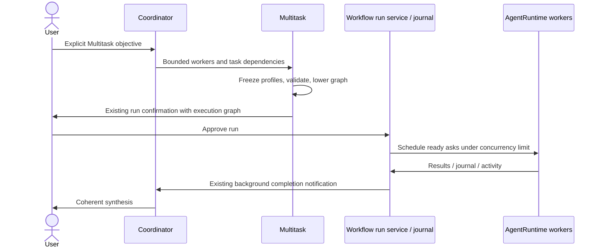
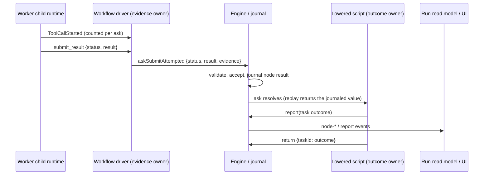

# Multitask M1

Multitask is explicitly requested by the user (name Multitask or parallel workers).
The coordinator submits a structured, one-off graph through `Multitask`, normally
1–4 workers, at most 16 tasks. Workflow remains the repeatable script product.
The coordinator uses the minimum useful worker set and synthesizes the returned
worker results itself; no automatic reviewer/report hierarchy is created.

## Ownership and boundary

The tool resolves normal Subagent profiles at admission, freezes role, model,
tools, permission mode and max turns in each actor persona, validates the DAG,
and deterministically lowers it to an internal Workflow script. The user and
coordinator do not author a `.dwf.ts` file. The existing CreateWorkflow gate,
DynamicWorkflowRunPort, scheduler, concurrency governor, journal, child
AgentRuntime factory, progress events and runtime task registry remain owners.
No new queue, session store or execution engine is introduced.



Worker `access` is explicit: `read` or `write`. Read workers receive only a
conservative built-in read-tool allowlist (no shell, REPL, MCP or plugin tools).
Every writer forms an exclusive barrier in topological task order; readers on
either side do not overlap the writer. Real parallel writers await worktree
isolation in M2. A worker executes its tasks FIFO; all declared dependency
results are included in downstream task context. Shared context is supplied
once per worker in its persona. Dependency failures fail the run; they never
silently release dependents.

Profiles are resolved from the same registry used by Agent/Task, with built-in
fallbacks. Unknown profiles fail before launching. Explicit worker model wins
over profile model, otherwise the parent model is inherited. Snapshot models
are validated against the normal catalog. Profiles requiring skills, memory or
MCP-server scoping are rejected in M1 rather than silently dropping policy.
Profile tool denies are preserved; nested orchestration and Agent/Task dispatch
are denied for every worker. Read access also narrows a permissive profile.
Resume reconstructs the frozen persona from the existing script and journal,
not the current profile registry. Existing model pins and stale-run guards apply.

## UI and delivery

The existing Workflow run card opens the existing colored worker roster and
child inspection pane: name/role, actual model, status, current task, elapsed
time and recent activity. M1 identifies the submission as Multitask but reuses
the existing detailed execution view. A dedicated compact worker-first view is
M2. Desktop continuous and mobile replayable delivery use unchanged run events
and projections. No new protocol payload or database migration is needed.
Cancellation, background notifications, cold resume and completed-result reuse
use the existing run ID and Workflow controls.

## Acceptance

- Explicit Multitask call registers only when dynamic Workflow is available.
- Invalid IDs, unknown dependencies, cycles, unassigned/duplicate workers,
  unknown profiles and oversized graphs cannot start runs.
- Two safe readers start concurrently; a dependency waits for its inputs.
- Writers cannot overlap any other worker in the shared checkout.
- Input strings are JSON escaped, never executable source.
- A profile's model and policy survive lowering and replay.
- A child cannot launch Multitask or another orchestration run.
- A real tool submission starts one Workflow background run, uses the run
  lifecycle provider, emits the existing display, and returns results by task ID.
- Interaction scenario: request Multitask, approve, inspect colored workers,
  open child conversation, cancel/resume via existing run controls, receive
  synthesis. Live acceptance requires exclusive dev-runtime ownership.

# Multitask M2

M2 keeps the M1 runtime (same tool, lowering target, scheduler, journal,
concurrency, cancel/resume) and changes two things: what "a worker finished"
means, and how a run is shown.

## Completion semantics

A worker ending its model turn is **execution completion**, never assignment
success. Every Multitask task is a *typed* ask whose result the worker must
submit explicitly:

```ts
interface MultitaskTaskResult {
  status: "done" | "blocked";   // worker's declaration
  result: string;               // deliverable, or what blocked it
  evidence?: MultitaskEvidence; // stamped by the runtime, never by the model
}
```

A turn that ends without `submit_result` is nudged once by the existing typed-ask
machinery; if it still does not submit, the node fails with
`ResultNotSubmitted`. The lowered script catches node failures per task (except
`Cancelled`, `ProviderStop` and `Interrupted`, which must stop the run so it stays
resumable) and turns them into an honest task outcome instead of erroring the
whole run.

**Evidence owner.** The Workflow driver (bootstrap) is the only writer of
`evidence`. At the single point where a Multitask worker's `submit_result`
payload is forwarded to the engine, the driver overwrites `evidence` with the
counts it observed from that ask's `ToolCallStarted` events:

| field | meaning |
| --- | --- |
| `toolCalls` | all tool calls that actually started |
| `worldToolCalls` | calls that read or changed the outside world (excludes `submit_result`/`escalate`) |
| `mutatingToolCalls` | calls classified workspace-mutating (`isWorkspaceMutatingToolCall`) |
| `commandCalls` | calls carrying a shell `command` input (e.g. tests, builds) |
| `filesChanged` | distinct `file_path`/`notebook_path` targets of mutating calls (≤ 32) |

Denied calls never start and are not counted.

**Evidence across resume.** A task interrupted by Stop (or a lost host) is
re-dispatched on resume into the *same* worker session, which still holds the
interrupted attempt's tool results; the worker may legitimately only call
`submit_result`. Per-attempt counters would then read zero and wrongly mark the
task `unverified`. So each per-tool `node-progress` of a Multitask worker also
journals the attempt's evidence counts, and when the driver re-dispatches an ask
it adds the last snapshot from every earlier life of the **same run and ask
instance** (lives are delimited by `run-started`). Different runs (Amend mints
a new run id) and different tasks (different ask instances) are never counted;
completed tasks replay as `cached` and are never re-dispatched, so they stay
`Reused` and contribute nothing. Totals feed the unchanged outcome rule; the
carried part is also stamped as `evidence.priorAttempts` (only when the run's
result schema declares it, so runs created before this field still validate)
so the UI can show how much work happened before the stop. A worker tool allowlist narrows
capabilities only: the Workflow protocol tools `submit_result` and `escalate`
are always kept, otherwise a narrowed (read) worker could never submit a typed
result (found live in M2: every reader failed with `ResultNotSubmitted`). Because the stamped payload is the
accepted result, evidence is journaled with the node and replayed unchanged on
resume. Model-authored `evidence` is discarded. Normal Workflow personas (no
`worker` policy) are never stamped.

**Outcome owner.** The lowered script (generated by `multitask-graph.ts`) derives
each task's outcome deterministically from declaration + evidence + access:

| outcome | rule |
| --- | --- |
| `done` | declared done; reader with ≥1 world call, writer with ≥1 mutating call |
| `done_no_changes` | writer declared done, inspected, but made no mutating call |
| `unverified` | declared done with zero world calls (or no evidence) |
| `blocked` | worker declared `blocked` |
| `failed` | no result submitted, or the ask failed |
| `skipped` | a dependency ended `blocked`, `failed` or `skipped`; never dispatched |

`unverified` and `done_no_changes` still release dependents (a later verifier can
settle them) but are never presented as success. Each outcome is `report()`ed
(journaled, replay-safe, delivered with the completion notification even on
failure) and returned by task ID to the coordinator, which is told that only
`done` is evidence-backed. Coordinator verification remains a backstop; success
semantics no longer depend on it. No chain-of-thought is exposed: only the
worker's submitted `result` and runtime counts.



## Worker-first view

Runs whose actors carry a frozen Multitask `worker` policy expose its `access` on
the run read model (`WorkflowRunActor.access`, read from the bounded
`actor-created` persona). The turn digest card renders those runs worker-first:
one row per worker with role/name, read-only or writer badge, live state and
current action (last tool + target), progress (tool count), and after
settlement the outcome and evidence (files changed, commands run, tool calls).
`unverified`, `done_no_changes`, `blocked`, `failed` and `skipped` are visibly
distinct from `done`. A row expands to its tasks with outcome and result summary
and opens the worker transcript. Tasks reused from a previous run on resume are
marked reused. Because a worker task is usually one long model turn, the driver
also emits `node-progress` each time a Multitask worker starts a tool (normal
Workflow keeps turn-end progress only), so the current action stays live. The
digest and completion cards name the product "Multitask" for these runs. Stop/Resume/Configure and the run-details pane (with the phase
graph as the advanced view) are unchanged. Normal Workflow runs keep the
timeline. No new protocol event, payload type or migration is introduced; the
only protocol addition is the optional `access` actor field.

## M2 acceptance

- A worker that ends its turn without submitting is nudged, then reported
  `failed`, and its dependents `skipped`; the run completes and stays coherent.
- `blocked` declarations skip dependents; `Cancelled` still stops the run.
- Evidence is stamped only for Multitask workers and overwrites model input.
- Reader/writer zero-action claims surface as `unverified`/`done_no_changes`.
- Live: worker A completes, worker B active, cancel, resume — A's node replays
  `cached`, no new model request for A, B reruns.
- M1 regressions: reader concurrency, writer exclusivity, no orchestration
  tools in workers, normal Workflow unaffected, cancel/resume.
