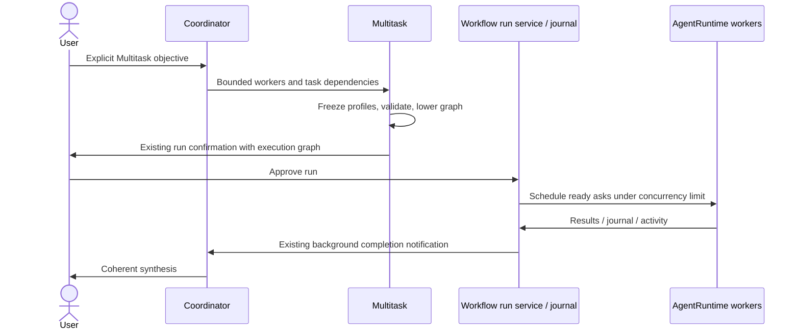

# Multitask M1

Multitask is explicitly requested by the user (name Multitask or parallel workers).
The coordinator submits a structured, one-off graph through `Multitask`, normally
1–4 workers, at most 16 tasks. Workflow remains the repeatable script product.
The coordinator uses the minimum useful worker set and synthesizes the returned
worker results itself; no automatic reviewer/report hierarchy is created.

## Ownership and boundary

The tool resolves normal Subagent profiles at admission, freezes role, model,
tools, permission mode and max turns in each actor persona, validates the DAG,
and deterministically lowers it to an internal Workflow script. The user and
coordinator do not author a `.dwf.ts` file. The existing CreateWorkflow gate,
DynamicWorkflowRunPort, scheduler, concurrency governor, journal, child
AgentRuntime factory, progress events and runtime task registry remain owners.
No new queue, session store or execution engine is introduced.

Worker `access` is explicit: `read` or `write`. Read workers receive only a
conservative built-in read-tool allowlist (no shell, REPL, MCP or plugin tools).
Every writer forms an exclusive barrier in topological task order; readers on
either side do not overlap the writer. Real parallel writers await worktree
isolation in M2. A worker executes its tasks FIFO; all declared dependency
results are included in downstream task context. Shared context is supplied
once per worker in its persona. Dependency failures fail the run; they never
silently release dependents.

Profiles are resolved from the same registry used by Agent/Task, with built-in
fallbacks. Unknown profiles fail before launching. Explicit worker model wins
over profile model, otherwise the parent model is inherited. Snapshot models
are validated against the normal catalog. Profiles requiring skills, memory or
MCP-server scoping are rejected in M1 rather than silently dropping policy.
Profile tool denies are preserved; nested orchestration and Agent/Task dispatch
are denied for every worker. Read access also narrows a permissive profile.
Resume reconstructs the frozen persona from the existing script and journal,
not the current profile registry. Existing model pins and stale-run guards apply.

## UI and delivery

The existing Workflow run card opens the existing colored worker roster and
child inspection pane: name/role, actual model, status, current task, elapsed
time and recent activity. M1 identifies the submission as Multitask but reuses
the existing detailed execution view. A dedicated compact worker-first view is
M2. Desktop continuous and mobile replayable delivery use unchanged run events
and projections. No new protocol payload or database migration is needed.
Cancellation, background notifications, cold resume and completed-result reuse
use the existing run ID and Workflow controls.

## Acceptance

- Explicit Multitask call registers only when dynamic Workflow is available.
- Invalid IDs, unknown dependencies, cycles, unassigned/duplicate workers,
  unknown profiles and oversized graphs cannot start runs.
- Two safe readers start concurrently; a dependency waits for its inputs.
- Writers cannot overlap any other worker in the shared checkout.
- Input strings are JSON escaped, never executable source.
- A profile's model and policy survive lowering and replay.
- A child cannot launch Multitask or another orchestration run.
- A real tool submission starts one Workflow background run, uses the run
  lifecycle provider, emits the existing display, and returns results by task ID.
- Interaction scenario: request Multitask, approve, inspect colored workers,
  open child conversation, cancel/resume via existing run controls, receive
  synthesis. Live acceptance requires exclusive dev-runtime ownership.
