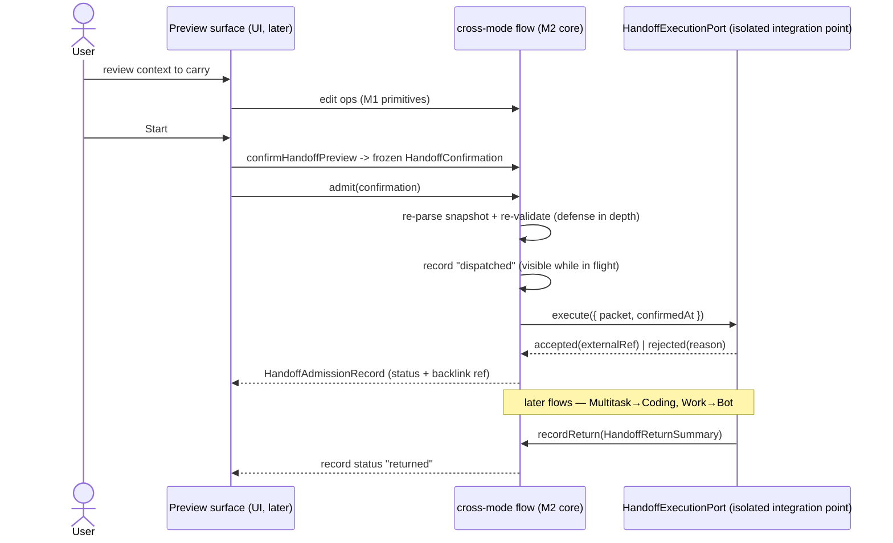

# Cross-Mode Continuity — M2 spec (context preview + transfer/admission flow)

> Status: **prepared** — the isolated flow scaffold has landed on `feature/cross-mode`;
> UI binding and real execution stay behind isolated integration points until the
> `feature/personal-bot` and `feature/multitask` branches stabilize.
>
> Contract input: M1 (`docs/specs/cross-mode-continuity.md`, frozen `handoff-packet/v1`).
> Module: `packages/shared/src/cross-mode/` (`preview-session.ts`, `admission.ts`, `ports.ts`,
> `flow-errors.ts` added; no M1 file semantics changed).

## 1. Product rule for M2

M2 is the user-visible middle of cross-mode continuity, still without mode switching or
hidden work:

1. **Context preview** — the user reviews exactly what will be carried (objective, context
   items, provenance, byte budget, return policy), toggles/edits items, and confirms.
2. **Transfer/admission** — a confirmed handoff is re-validated, recorded, and dispatched
   to an execution port that the destination side implements later.

Both halves are explicit and inspectable. Nothing is dispatched by editing; only a user
confirmation produces a frozen snapshot, and only an explicit admission call dispatches it.

## 2. Scope

Ships in M2 (this preparation + later UI):

- preview session state machine (draft → confirmed) built on M1 primitives;
- UI-neutral preview view model (`objective`, modes, context preview, blockers, warnings);
- admission flow: frozen snapshot → re-validate → `dispatched` record → execution port →
  `accepted` / `rejected`; return summaries attach once (`returned`);
- in-memory admission store as the reference persistence (host adapter later);
- isolated integration points (ports) so Bot/Multitask/UI can plug in without cross-mode
  depending on them.

Does not ship in M2:

- React/desktop implementation of the preview dialog (UI work, later; it binds to the
  view model);
- any concrete `HandoffExecutionPort` implementation (destination work creation belongs to
  the executor milestone — session creation / multitask run creation);
- persistent store adapter, object graph (Goal/Project/Idea) persistence, device routing;
- changes to Bot or Multitask branches.

## 3. Preview flow (user-facing)

### 3.1 States

```text
draft ──edit (M1 ops)──▶ draft ──confirm (no error issues)──▶ confirmed (frozen snapshot)
   ▲                           │
   └── cancel / new preview ◀──┘
```

- `draft` is a regular `HandoffPacket` (M1); edits reuse M1 edit primitives.
- `confirmed` freezes the canonical serialized snapshot (`HandoffConfirmation.packetJson`);
  later edits require a **new** preview session. The confirmed snapshot never changes.

### 3.2 What the surface shows

```text
Move to Coding Session

Objective
Build the first Personal Bot settings surface

Context to carry                        3 of 5 items · 1.2 KB / 8 KB
[x] Idea summary            idea:personal-bot     standard
[x] Project constraints     (typed)              standard
[ ] Unrelated personal note (excluded — personal context must be included explicitly)
[ ] Grocery list            (excluded)

Linked project  project:acevra
Returns to      Bot · summary + artifacts
Warnings        1 (duplicate constraint)

[Start Coding Session]   ← disabled while blocked, with the blocking issues listed
```

Rules (all enforced by the flow module, not by UI code):

- context items render with include toggles, sensitivity, provenance and byte counts
  (from `buildHandoffContextPreview` — M1);
- `personal` / `sensitive` items start excluded; enabling one records `inclusion: "user"`
  (M1 edit op `setHandoffContextItemIncluded`);
- confirm is **blocked** while any error-severity admission issue exists; the surface shows
  the sorted issue list instead of a disabled mystery button;
- warnings (for example duplicate constraints) do not block but are carried into the
  confirmation record for auditability.

### 3.3 API (implemented in this milestone)

| Call                                                                         | Purpose                                                                                                                    |
| ---------------------------------------------------------------------------- | -------------------------------------------------------------------------------------------------------------------------- |
| `beginHandoffPreview(draft, now?)`                                           | start an editable, unconfirmed session.                                                                                    |
| `editHandoffPreviewDraft(session, edit, now?)`                               | apply an edit function (M1 op) to the draft. Throws `handoff_flow_preview_confirmed` once confirmed.                       |
| `validateHandoffPreview(session)`                                            | current admission issues (same rules as final admission).                                                                  |
| `canConfirmHandoffPreview(session)` / `confirmHandoffPreview(session, now?)` | confirm gate; on success freezes `{handoffId, packetJson, confirmedAt, warnings}`. Never dispatches.                       |
| `buildHandoffPreviewViewModel(session)`                                      | UI-neutral view model: objective, modes, linked project, return policy, context preview, issues, `blocked`, `confirmedAt`. |

## 4. Transfer / admission flow

### 4.1 Sequence



### 4.2 Ownership

| State                                | Owner                                     | Notes                                              |
| ------------------------------------ | ----------------------------------------- | -------------------------------------------------- |
| Handoff admission records            | cross-mode flow (this module)             | single owner; store port isolates persistence.     |
| Confirmed snapshot                   | preview session (immutable)               | admission re-parses from the snapshot only.        |
| Destination work (session / run / …) | `HandoffExecutionPort` implementation     | flow layer keeps only `externalRef` for backlinks. |
| Return summaries                     | return source, attached by `recordReturn` | same `handoffId` linkage; attach exactly once.     |

### 4.3 Record lifecycle

```text
dispatched ──executor──▶ accepted ──recordReturn──▶ returned
     │
     └──────executor──▶ rejected ──admit (retry)──▶ dispatched ...
```

- `dispatched` is written **before** calling the executor, so in-flight handoffs are
  observable (status cards, crash recovery later).
- `rejected` is retryable: a new `admit` attempt increments `attempts`; `accepted` /
  `dispatched` / `returned` are not re-admittable (`handoff_flow_already_admitted`).
- `recordReturn` attaches `HandoffReturnSummary` once; repeats and unknown `handoffId`s
  throw typed flow errors.

### 4.4 Failure semantics

| Failure                                                         | Behaviour                                                               |
| --------------------------------------------------------------- | ----------------------------------------------------------------------- |
| Confirm with error-level issues                                 | returns `{ ok: false, issues }`; session stays draft.                   |
| Edit after confirm / double confirm                             | `HandoffFlowError` `handoff_flow_preview_confirmed`.                    |
| Tampered / unparseable / mismatched confirmation snapshot       | `handoff_flow_invalid_confirmation` (carries M1 issues when available). |
| Snapshot no longer transferable at admission (defense in depth) | `handoff_flow_invalid_confirmation` with the M1 issue list.             |
| Duplicate admission of an active/finished handoff               | `handoff_flow_already_admitted`.                                        |
| Return for an unknown handoff / second return                   | `handoff_flow_unknown_handoff` / `handoff_flow_already_returned`.       |

## 5. Integration isolation contract

Until the sibling branches stabilize, everything cross-mode touches happens through the
following seams. **cross-mode must never import Bot / Multitask / UI implementations.**

| Integration point          | Type (M2)                                                                          | Implemented later by                                                                                                       |
| -------------------------- | ---------------------------------------------------------------------------------- | -------------------------------------------------------------------------------------------------------------------------- |
| Destination dispatch       | `HandoffExecutionPort.execute(request) → accepted(externalRef) / rejected(reason)` | executor milestone: coding-session creation / multitask run submission — the destination owns how work is created and run. |
| Preview surface            | `buildHandoffPreviewViewModel` + edit/confirm calls (data-only)                    | UI milestone (desktop/web); renders preview, wires buttons, shows provenance.                                              |
| Handoff producers (drafts) | M1 builders (`createHandoffContextItem`, `createHandoffPacket`, …)                 | personal-bot (Bot→Coding), multitask (Coding→Multitask). Both use the frozen contract only.                                |
| Return summaries           | `createHandoffReturnSummary` + `recordReturn`                                      | multitask / coding return paths (Multitask→Coding, Work→Bot).                                                              |
| Persistence                | `HandoffAdmissionStore` (async port; in-memory reference)                          | host adapter when the runtime host is chosen (desktop service / CLI).                                                      |

Anti-corruption rules:

1. No sibling imports in either direction; wiring happens only via the ports above.
2. The executor may not create handoff records or mutate flow state — it returns
   `accepted(externalRef)` / `rejected(reason)` only.
3. UI may not re-implement caps, scoring, or issue codes; all display data comes from the
   view model / context preview.
4. The flow layer never switches modes, never spawns work on its own, and never sends
   anything back to Bot from coding details (returns are explicit summaries).

## 6. Persistence boundary

- `createInMemoryHandoffAdmissionStore()` is the **reference** store: deterministic,
  test-oriented, explicitly not durable.
- The store is an async port so a host adapter (file/SQLite/service) can replace it without
  changing the flow. One owner: the flow service is the only writer of admission records.
- Persistence host selection is an open question (see §8); until then no production code
  should rely on the in-memory store.

## 7. Acceptance scenarios (M2)

1. Preview a bot→coding packet: view model shows objective, both context items, byte counts,
   provenance; `blocked` is false for a valid draft.
2. Toggling a personal item on records `inclusion: "user"`; confirming then freezes a
   snapshot that parses back equal to the draft.
3. A draft without `sourceRefs` cannot be confirmed; the blocking issue is reported and the
   session remains editable.
4. Admission dispatches through the execution port; the record transitions
   `dispatched → accepted` with the port's `externalRef`; the in-flight `dispatched` state
   is observable.
5. A rejected dispatch records the reason and can be retried (attempts increment); a third
   admission attempt on an accepted record fails.
6. Tampered snapshots, mismatched ids, and blocked snapshots fail with typed flow errors and
   leave no record behind.
7. A return summary attaches once and flips the record to `returned`; duplicates and unknown
   ids are rejected.

All scenarios are covered by `packages/shared/test/crossModePreviewSession.test.ts` and
`packages/shared/test/crossModeAdmission.test.ts`.

## 8. Open questions (gated on sibling stabilization)

- Where does `HandoffExecutionPort` live and who implements it (desktop service vs CLI vs
  coordinator worker)? What belongs in `externalRef` per destination (`coding-session`,
  `multitask-run`)?
- Which persistent store hosts admission records, and does crash recovery replay
  `dispatched` records into resume/cancel UX?
- Retry policy details for `rejected` (auto vs manual; how many attempts before surfacing).
- Preview surface specifics: where the entry points live, i18n strings, and whether
  suggestions ("This looks like implementation work…") are allowed as non-executing hints.
- Whether `returnPolicy: "none"` transfers should still produce a status card.

## 9. Non-goals (deliberately deferred)

- React/desktop preview dialog and backlink components.
- Real dispatch implementations and destination work creation.
- Durable admission store, object-graph persistence, device routing metadata.
- Any change to M1 v1 semantics (`handoff-packet/v1` stays frozen; M1 files unchanged except
  the additive barrel exports for this milestone).

## 10. Files

```text
packages/shared/src/cross-mode/
  flow-errors.ts        flow-layer error codes + HandoffFlowError
  ports.ts              HandoffExecutionPort and request/outcome types (isolated seam)
  preview-session.ts    preview state machine, confirmation, view model
  admission.ts          admission service, records, store port + in-memory store
packages/shared/test/
  crossModePreviewSession.test.ts
  crossModeAdmission.test.ts
```
