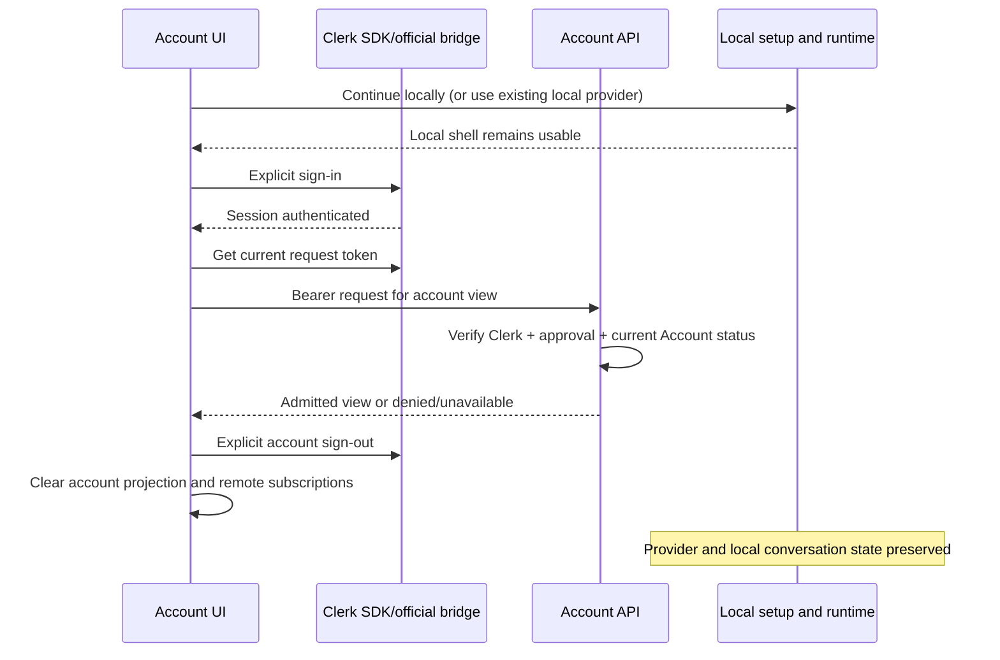
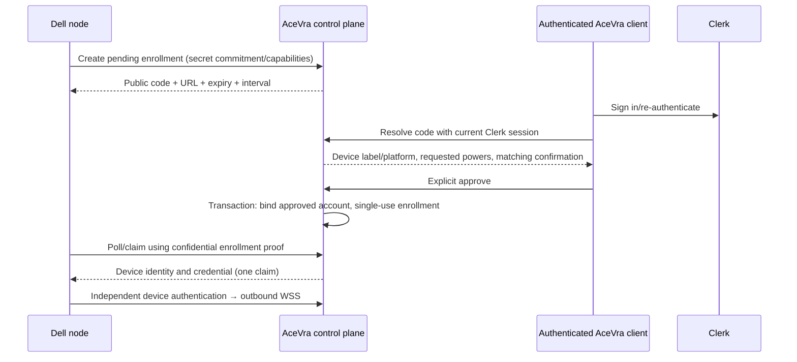

# AceVra Account and control-plane boundary — M2

Status: proposed design; discovery only. Date: 2026-10-01.
Source baseline: `release/0.1.0-alpha`, `6e521c4b4958be2ac728e64bd6e7d1756c8ab58a`.

M1 commits `f32169d924207fa77ea959ba9dfb955c436e80e1` and
`6e521c4b4958be2ac728e64bd6e7d1756c8ab58a` were pushed to
`origin/release/0.1.0-alpha`; the remote tip was verified. No merge or tag.

This document proposes interfaces and acceptance cases. It does not install Clerk,
configure a Clerk instance, change application behavior, or implement M2A–M2F.
The previous runtime-scope investigation and accepted Computer UX are outside this work.

## 1. Product rules and invariants

- Clerk is the human authentication authority. AceVra owns product admission,
  account metadata and resource authorization. An inference provider is never the
  account authority.
- A local provider connection can run without an AceVra Account. Keep **Continue
  locally**, including when Clerk or the control plane is unavailable.
- Account login does not create a runtime, change taskType, change inference
  selection, upload credentials, import conversations or register a device.
- Account logout and provider disconnect are distinct commands. Account switching
  clears account projections and remote subscriptions before showing the next user.
  It preserves local provider configuration and local conversations. A shared Mac
  profile remains a local trust boundary; account login does not encrypt local data.
- Human sessions, device credentials, provider credentials, runtime leases and
  workspace identity are separate identities with separate owners.
- Cloud resource ownership uses server-resolved account IDs. Device names,
  workspace paths, client-supplied user IDs and Host ownerInstanceId are not owners.
- M2A has no sync, remote task admission, node registration or cloud execution.
  Later control-plane business state must live outside Main and the transport relay.

## 2. Current source and impact map

All paths below are repository-relative and verified at the source baseline.

| Rank           | Source                                                                                                                       | Current fact                                                                                                                                                                                 | Proposed boundary                                                                                                                                                      |
| -------------- | ---------------------------------------------------------------------------------------------------------------------------- | -------------------------------------------------------------------------------------------------------------------------------------------------------------------------------------------- | ---------------------------------------------------------------------------------------------------------------------------------------------------------------------- |
| Must inspect   | `packages/services/src/onboarding/acevraSetup.ts`, `acevraSetupService.ts`; `packages/ui/src/onboarding/AceVraFirstRun.tsx`  | M1 owns local setup/readiness and defer state; its contract has no human account                                                                                                             | Preserve startup and usable local inference; account choice is independent                                                                                             |
| Must inspect   | `packages/ui/src/root/useRootWorkspaceActions.ts`                                                                            | Existing logout calls provider OAuth service                                                                                                                                                 | Introduce separate account logout; do not reuse provider logout                                                                                                        |
| Must inspect   | `packages/desktop/src/main/index.ts`, `desktopHostProcess.ts`                                                                | Main owns single-instance/deep links; isolated renderer currently loads packaged `file://`                                                                                                   | Integrate official bridge into existing lifecycle; review packaged origin before OAuth                                                                                 |
| Must inspect   | `packages/desktop/src/main/desktopOAuthDeepLink.ts`, `localMediaPreviewProtocol.ts`                                          | Existing provider callback routing and privileged protocols                                                                                                                                  | Keep provider callback state separate; compose scheme registration and CSP                                                                                             |
| Must inspect   | `packages/server/src/customForkClerkAuth.ts`                                                                                 | Clerk backend verification and explicit user-ID allowlist already exist for fork routes; bearer header or query token accepted; optional authorized parties and localhost development bypass | Reuse official SDK knowledge; production Account API must require exact origins, correct token type and persistent admission; no query bearer or hostname-based bypass |
| Must inspect   | `packages/web/src/customForkRemoteApp.tsx`, `main.tsx`                                                                       | Existing browser Clerk login obtains tokens for fork attachment                                                                                                                              | This is existing remote access, not a universal AceVra Account or sync implementation; future client uses fresh request tokens                                         |
| Must inspect   | `packages/server/src/http.ts`, `customForkRelay.ts`; `packages/desktop/src/host/customForkHostRelay.ts`                      | Relay uses deployment device token, supplied owner ID, presence/attachment sockets, expiring single-use tickets and in-memory registries                                                     | Preserve attachment semantics; future device registry derives owner from device credential, never registration query data                                              |
| Should inspect | `packages/server/src/http.ts` device endpoint                                                                                | Display name/platform contribute to derived device ID                                                                                                                                        | Future registry allocates stable random IDs; display names can change                                                                                                  |
| Must inspect   | `packages/services/src/session/taskIndexRepo.ts`; `packages/shared/src/zcode-protocol-v4/snapshot.ts`                        | Local index keyed by workspace/task; snapshots carry sessionId, sequence and revision; ownerInstanceId fences runtime ownership                                                              | Add an explicit future cloud binding; do not rename local IDs or reinterpret runtime fencing                                                                           |
| Should inspect | `apps/zcode-cli/packages/bootstrap/src/zcode-protocol-v4/create-session-command-fact.ts`, `zcode-protocol/session-mapper.ts` | createSession exposes record.sessionID; mapper retains workspace identity/path                                                                                                               | Preserve local records and map exact identifiers through an adapter                                                                                                    |
| Invariant      | Existing conversation-runtime, conversation-projection, workspace-identity and delivery-profile graph seeds                  | Host/runtime owns admitted work; clients have projections; desktop continuous and remote replayable deliveries differ                                                                        | Account state must not introduce another accepted queue or discard lease/gap repair                                                                                    |

Existing dependencies include `@clerk/backend` in server and `@clerk/clerk-js` in
web. Desktop has Electron **41.0.3**, React 19 and no `@clerk/electron` dependency;
the workspace pins Node **24.14.0**. This is documentation feasibility, not a
completed integration or proof of compatibility with a selected SDK release.

Graph drift candidate: verified fork Clerk/relay surfaces lack a dedicated Account
seed. Add those verified current edges when implementing the account contract;
proposed cloud/device modules have no tracked implementations yet and must not be
entered as existing capabilities.

## 3. Clerk Electron feasibility and process boundaries

Clerk's official Electron SDK is beta. Its documented baseline is Electron 28+,
Node 20.9+, context isolation, and the official main/preload/React bridge. Enable
Clerk Native API. Use Clerk components and SDK flows rather than implementing a
human authentication protocol. [Official quickstart](https://clerk.com/docs/electron/getting-started/quickstart).

| Owner                    | Proposed responsibility                                                                                           | Forbidden contents                                                              |
| ------------------------ | ----------------------------------------------------------------------------------------------------------------- | ------------------------------------------------------------------------------- |
| Main                     | Initialize `createClerkBridge` before windows; storage adapter and official OAuth listeners; dispose on quit      | Clerk secret key, product account database, task queue                          |
| Preload                  | `exposeClerkBridge` only to trusted AceVra renderer; optional native passkey bridge                               | Generic IPC execution, exposure to webview guests/untrusted pages               |
| Renderer                 | `ClerkProvider` from `@clerk/electron/react`, prebuilt sign-in/profile; transient SDK session token for API calls | Persisted bearer token in Zustand/localStorage, provider-key upload             |
| Account service contract | Backend profile/admission state and transient account projection; accessed by UI hooks                            | Alternate session-token store or ownership derived from provider profile        |
| Window Host/runtime      | Continue owning local workspaces, sessions and CommandInbox admission                                             | Human session as device identity; credential propagation into agent prompts/env |
| Account API              | Verify Clerk identity, enforce admission and ownership, return account view                                       | Trust a renderer accountId/userId or raw provider OAuth identity                |

Main already owns the app lock. Acquire it before bridge initialization and use
`manageSingleInstanceLock: false`; compose listeners with existing deep-link handling.
Use the documented async-capable TokenStorage interface for a memory-only adapter
when persistence is unsafe. [Bridge reference](https://clerk.com/docs/reference/electron/create-clerk-bridge).

### Packaged OAuth origin

Google opens the system browser and returns through the official Clerk deep-link
flow. Packaged `file://` is not a suitable OAuth redirect origin. Proposed account
renderer origin: a dedicated registered custom scheme such as
`acevra-account://renderer` (exact production registration remains to be decided).
Serve only bundled assets through `protocol.handle`, normalize paths and reject
traversal. Preserve existing provider/workspace deep links. Do not hand-roll token
callbacks. Test cold and warm activation, concurrent windows, cancellation and
unexpected callbacks using the SDK. Mac/Linux deep links need packaged-app testing.
[OAuth deep links](https://clerk.com/docs/guides/configure/auth-strategies/oauth-deep-links).

Allowlist the exact renderer origin; dev localhost only in development builds.
Deny foreign main-frame navigation/redirects and untrusted new windows; otherwise
a page may inherit a privileged preload. Compose CSP with the existing session
handler rather than replacing it. Production removes development origins and
`unsafe-eval`. Native API changes browser CAPTCHA protection, so restricted
admission and rate limits are required.

### Session, refresh, logout, offline

The SDK owns session restoration and refresh. Obtain `session.getToken()` per
authenticated request, not once at app startup. Current session JWT TTL is about
one minute; network failures can produce `ClerkOfflineError`. Treat authentication
and backend admission as separate states; stale cached UI never authorizes cloud
actions. [Session reference](https://clerk.com/docs/electron/reference/objects/session).

Use SDK sign-out, with clearly separate current-session and all-session actions.
On local sign-out clear account projection, disconnect account subscriptions and
cancel pending account actions. An offline sign-out removes local access; do not
claim server revocation succeeded until acknowledged. Provider disconnect is a
separate explicit setting. [Sign-out flow](https://clerk.com/docs/guides/development/custom-flows/authentication/sign-out).

Offline: show local mode and optionally a clearly stale profile summary. Existing
local conversations remain usable with locally available inference. Cloud actions
fail closed with a retry option; no hidden remote action queue in M2A. Returning
online requires fresh SDK authentication and server admission before enabling them.

## 4. Login methods and passkeys

| Method  | Design                                                                                             | Qualification                                                                                                          |
| ------- | -------------------------------------------------------------------------------------------------- | ---------------------------------------------------------------------------------------------------------------------- |
| Google  | Prebuilt Clerk social sign-in, external browser                                                    | Production custom Google OAuth credentials/consent and approved redirect configured in Clerk, never in Electron        |
| Email   | Prefer email code for first alpha; Clerk email link remains a possible configured alternative      | Verified invited email; verify delivered links and trusted redirect flow                                               |
| Phone   | SMS code for approved existing/manual-created users or linked verified number                      | Production paid feature and supported SMS countries; do not assume an email invite permits arbitrary phone-only signup |
| Passkey | Enroll optionally after initial Google/email/phone login; explicit Use passkey for returning users | Production paid feature; platform/packaging prerequisites below                                                        |

Clerk provides email, phone and passkey strategies; phone and passkeys currently
require a paid production plan. Confirm SMS country availability before exposing
phone. [Sign-in options](https://clerk.com/docs/guides/configure/auth-strategies/sign-up-sign-in-options).
Production Google credentials and redirect configuration are documented separately.
[Google connection](https://clerk.com/docs/guides/configure/auth-strategies/social-connections/google).

After successful admission, offer **Create a passkey** via the SDK
`user.createPasskey()`, with skip, rename and delete management. Choose a stable
Clerk relying-party domain before enrollment. Recovery stays with an approved
verified Google/email/phone method; never invent a password recovery scheme.
[Passkey enrollment](https://clerk.com/docs/guides/development/custom-flows/authentication/passkeys).

Native Electron passkeys use the optional native package and main/preload enablement.
macOS requires AuthenticationServices, matching App ID/team/bundle identifiers,
Clerk Native Applications association, `webcredentials` associated-domain entitlement,
provisioning profile and valid signing. Windows uses native WebAuthn; Linux has no
native support. Renderer WebAuthn needs HTTPS matching the Clerk RP ID; custom
schemes/localhost do not satisfy it. Electron 42+ renderer macOS Touch ID support
does not imply our Electron 41 native path is unsupported. Native mode has no
conditional autofill. [Electron passkeys](https://clerk.com/docs/reference/electron/passkeys).

Use **Use passkey** across platforms; explanatory text may mention Touch ID,
Windows Hello, device PIN or another authenticator when applicable. Do not label
all authentication “Face ID.” Unsupported platforms must not show a functional
native-passkey button. Signed Mac native behavior remains unproven until tested.

## 5. Private-alpha admission and revocation

Configure Clerk **Invite-only** access (`restricted` API mode), with no public
signup entry. Invite Felipe and explicitly approved users. Do not enable an
enterprise admission route that bypasses the intended restriction. Clerk's identifier
allowlist belongs to open mode, not an extra invite-only setting.
[Access restrictions](https://clerk.com/docs/guides/secure/restricting-access).

Operator flow: create pending AceVra approval → invite verified email through Clerk
→ approved user accepts trusted invitation → sign in using official flow → Account
API admits that Clerk user and atomically creates/links Account. Invitations alone
do not restrict signup; configure restricted mode. Pending invitations expire and
can be revoked; revoking an invitation is not revoking an existing user.
[Invitations](https://clerk.com/docs/guides/users/inviting).

Manual creation is via Clerk Dashboard or privileged backend `createUser`, linked
to a pending approval. Never create shared passwords or fabricate verified phone/
email claims. [User management](https://clerk.com/docs/guides/users/managing).
For private alpha, the operator records approved Clerk IDs in a backend-owned
admission ledger; invitation reconciliation may associate IDs through trusted
Clerk records. Email text supplied by a client is insufficient.

Revoke existing access: suspend Account first and increment authorization version;
reject requests, close active cloud sockets and revoke its device credentials.
Then Clerk `banUser` prevents future sign-in and revokes sessions. Individual
session revocation uses `revokeSession`, plus immediate server sid denial/socket
closure. Keep an audit entry and retry external revocation failures.
[Ban user](https://clerk.com/docs/reference/backend/user/ban-user),
[Revoke session](https://clerk.com/docs/reference/backend/sessions/revoke-session).

JWT signature validation does not itself provide immediate revocation. Every API
admission reads current Account status; sensitive actions also verify live session
status/recent authentication. Webhooks are signature-verified, deduplicated and
reconciled, not the only immediate revocation channel. Out-of-band Clerk changes
need reconciliation/online checks; document the bounded detection delay.
[Webhooks](https://clerk.com/docs/guides/development/webhooks/overview).

## 6. Account UX and state ownership

Future full-product copy: **Welcome to AceVra — Sign in to sync your conversations,
agents and devices.** M2A must instead say **Sign in to connect your AceVra account.
Conversation and device sync is coming later.** Do not advertise working sync.

| Surface                    | Action/view                                              | Owner and gate                                                   | Remains independent            |
| -------------------------- | -------------------------------------------------------- | ---------------------------------------------------------------- | ------------------------------ |
| Welcome/account choice     | Google, phone/email, supported passkey, Continue locally | Clerk sign-in UI; Account API admission after authentication     | M1 provider setup/readiness    |
| App shell Account settings | Profile, sign in/out, optional passkey enrollment        | Account contract projection; Clerk profile SDK                   | Provider connection settings   |
| Existing provider settings | Configure/disconnect inference                           | Existing provider services                                       | Clerk login/logout             |
| Future target picker       | Cloud, MacBook, Dell display names                       | Registry-derived authorized targets; capability and online gates | Hardware labels never identity |
| Future browser             | Same account/resources; remote capability view           | Same API authorization; browser replayable delivery              | No native execution in browser |

Local profile owns a dismissible account-choice preference, not account authority.
Clerk owns human session. Account API owns admitted Account. UI keeps a derived
view through service hooks; platform bridges are injected, no direct platform calls
from UI. Avoid duplicating Clerk session data in the provider/user store.



Proposed projection states: `local`, `authenticating`, `checkingAdmission`,
`admitted`, `denied`, `unavailable`. Attach an attempt generation to async results;
logout/account switch invalidates earlier responses. Retrying is explicit, bounded
and does not block local shell startup. SDK session is never proof of admission.

## 7. Human API authentication vs device identity

Human API uses `@clerk/backend` `authenticateRequest` accepting only
`session_token`, configured issuer/keys, exact `authorizedParties`, and audience
when configured. Derive user and session IDs from verified claims. Reject missing
required claims and wrong token classes; never use `acceptsToken: any` here.
Rotating keys use SDK verification; unverifiable tokens fail closed.
[Backend authentication](https://clerk.com/docs/reference/backend/authenticate-request).

Only publishable key is shipped to clients. Clerk secret belongs to backend
deployment secret storage. Bearer headers over TLS; no long-lived bearer query
parameters. Browser WS uses short-lived, single-use, audience-bound tickets from
an authenticated HTTP request, with Origin enforcement; renew through authenticated
HTTP. No token in telemetry, URLs, prompts or generic service broadcasts.

Device credentials authenticate a registered machine independently. Proposed alpha
design: a cryptographically random per-device refresh secret, hashed at rest on
server, locally in OS credential storage, rotation with reuse detection, and
short-lived signed device access token with explicit issuer/audience, accountId,
deviceId, scopes and credentialVersion. Use vetted JWT/crypto libraries. Separate
human and device verifiers/routes. Revocation disables renewal and active sockets;
each remote command checks current account/device authorization. No human refresh
token retained by a node. Device credential is not a Clerk session or provider key.

Headless credential storage: OS secret service where available; otherwise explicit
operator-controlled file in a user-owned directory, permissions 0600, with documented
disk/root compromise risk. Never silently downgrade human Clerk storage to plaintext.
Clerk M2M tokens may be evaluated later, but do not replace the product device
registry or grant all registered devices a shared identity.

## 8. Dell node pairing (M2C proposal)

`acevra node connect` is a future command, not present functionality promised by
this document. Node generates an enrollment secret retained locally; starts a
rate-limited pending enrollment over HTTPS. Server returns authorization URL,
short human code, polling interval and expiry. Human code is not an enrollment
credential. Bind enrollment to node secret hash and proposed capabilities; never
accept credential collection using only the displayed code.



Expiry, denial and rate limits are server-owned. Display a matching code on both
surfaces; machine name is untrusted descriptive input. Require recent human
authentication, no approve-on-link-open, atomic single-use claim, and redacted
responses/logs. Lost claim response must use a narrowly bounded authenticated
recovery or restart enrollment; never enable repeated unauthenticated secret fetch.
Re-pair after revoke requires new approval. No password/token copying or inbound SSH.

Clerk OAuth Device Authorization Grant is a **candidate bootstrap**, not selected.
It supports public-client device authorization with advertised discovery endpoints,
expiry/interval, polling and OAuth access/refresh tokens. Respect `slow_down`,
denial and expiry. Validate feature/plan availability and restricted-user behavior
in the actual Clerk instance before choosing it.
[Device grant](https://clerk.com/docs/guides/configure/auth-strategies/oauth/device-authorization-grant).

If adopted, a separate bootstrap endpoint verifies Clerk OAuth tokens with correct
issuer/client/scopes, then exchanges the authorized enrollment for an AceVra device
credential. OAuth consent must not skip explicit machine/capability confirmation
or confidential claim binding. Discard bootstrap human-delegated credentials after
enrollment. Keep normal human API session-token-only. No device grant in M2A.

## 9. Minimal control-plane contract and backend

Recommend Node 24/TypeScript, Hono, official Clerk backend SDK, managed PostgreSQL,
and a container/service host supporting long-lived WSS. Existing server dependencies
reduce integration cost; deploy account authority separately from a privileged
workspace Host. Initially one deployable modular service; no Kafka/Redis requirement.
Use migrations, transactions and durable audit. Future durable task delivery uses
a transactional outbox, not business queues in relay/Main.
[Hono WebSocket support](https://hono.dev/docs/helpers/websocket).

Ports: `HumanIdentityVerifier`, `AccountAdmission`, `AccountRepository`,
`DeviceRegistry`, `DeviceCredentialAuthority`, `TaskRouter`, `EventRepository`,
`ConversationBindings`, `ProviderMetadataRepository`. Proposed names, not existing
exports. Declare module ownership and public contracts before future implementation.
Transport adapters do authentication and forwarding; app modules own authorization
and lifecycle transitions. Browser/native share API resource rules.

| Proposed API                                    | Principal                              | Milestone / authority                                            |
| ----------------------------------------------- | -------------------------------------- | ---------------------------------------------------------------- |
| `GET /v1/me`, `PATCH /v1/me`                    | Admitted human                         | M2A Account profile; allowlisted profile fields only             |
| Admin admission/revoke commands                 | Privileged operator                    | M2A private operational path; never ordinary client role         |
| Clerk webhook ingestion                         | Verified Clerk signature               | M2A reconciliation; idempotent event ID                          |
| `GET /v1/devices`, `DELETE /v1/devices/:id`     | Human owner                            | M2B registry and revocation                                      |
| `POST /v1/enrollments`, confidential claim/poll | Pending-node proof                     | M2C enrollment lifecycle; rate limited                           |
| Enrollment lookup/approve/deny                  | Recently authenticated human           | M2C admission + ownership                                        |
| Device renewal + `WSS /v1/device-channel`       | Scoped device credential               | M2B/C current registry/authorization version                     |
| `POST /v1/ws-tickets`, client event socket      | Human → one-use ticket                 | Future shared-client events; expiry + Origin binding             |
| Conversations/bindings and incremental sync     | Human owner / explicitly scoped device | M2D; ownership and revision contracts                            |
| Tasks submit/cancel/events                      | Human owner / execution device         | Future routing milestones; strict command schema and idempotency |
| Agents/projects/provider metadata               | Human owner                            | Future registry; no credential content                           |

Account endpoints derive owner from verifier. Return 401 unauthenticated, 403
unapproved/suspended, and non-disclosing 404 for another account's object. CORS is
an exact client-origin allowlist, not authorization. Rate-limit login-adjacent API,
enrollment attempts and execution submissions. Backend-only secrets never enter
desktop build config. No production development bypass.

## 10. Outbound transport and execution target

Desktop/node → outbound TLS WSS → control plane. No public inbound SSH. Device
registers through approved enrollment, renews its own credential, opens WSS and
advertises validated capabilities. Presence is a server lease: proposed heartbeat
20 seconds / expiry 60 seconds, tunable operational policy rather than proof of
execution availability. Use server time; disconnect expires presence. Capability
advertisement is not permission to execute.

Reconnect uses bounded exponential backoff with jitter. Authenticate anew; server
issues a new connection generation and fences the previous socket. Versioned
envelopes include message ID, task ID, execution attempt, connection generation and
event sequence. Durable delivery is at least once: idempotent command admission,
deduplicated events and cursor resume. ACK means persisted authoritative admission,
not a frame received by relay. Never claim exactly-once side effects.

Control plane owns requested routing/dispatch state; runtime CommandInbox owns
execution admission. A submission is only executed after its destination lease
and local permissions are checked. Re-delivery retains the same admission key.
Unknown outcome after disconnect stays unknown/reconciles; do not auto-run on a
second device. Local operator may deny tasks/capabilities. Preserve existing Host
owner/lease and stale-run protections. Desktop continuous and browser/mobile
replayable delivery adapt to the same owner and sequence without merging semantics.

Proposed target view:

```ts
interface ExecutionTarget {
  id: string; // Stable opaque registry ID; independent of display label
  type: "cloud" | "desktop" | "node";
  name: string;
  online: boolean; // Derived from server lease
  capabilities: string[]; // Versioned capability IDs, not executable text
}
```

“AceVra Cloud”, “Felipe's MacBook” and “Dell Server” are display labels. Authorization
uses target/account IDs and capability policy. A cloud target is a provisioned
execution principal, not every deployment of the Account API. Do not show Cloud
as runnable until M2F. Selection of offline/unsupported target cannot silently
fall back to another target. Native-only operations execute on the selected
authorized device; the browser never obtains native privilege from human login.

## 11. Conversation ownership and proposed cloud schema

Future Conversation belongs to Account. Allocate a cloud UUID distinct from local
session/task ID. Add explicit binding `(accountId, deviceId, workspaceKey,
localSessionId) → conversationId`; preserve workspace key rule
`workspaceIdentity?.trim() || workspacePath`. Never identify a conversation by path
alone or map runtime ownerInstanceId to account owner. Keep remoteSessionId in
remote correlations. Existing logs/epochs/revisions are inputs to a future sync
adapter, not a cloud-ready replication format.

Login does not claim old local conversations. M2D requires explicit user consent,
binding creation and conflict/retention protocol before upload. No migration in M2.
Account switching cannot expose another account's cloud cache. Local-only records
remain unbound. Browser is another AceVra client over the same authorized resources,
not a separate business model; native work remains on registered execution targets.

| Entity              | Minimal fields and ownership                                                                  | Relationships / constraints                                                   |
| ------------------- | --------------------------------------------------------------------------------------------- | ----------------------------------------------------------------------------- |
| Account             | id, unique clerkUserId, profile subset, admissionStatus, authorizationVersion, timestamps     | Clerk ID is human subject; no provider identity substitution                  |
| Device              | id, accountId, type desktop/node/cloud, name, capability policy, credentialVersion, revokedAt | FK Account; unique `(accountId,id)`; presence lease projection separate       |
| Conversation        | id, accountId, title, revision, timestamps                                                    | FK Account; unique `(accountId,id)`                                           |
| ConversationBinding | accountId, deviceId, workspaceKey, localSessionId, conversationId                             | Composite owner FKs; unique source tuple                                      |
| Task                | id, accountId, conversationId, targetId, agentId nullable, status, attempt, idempotencyKey    | Composite owner FKs to Conversation/Device/Agent; unique account/request key  |
| Agent               | id, accountId, name, definitionVersion, permitted capability metadata                         | FK Account; no embedded secrets                                               |
| TaskEvent           | accountId, taskId, attempt, sequence, type, schemaVersion, bounded payload, timestamp         | Composite Task FK; unique `(taskId,attempt,sequence)`; access scoped to owner |
| ProviderConnection  | id, accountId, provider, name, executionLocation, deviceId nullable, availability summary     | Metadata only; composite Device FK when local; no token/key/config blob       |
| Project (later)     | id, accountId, name; optional conversation/agent relations                                    | Explicit account-owned project IDs; no path-based global ownership            |

Operational records: pending approval/invitation mapping, enrollment hashes/expiry,
hashed rotating device refresh credentials, revoked session IDs and security audit.
M2A creates only Account/admission/audit structures; other tables are future design.
Do not collect profile fields beyond need; Clerk remains source of verified contact
identity. User-editable profile fields cannot confer admin rights.

Use composite ownership FKs to prevent cross-account references. All queries derive
account scope from principal. PostgreSQL RLS is optional defense in depth with a
restricted application role and transaction-local trusted context; table owners
normally bypass RLS, so it cannot replace app authorization.
[PostgreSQL RLS](https://www.postgresql.org/docs/17/ddl-rowsecurity.html).

### Provider-secret policy

Desktop provider keys remain in the existing local provider credential owner.
Account login does not move/re-key them. Cloud ProviderConnection stores only
allowlisted metadata: provider enum, name, placement and availability, never key,
OAuth refresh/access token, authorization header or unrestricted config object.
Custom base URLs may themselves contain credentials/internal hosts: sanitize or
omit them. Logs/events/artifact sync need schema-based exclusion/redaction.

Future cloud execution requires separately configured cloud credentials or a
separately reviewed encrypted vault with key management and access auditing.
No plaintext credential synchronization path is designed here. A local connection
can be optionally associated through metadata later without uploading its secret.

## 12. Practical alpha threat model

| Threat                            | Required control                                                                                            | Residual/operational limit                                                           |
| --------------------------------- | ----------------------------------------------------------------------------------------------------------- | ------------------------------------------------------------------------------------ |
| Stolen Clerk session              | Short token lifetime, exact issuer/origin/type, current admission; recent reauth for pairing; ban/revoke    | Valid bearer can act until detection; signature verification alone is not revocation |
| Revoked user                      | Suspend admission first, invalidate authorization version, close sockets/revoke devices, Clerk ban          | Out-of-band Dashboard changes have detection delay; reconcile and online-check       |
| Lost Mac/device                   | Remote device revoke, Clerk session revoke, OS lock/encryption                                              | Cloud revoke cannot erase local history or provider keys on lost hardware            |
| Stolen device credential          | Per-device scope, hashed refresh, rotation/reuse detection, revocation and current-status command gate      | OS/root compromise can impersonate device until revoked                              |
| Malicious task                    | Typed command/capability schema, ownership, explicit target, local permissions/sandbox and operator refusal | Registered device is not permission for arbitrary shell or Computer use              |
| Cross-user device/resource access | Principal-derived owner, composite FKs, scoped repository, negative tests                                   | Names, paths and query owner IDs cannot authorize                                    |
| Replayed pairing code             | Short expiry, rate limits, authenticated approval, confidential node proof, atomic claim                    | Social engineering remains; show matching code and requested powers                  |
| WS impersonation/replay           | TLS, per-device audience, version checks, one-use client tickets, Origin, connection fencing                | XSS can act as user; never expose device secrets to browser                          |
| Compromised web client            | CSP, minimal token lifetime, no provider/device secrets, server-side authorization and reauth               | Authenticated malicious UI can request allowed actions; local execution gate remains |
| Provider-key leakage              | Local secret owner, allowlisted cloud metadata, no unrestricted payload/log sync                            | Local process compromise still exposes locally usable keys                           |
| Privileged renderer navigation    | Exact origin, restricted preload, deny foreign navigation/new windows                                       | SDK beta and callback/multi-window behavior require packaged validation              |

Security audit contains event IDs, principal/object IDs, status and time; no tokens,
pairing secrets, prompts, task content or provider keys. Account deletion/retention
policy must be specified before M2D stores conversation content.

## 13. Clerk authentication and Apple trust

Clerk secures human authentication. Developer ID signing/notarization establishes
downloaded app trust and Apple's malware check; it is not account admission.
Public signing/notarization may remain deferred for private alpha.
[Apple notarization](https://developer.apple.com/documentation/security/notarizing-macos-software-before-distribution).

There are nevertheless OS prerequisites: Clerk documents that unsigned/ad-hoc
Mac builds cannot safely persist its session across launches. Recommend session-only
unsigned alpha, with honest re-login after relaunch. Production Clerk also requires
a custom Clerk domain. [Electron deployment](https://clerk.com/docs/guides/development/deployment/electron).

Default Clerk storage uses Electron safeStorage and electron-store; leave
`unencryptedFallback` disabled. If secure storage is unavailable, remain memory-only.
On Linux reject `basic_text` as secure persistence despite encryption availability;
use memory-only without a real keyring. Storage/decryption failures must not block
local mode. [Storage reference](https://clerk.com/docs/reference/electron/storage).

Native Mac passkeys require associated domains and an appropriate signed/provisioned
bundle even when public notarization is deferred. Development signing can be used
for a test Mac. Do not promise Developer ID alone satisfies every native entitlement;
validate the actual distribution profile. Do not require account login for local
execution just because these optional auth features need signing.

## 14. Milestones and recommended M2A

| Stage                 | Deliverable                                                                                                                          | Acceptance gate                                                                                                   |
| --------------------- | ------------------------------------------------------------------------------------------------------------------------------------ | ----------------------------------------------------------------------------------------------------------------- |
| M2A Account shell     | Official Electron bridge; local choice; profile/admission API; account/provider separation; restricted invitations/revoke operations | Packaged Google/email, safe session/offline/logout behavior, local provider regressions, negative admission tests |
| M2B Device registry   | Stable device IDs, independent credentials, revoke, presence contracts                                                               | Per-device ownership, restart persistence, no caller-controlled owner, lost-device revocation                     |
| M2C Dell node         | CLI enrollment/approval, credential storage, outbound channel                                                                        | Replay/expiry/deny tests; no human permanent token; explicit task permissions                                     |
| M2D Conversation sync | Explicit account binding, revision/retention protocol, durable events                                                                | Consent, conflicts, account isolation, replay/gap repair, no credentials uploaded                                 |
| M2E Browser AceVra    | Same authorized resources and targets; adapt existing fork client                                                                    | Browser replayable recovery, no native privileges/device secrets, cross-client consistency                        |
| M2F Cloud execution   | Provisioned target, sandbox, quota/billing and separate cloud credentials                                                            | Isolation, permission, cancellation, duplicate-dispatch and secret-management review                              |

Recommended M2A sequence:

1. Select private Clerk instance/domain, exact allowed origins, restricted admission,
   approved IDs, Google/email strategy and deployment secret handling.
2. Write Account module contract/architecture edges. Keep session authority inside
   Clerk; add injected account service for backend admission/profile projection.
3. Integrate official beta bridge, safe storage and origin/deep-link/CSP lifecycle.
   Preserve existing app lock, provider callbacks and window Host boundaries.
4. Add explicit account choice/settings and separate logout; retain local startup.
5. Implement minimal Account API and operator approval/revocation reconciliation.
6. Validate packaged first-launch and warm/cold OAuth. Ship Google/email first;
   phone only when production plan/country requirements are satisfied; passkey UI
   only after supported signed packaging is proven. This stage does not implement
   device registry, sync, browser rebuild or cloud tasks.

### Blockers and decisions before implementation

- Actual beta SDK version/package compatibility, bundle/preload handling and
  packaged multi-window OAuth have not been tested.
- Clerk project, restricted invitation setup, production domain/DNS, exact custom
  scheme/origin and Google production credentials/consent are not configured here.
- Decide session-only unsigned alpha vs development signing for persistence/native
  Mac passkeys. Stable RP domain, associated-domain profile/entitlements and signed
  binary are required for native Mac acceptance.
- Production phone/passkey plan availability and SMS countries need confirmation.
- Select WSS-capable backend deployment/database and operational admin identity;
  define authorization reconciliation SLO before remote capabilities ship.
- Device bootstrap choice remains open until Clerk device grant meets enrollment
  approval/binding requirements. This does not block M2A.
- Conversation retention/conflicts and cloud execution credential/sandbox policy
  remain future-stage decisions. They do not block local account shell.

## 15. Validation plan and evidence boundary

The cases below are **planned**, not executed auth/E2E coverage. No Clerk instance,
SDK installation, application packaging or live sign-in occurred in this task.
Existing M1 tests do not prove M2 behavior. Use target package's actual test runners
when implementing; never claim a future test file exists.

| Case                          | Setup/action                                                                        | Required assertions and evidence                                                              |
| ----------------------------- | ----------------------------------------------------------------------------------- | --------------------------------------------------------------------------------------------- |
| Local-only, accepted          | Fresh profile/no account; Continue locally; configure any M1-supported provider     | Shell and inference usable; no account-created runtime/scope change; no cloud/key upload      |
| Existing profile, accepted    | Configured provider; Clerk/backend unavailable at startup                           | Provider selection/local history preserved; account UI unavailable without blocking shell     |
| Restricted access, accepted   | Invite/manual-create approved user; attempt uninvited Google/email/phone            | Only approved ID admitted; no public signup; direct API bypass rejected                       |
| Packaged OAuth, accepted      | Cold then warm Google callback; cancel/duplicate/window switch                      | Official SDK handles correlated session; provider callbacks unchanged; no token logging       |
| Account switch race, accepted | Delay account A response; sign out/sign in B                                        | A response ignored; no A cloud projection/subscription exposed                                |
| Logout separation, accepted   | Account and provider both connected; account logout, then provider disconnect       | Independent effects; no key/history deletion on account logout                                |
| Revocation, accepted          | Active human/device sockets; suspend/ban/revoke session                             | Admission and sockets denied; no new dispatch; operator acknowledgment and audit              |
| Secure storage, accepted      | Unsigned Mac; Linux no keyring; decrypt/write failure                               | Memory-only, honest relaunch behavior, no plaintext fallback; local startup works             |
| Passkey, conditional          | Signed/provisioned Mac and supported Windows; Linux/custom scheme renderer negative | Enrollment after login; platform wording; native path works; unsupported path hidden/refused  |
| API isolation, accepted       | Account A references B object/forged owner, wrong issuer/origin/token type          | 401/403/non-disclosing 404; no cross-account data or mutation                                 |
| Pairing, future accepted      | Approve/deny/expire/replay; steal public code; credential claim retry               | Original confidential node only; one-use transaction; fresh approval after revoke             |
| Transport, future accepted    | Drop/duplicate/reconnect; old socket sends; crash around ACK                        | No duplicate admission, stale generation refused, cursor gap repaired; no second-target rerun |
| Secret sync, future accepted  | Provider metadata with embedded URL credentials; task event containing token        | Schema excludes/rejects secret fields; logs and cloud storage contain no provider secret      |
| Public signup, pruned         | Anonymous account creation                                                          | Invariant: restricted Clerk configuration plus backend admission rejects it                   |
| Sync/import on login, pruned  | Existing local sessions and keys                                                    | Invariant: M2A has no binding/upload command or device registration                           |
| Cloud execution, pruned       | Select unavailable Cloud target                                                     | Invariant: M2A has no provisioned cloud target or execution endpoint                          |

Only this spec is added. `.spike` and unrelated local release logs remain untracked
and untouched. M2 spec is left uncommitted for review; no M2 implementation is pushed.

Executed repository checks (pinned Node 24.14.0): workspace freshness and
`pnpm typecheck` passed. `pnpm lint` failed with 94 warnings and three existing
`max-lines` errors in `.spike/perception/cua4-matrix.mjs`,
`cua4-inline-acceptance.mjs` and `run-perception-spike.mjs`. No source was changed
to address that unrelated baseline. Formatting of this document and whitespace
checks are checked separately; none of these checks demonstrates live Clerk auth.
