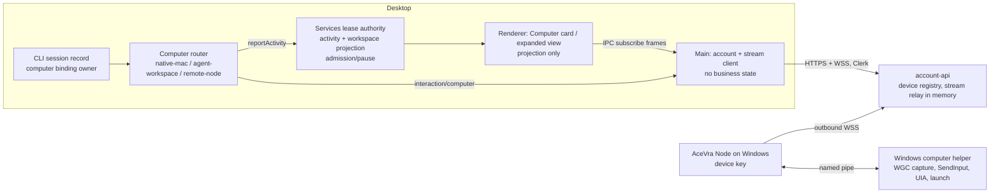
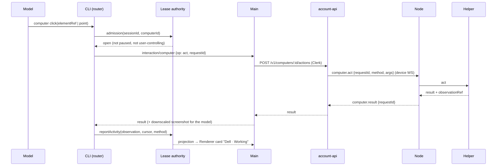
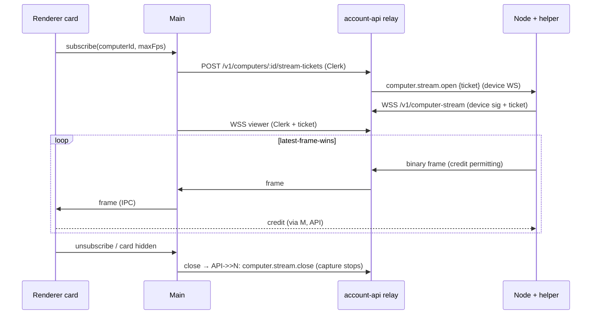
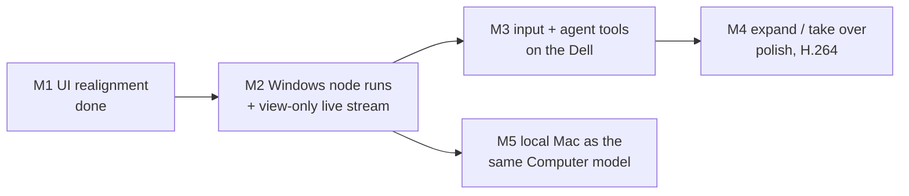

# The agent's own computer — design spec and plan

Status: M1 (UI realignment) implemented with this change; M2–M5 proposed, awaiting user review.
Date: 2026-10-01. Supersedes the user-facing parts of `acevra-execution-ux-m2e.md` (composer
"Run on" control, Devices wording) and the "Run on selection" framing of
`acevra-agent-execution-m2f.md`. Keeps their infrastructure (Task / TaskEvent / ExecutionTarget,
`ExecutionTargets` / `RunOnTarget` / `TargetTask`). Extends `packages/zcode-cua/specs/
computer-workspace.md` (ComputerBackend, AgentWorkspaceBackend, mini Computer).

## 1. Product direction (from the user)

The agent should get a **computer of its own** — screen, apps, browser, files, terminal — like
Grok's and OpenAI's computer agents, not a "run commands on a target" feature. First computer: the
user's **Dell, which runs Windows**, connected as an AceVra Node. In chat the agent simply uses its
computer; the user can watch a **live view**, expand it, **take over**, and stop. There is no
"Run on", "execution", "commands" or "capabilities" wording in normal UX. Settings only manage
**Computers**: connect (pair), rename, remove, online/offline.

## 2. What is proven vs assumed today (source-verified at `612a970`)

| Area                                           | State                                                                                                                                                                                                                                                                                                                                                                                          |
| ---------------------------------------------- | ---------------------------------------------------------------------------------------------------------------------------------------------------------------------------------------------------------------------------------------------------------------------------------------------------------------------------------------------------------------------------------------------- |
| Pairing, device identity, presence, revocation | **Proven** (account E2E F): Ed25519 device key, code pairing, outbound WS `/v1/device-channel`, signed-nonce auth, no bearer/Clerk token on the node, revoke closes the socket (4001) and the node exits.                                                                                                                                                                                      |
| Remote terminal work                           | **Proven** (account E2E G): structured process tasks, streamed TaskEvents, cancel, `running_unknown`, agent `RunOnTarget`.                                                                                                                                                                                                                                                                     |
| Node on Windows                                | **Assumed, not run.** Static analysis: `win32` accepted (`packages/node/src/cli.ts`), PATHEXT resolution and safe batch invocation (`shell/windows.ts`), `taskkill /T /F` tree kill (`shell/kill.ts`), case-insensitive root policy (`shell/policy.ts`), chmod skipped on win32, no native deps. Gaps in §5.1.                                                                                 |
| Graphical computer on a node                   | **Does not exist.** `computerUse` is a legal capability string (`packages/node/src/capabilities.ts`, `account-api/src/devices.ts`) but nothing provides it. No screen capture, input, UI tree or app launch on the node.                                                                                                                                                                       |
| Live frame transport                           | **Does not exist.** The device channel is JSON text only, rejects binary, caps messages at 32 KiB both ways; every TaskEvent is a Postgres row; the desktop polls HTTP (UI 700 ms / 1.5 s). Unsuitable for frames.                                                                                                                                                                             |
| Local Mac agent workspace                      | **Proven, snapshot-driven.** `ComputerUseRuntime.execute` → broker → signed Swift Helper. Mini Computer panel polls the session view every 1 s and fetches one PNG per observation id ("Snapshot, not a stream", `MiniComputerPanel.tsx`). No Take Over control yet.                                                                                                                           |
| `ComputerBackend` abstraction                  | **Exists but is not on the live path.** `packages/zcode-cua/computer-backend.{js,d.ts}` (`perform(method,args,context)` + capabilities incl. unused `frameStream`), `computer-workspace-backend.js`, `createComputerBackendRouter` — instantiated only in tests. The live path calls `ComputerUseRuntime.execute({toolName, arguments, context})` directly, hard-gated to darwin (`index.js`). |
| Model tool surface for Computer                | No first-class tool: the model writes JS in `node_repl` and calls `agent.computerUse["computer.*"]` (names in `capability-contract.js`). Targeting is Mac-specific (`pid`, CGWindow `window_id`, `bundle_id`, `AX*` roles, `option/command`).                                                                                                                                                  |
| Activity labels                                | Product labels exist (`lib/computerActionLabel.ts` → `chat.computerAction.*`, en/zh). **Leak:** the `node_repl` row shows the model-authored cell `title` (e.g. Chinese "点击按钮") for computer calls (`lib/nodeReplToolDisplay.ts`, `renderers/node-repl.tsx`).                                                                                                                              |

Nothing in the UI may imply a graphical remote capability before M2/M3 land.

## 3. Product model

### 3.1 Computers

A **Computer** is a machine the agent can use as its own. Kinds:

- **This Mac** — the local background agent workspace (`agent-workspace` backend). Already exists.
- **Connected computer** — a paired AceVra Node (first: the Dell, Windows).

Computers are managed in Settings → AceVra Account → **Computers** (M1, implemented): name, "This
computer" / "Connected computer" / "AceVra app" (another desktop install), Online / Offline /
Removed, **Connect a computer** (existing pairing: start AceVra Node on the other computer, enter
the code it shows, approve), Rename, Remove (= existing revoke). No capability lists.

### 3.2 Which computer a conversation uses

- **Default: this Mac**, exactly as today (Bash, files, browser, local Computer workspace). No
  selector anywhere in chat. Rendering chat never starts work on any computer.
- **The user asks in words**: "use my Dell", "do this on the Dell". The agent resolves the name
  against the user's computers (today: `ExecutionTargets`; from M3: `Computers` tool) and binds
  the conversation to that computer. Names are never hardcoded.
- The **binding is per conversation**, owned by the CLI session record (today's
  `record.executionTarget`, written only by user-input commands; from M3 also written by the
  agent's `UseComputer` call after the user asked). One active computer per conversation at a
  time; switching back ("do it here") clears it.
- Open question Q6: an optional per-project default computer in project settings.

### 3.3 What chat shows

```text
┌ Dell · Working ──────────────────────── [Expand] [Take over] [Stop] ┐
│ ▣ live thumbnail (2–5 fps)   "Opening Notepad"  (AceVra-owned label)  │
└──────────────────────────────────────────────────────────────────────┘
```

- One **Computer card** per conversation, docked above the composer (same slot as today's mini
  Computer panel). Title: `<computer name> · <status>`; status words: Working, Waiting, Needs you,
  You're in control, Done, Stopped, Offline, Connection lost.
- **Expand**: large live view of the same stream (10–15 fps), not a second session.
- **Take over**: explicit user click; the agent pauses (admission closed), the user's
  mouse/keyboard in the expanded view drive the computer; the remote screen shows a banner "You're
  controlling this PC from AceVra". **Give back** resumes the agent. Physical input on the remote
  computer itself always wins (agent yields, never reclaims automatically — same rule as macOS).
- **Stop**: stops the turn and cancels the computer's in-flight work and terminal tasks.
- Hiding the card never stops the agent; a compact "Dell · Working · Show" affordance remains.
- Terminal work on a connected computer keeps showing as a compact work card ("Dell · Working",
  latest output lines, Stop) — M1 wording, see §8.
- **Offline**: card shows "Dell · Offline"; agent calls fail truthfully (`computer_offline`);
  the agent tells the user; **never** silently falls back to this Mac. On reconnect the next
  action proceeds; an action in flight at disconnect reports "unknown outcome" and the agent
  re-observes before acting again.

### 3.4 Wording

| Use                                         | Never in normal UX                                                    |
| ------------------------------------------- | --------------------------------------------------------------------- |
| Computer, This computer, Connected computer | Device, Node, Target, Run on, Execution, Commands, Capabilities, Task |
| Connect a computer, Remove                  | Pair a node, Revoke                                                   |
| Dell · Working / Done / Stopped             | Task running / exit code / Tool callRunning                           |

Engineering surfaces (gated `ACEVRA_ENGINEERING_TOOLS`, never in installed builds) may keep
technical words.

## 4. Abstraction: one agent-computer model for Mac and Node

Reuse `packages/zcode-cua` `ComputerBackend` — do not create a parallel stack.

### 4.1 Seam

The live seam is `ComputerUseRuntime.execute({toolName, arguments, context})`, called by both
`node_repl` entry points through the proxy broker (`node-repl-cua-bridge.js`). Plan:

1. Put the existing `createComputerBackendRouter` on the live path: backends `native-mac`
   (wraps today's `execute`, keeps the darwin gate inside), `agent-workspace` (today), and new
   **`remote-node`**.
2. Route by a new `context.computerId` (added to the bridge `requestContext` / `parseContext`),
   resolved from the conversation's computer binding. Absent = this Mac (today's behaviour).
3. `RemoteNodeComputerBackend.perform(method, args, ctx)` sends a reverse request
   `interaction/computer {op: act|observe|list, sessionId, computerId, method, args}` (same
   pattern as `interaction/executionTarget`) → services → host → Main → account-api → node →
   Windows helper. It reports activity through the **same** `reportActivity` sideband
   (`observation`, `workspaceCursor`, action) so the lease authority's workspace projection,
   session view and Computer card are reused.

### 4.2 Provider-neutral types (new, `packages/shared/src/agent-computer.ts`, zod-validated)

```ts
type ComputerKind = "thisMac" | "node";
interface ComputerRef {
  computerId: string;
  kind: ComputerKind;
  displayName: string;
  platform: "darwin" | "win32" | "linux";
}
interface ComputerSurface {
  computerId: string;
  surfaceId: string /* workspace / desktop / window */;
  windowId?: string;
}
interface ComputerFrame {
  sourceId: string; // backend instance (e.g. "remote-node:<deviceId>", "agent-workspace")
  computerId: string;
  surfaceId: string;
  frameId: string;
  seq: number;
  capturedAt: string;
  width: number;
  height: number;
  scale: number;
  encoding: "png" | "jpeg" | "h264";
  keyframe: boolean;
  cursor?: { x: number; y: number; visible: boolean }; // agent's logical cursor
}
type ComputerActivityState =
  | "idle"
  | "working"
  | "waiting"
  | "needsUser"
  | "userControlling"
  | "offline"
  | "connectionLost"
  | "stopped";
interface ComputerActivity {
  computerId: string;
  state: ComputerActivityState;
  actionMethod?: string;
  at: string;
}
```

- `WorkspaceFrame` / `WorkspaceCursor` / `WorkspaceTarget` in
  `computer-workspace-projection.d.ts` become thin adapters of these (Mac `pid`/`window_id` move
  into an opaque `surfaceId`).
- **ComputerFrameStream** = a subscription `subscribe(computerId, surfaceId, {maxFps, maxWidth})
→ AsyncIterable<ComputerFrame + bytes>` with latest-frame-wins semantics. Consumers: Computer
  card (PiP), expanded view, future web/mobile clients. Local Mac implementation: today's
  observation frames (snapshot rate) behind the same interface; later a ScreenCaptureKit stream.
  Remote implementation: §6.
- UI gating changes from `backendId === "agent-workspace"` to "this session has a computer with
  frames".

### 4.3 Owners and event order



| Fact                                       | Single owner                                          |
| ------------------------------------------ | ----------------------------------------------------- |
| Conversation ↔ computer binding            | CLI session record                                    |
| Agent activity, pause/admission, take-over | Services lease authority (extended with `computerId`) |
| Device identity, presence, revocation      | account-api device registry                           |
| Live frames                                | The node's helper (source); never persisted anywhere  |
| Hide/expand                                | Renderer presentation store (never touches execution) |

Action event order (remote):



Idempotency: `requestId` per action; the node de-duplicates a replayed `requestId` and never
re-executes it; a result arriving after the turn was stopped is dropped (stale). Disconnect while
an action is in flight → `outcome_unknown`, never retried automatically.

## 5. Windows computer on the Node

### 5.1 Node runtime on Windows (gaps to close in M2)

| Gap                                                                                           | Fix                                                                                                     |
| --------------------------------------------------------------------------------------------- | ------------------------------------------------------------------------------------------------------- |
| No installable build: `bin/acevra.mjs` runs TS through `tsx`, needs the repo + Node 24 + pnpm | Bundle (esbuild) + Node single-executable or bundled `node.exe`; MSI/MSIX installer                     |
| No startup integration                                                                        | Per-user Scheduled Task "at logon" (runs in the interactive session, see §5.3); not a Session-0 service |
| `SIGTERM` is never delivered on Windows; no `SIGBREAK` handler; children not in a Job Object  | Handle `SIGBREAK` + a stop pipe; put children in a kill-on-close Job Object                             |
| Data root `%USERPROFILE%\.acevra-node`, `key.pem` inherits profile ACL                        | Move to `%LOCALAPPDATA%\AceVra\Node`; set an owner-only ACL on the key                                  |
| Tests never run on Windows                                                                    | Add a Windows CI job for `packages/node` tests                                                          |

### 5.2 Computer helper (new, Windows)

A small signed helper process `acevra-computer-helper.exe`, spawned by the node inside the
interactive user session, talking over a per-session named pipe (JSON control + binary frames).
Recommended language: **Rust** (`windows` crate: Graphics Capture, Direct3D11, Media Foundation,
UI Automation, SendInput; static binary, no runtime, crash-isolated from the node). Alternative:
C# .NET 8 NativeAOT (faster UIA development, larger binary). Not a Node native addon (ABI
rebuilds per Node version, harder signing, a crash takes the node down).

| Capability     | Windows API                                                                                                                                                                                                                              |
| -------------- | ---------------------------------------------------------------------------------------------------------------------------------------------------------------------------------------------------------------------------------------- |
| Screen frames  | **Windows.Graphics.Capture** (Win10 1903+; per-monitor or per-window; Win11 can hide the yellow border) ; **DXGI Desktop Duplication** fallback; JPEG via WIC (v1), H.264 via Media Foundation HW encoder (v2)                           |
| Input          | `SendInput` (pointer, keyboard, wheel). UIPI blocks input into elevated windows unless the helper is `uiAccess` (signed + installed under Program Files). Secure desktop (UAC, lock screen, Ctrl+Alt+Del) cannot be driven → `needsUser` |
| Semantic UI    | **UI Automation** tree → neutral roles (`button`, `textField`, …), opaque element refs, Invoke/Value/Toggle patterns (works without moving the cursor)                                                                                   |
| Apps/windows   | Enumerate top-level windows, launch via `ShellExecuteEx`, focus via UIA/`SetForegroundWindow` rules                                                                                                                                      |
| Files/terminal | Existing node shell service (`RunOnTarget`) — unchanged                                                                                                                                                                                  |

Zero-capture invariant (same as macOS): the helper captures only while a viewer is subscribed or
the agent requested an observation.

### 5.3 Session 0 and "the agent's own desktop" — feasibility verdict

A Windows **service runs in Session 0** and cannot capture or inject into a user's desktop, so the
helper must run inside an interactive session. Options:

| Option                                                               | Own desktop?                                    | Feasibility                                                                                                                                                                                                                                                |
| -------------------------------------------------------------------- | ----------------------------------------------- | ---------------------------------------------------------------------------------------------------------------------------------------------------------------------------------------------------------------------------------------------------------- |
| A. Run in whoever is logged in at the console (logon task)           | No — shares the human's desktop                 | **Simplest, works on any edition.** Fine when the Dell is mostly unattended; physical input on the Dell makes the agent yield.                                                                                                                             |
| B. Dedicated local user "AceVra Agent" with autologon to the console | Yes, while no human uses the console            | **Viable v1 for a dedicated server.** Autologon stores a password (LSA secret); a human logging in at the console replaces the session.                                                                                                                    |
| C. Agent user in its own **RDP session** concurrent with the human   | Yes, truly concurrent                           | **Windows Server only** (2 admin sessions without RDS CALs). Windows 10/11 Pro allow one interactive session and block RDP loopback. Capture in a _disconnected_ RDP session is not proven (DXGI fails without a display; WGC unverified) — needs a spike. |
| D. Virtual monitor (IddCx indirect display driver)                   | Partially — separate screen, shared input/focus | Needs a signed driver; keyboard focus is still session-global (same "focus war" as macOS). Not v1.                                                                                                                                                         |
| E. Hyper-V / Windows Sandbox VM                                      | Yes, fully isolated                             | Heavy; Pro+; separate install and lifecycle. Future option.                                                                                                                                                                                                |

**Verdict:** a truly separate agent desktop _concurrent_ with a human on the same Windows PC is
only realistic on **Windows Server (option C, unproven capture-while-disconnected)** or in a VM.
The **simplest viable v1 is B (dedicated agent user, autologon) if the Dell is a dedicated
machine, otherwise A** with a visible "AceVra is using this PC" banner and yield-to-human. This
depends on Q1 (Dell's Windows edition and whether someone uses it at the console).

### 5.4 Packaging and signing

- Authenticode certificate (OV or EV) for the node installer and helper, otherwise SmartScreen
  warnings and no `uiAccess`. Q3.
- Installer: per-user MSI/MSIX; installs node + helper under Program Files (required for
  `uiAccess`), creates the logon task; uninstall removes the task and the data root on request.
- Updates: signed manifest, same channel as the desktop alpha (later).

## 6. Transport

- **Control** (actions, results, element trees, model screenshots): new `computer.*`
  request/response family. Small messages ride the existing device channel; model screenshots
  (100–400 KB) do not fit the 32 KiB cap, so they go over the media channel below as a one-shot
  frame referenced by `observationId`.
- **Live frames**: a separate **media WebSocket**, outbound from the node
  (`wss://…/v1/computer-stream`), authenticated by the device key plus a short-lived stream
  ticket minted by account-api for `(accountId, deviceId, sessionId, viewerId)`. The desktop Main
  opens the matching viewer socket with its Clerk session. account-api relays **binary frames in
  memory** (no Postgres, no disk), latest-frame-wins per viewer.
- **Encoding**: v1 JPEG frames (≤1280 px wide, q≈60, ~60–120 KB) at adaptive 2–5 fps for the card
  and 8–10 fps expanded (~0.5–1 MB/s). v2 H.264 (hardware encode on Windows, WebCodecs decode in
  the renderer) at 10–15 fps ≈ 1–2 Mbit/s.
- **Latency targets**: card ≤1 s glass-to-glass; expanded/take-over input-to-photon ≤300 ms in the
  same region.
- **Backpressure**: credit-based — at most 2 frames in flight per viewer; the node captures the
  next frame only on credit; nobody watching and no pending observation → no capture.
- **WebRTC** (P2P with TURN) is the long-term low-latency path but adds signalling/TURN
  infrastructure; deferred (Q7). Multi-instance account-api needs sticky routing of a node's
  stream (today `live` sockets are per process).
- **Security**:
  - No inbound ports on the node; no human Clerk token on the node; device auth only.
  - Removing (revoking) a computer closes its control and media sockets (extend `closeDevice`)
    and the helper exits; tickets are invalidated.
  - Take-over input is accepted by the node only during an explicit, user-initiated grant scoped
    to `(sessionId, viewerId)`, shown on the remote screen, revocable from either side.
  - Frames are never stored server-side; model screenshots live in the desktop's confined
    observation directory like macOS frames.
  - Agent actions on a remote computer go through the same approval policy as local Computer
    actions (Q8 for the default).



## 7. Agent tools

- **One method vocabulary for every computer**, generalized from `capability-contract.js`:
  `observe` (screenshot + element tree), `click` (point | elementRef), `type_text`, `key_press`
  (neutral keys; modifiers `shift|ctrl|alt|meta`), `scroll`, `drag`, `list_apps`, `list_windows`,
  `launch_app`, `press` / `set_value` (elementRef). The Mac backend maps these to existing Helper
  methods; the Windows helper maps them to SendInput/UIA. Platform-specific detail stays inside
  backends (opaque refs, no `AX*` roles or `pid` in the schema).
- **Surface:** recommended a first-class `Computer` tool (JSON schema, provider computer-use
  shape) backed by the same router, with `agent.computerUse` kept for existing `node_repl` code.
  Alternative: only extend the `node_repl` facade with `computerId`. Q5.
- **Selection tools:** `Computers` (list; replaces the model-facing name of `ExecutionTargets`)
  and `UseComputer {computerId | "this"}` to bind the conversation after the user asked.
- **Deterministic labels:** card captions and transcript rows for computer actions come only from
  `computerActionLabel` → `chat.computerAction.*` (en/zh), optionally "… on {computer}". For
  `node_repl` cells that call computer methods, the row shows the product label, not the
  model-authored cell `title` (fixes the Chinese title leak). Labels never come from the model.

## 8. What happens to Run on / ExecutionTargets / RunOnTarget (M1, implemented)

- The composer **Run on control and its caption are removed**, with its dead UI code
  (`V4ComposerRunOnControl`, selection state in `executionTargetStore`, target-option
  presentation helpers). Task attachment per conversation stays.
- **Default target with no selector:** user turns always send `executionTarget: {kind:
"automatic"}` (local workspaces with an account bridge), so Bash and every other tool run on this
  Mac exactly as before. The CLI session record stays the single owner of the binding; declaring
  `automatic` each turn guarantees no remote binding is left behind that the UI could not undo.
  The wire `target` variant stays for the future conversation-computer binding (§3.2).
- **Remote terminal work only when asked:** `ExecutionTargets`, `RunOnTarget`, `TargetTask` stay
  registered (Desktop + local workspace), so "use my Dell to run the tests" keeps working until the
  computer milestones land. Their descriptions no longer mention a UI "Run on" selection and say
  to use them only when the user asked to work on another of their computers; the
  `not_signed_in` message no longer suggests switching Run on. The provider-only context block
  (only emitted when a session is bound) is reworded as "this conversation is set to use another
  computer" (`source="conversation-computer"`).
- **Settings → Computers** replaces Devices (en/zh): This computer / Connected computer / AceVra
  app, Online / Offline / Removed, Connect a computer (with a one-line how-to), Rename, Remove.
- **Work cards** keep the TaskView/TaskEvent projection with plain words: `Dell · Working`,
  Waiting, Starting, Connection lost, Stopping, Done, Couldn't finish (`code N`), Stopped.
- **Bug fix:** the generic tool row read "Tool callRunning": two adjacent plain strings in a flex
  container merge into one anonymous flex item, so `gap-2` never applied. Strings are now wrapped
  in their own spans (`QueuedSummaryContent.tsx`).
- The engineering runner (gated, never in installed builds) defaults to this computer.

Later (M3) `RunOnTarget` becomes the terminal capability of a bound Computer; `ExecutionTargets`
is presented to the model as `Computers`.

## 9. Milestones (dependency order)



**M1 — UI realignment (this change).** Acceptance: no Run-on control or execution wording in the
composer with or without a connected computer; Settings shows Computers with connect/rename/
remove and online/offline; agent "use my Dell" still runs a terminal command on the node with a
`Dell · Working` → `Done` card and working Stop; offline fails truthfully with nothing run locally;
generic tool row shows "Tool call" and "Running" separately. Tests: UI unit tests
(`executionTargetStore`, `submissionExecutionTarget`, `executionTaskCard`, `toolSummaryContent`,
`executionPresentation`, `agentTaskAttachBridge`), CLI `execution-target-tools`, account E2E A/F/G.

**M2 — Windows node runs + view-only live stream.** Node Windows fixes (§5.1); Rust helper
skeleton with WGC capture + JPEG; `computerView` capability advertised only when the helper is
running in an interactive session; media relay in account-api; Main stream client; Computer card
in chat showing the Dell screen when the conversation is bound ("show me my Dell"). Acceptance:
pair the Dell on Windows 11; card shows its screen at ≥2 fps; no capture when nobody watches
(helper capture counter stays flat); Remove closes the stream within 5 s; Session-0 install is
refused with a clear message. Tests: node unit tests on Windows CI, helper integration test
(capture one frame), account-api relay tests (ticket scope, no persistence, revocation), desktop
E2E with a fake node frame source.

**M3 — Input + agent tools on the Dell.** SendInput, UIA tree + element refs, launch/list;
`computer.*` control family; `Computers` / `UseComputer` / `Computer` tools; router on the live
path; activity labels; offline/`outcome_unknown` semantics. Acceptance: "Use my Dell to open
Notepad and type hello" completes with the card "Dell · Working" and product labels (en/zh, no
model titles); Stop cancels mid-action; offline → truthful failure, nothing on this Mac; another
conversation never sees Dell frames. Tests: router contract tests (no classification downgrade,
fencing), helper tests per method, CLI tool tests, E2E with a scripted model against a fake helper,
manual live acceptance on the real Dell.

**M4 — Expand / take over / polish.** Expanded view, take-over grant + remote banner, give back,
physical-input yield on Windows, H.264 + WebCodecs, reconnect UX. Acceptance: take over → agent
paused, user's clicks land on the Dell, give back resumes; Dell physical mouse → agent yields;
latency targets met on LAN.

**M5 — Local Mac as the same model.** The mini Computer panel becomes the Computer card fed by
the same `ComputerFrameStream` (snapshot adapter first, ScreenCaptureKit stream later); "This
Mac" appears as a computer the agent can bind; Take Over for the Mac workspace. Acceptance: the
same card, controls and labels for Mac and Dell; zero-steal matrix stays green.

## 10. Open questions for the user (decision-ready)

1. **Dell's Windows edition** (10/11 Pro vs Windows Server) and **does anyone use it at the
   console?** Decides own-desktop option B (dedicated autologon user) vs A (shared) vs C (Server
   RDP session).
2. OK to create a **dedicated Windows user "AceVra Agent" with autologon** on the Dell (password
   stored by Windows as an LSA secret)?
3. **Code-signing certificate** for Windows (OV ≈ cheaper, EV avoids SmartScreen ramp-up) — buy
   now for M2?
4. Helper language: **Rust (recommended)** or C# .NET AOT?
5. Model tool surface: **first-class `Computer` tool (recommended)** or only the `node_repl`
   `agent.computerUse` facade?
6. Per-project **default computer** setting, or always "ask in words"?
7. Frames **relayed through account-api** (simple, costs server bandwidth ~0.5–2 Mbit/s per
   viewer) for v1, WebRTC later — agree?
8. Approvals on the remote computer: **per-session grant on first use (recommended)** or per
   action?

## 11. Risks

- Capture in a disconnected RDP session and WGC on Server editions are unproven (spike in M2).
- UIPI/secure desktop limit what the agent can do without `uiAccess`; some apps expose poor UIA.
- account-api single-process stream relay does not scale horizontally without sticky routing.
- Bandwidth cost of relayed JPEG until H.264/WebRTC.
- The node has never run on real Windows; M2 starts with that proof before any helper work.
