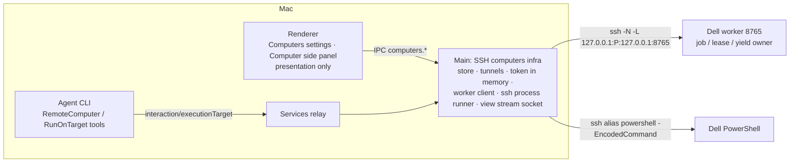
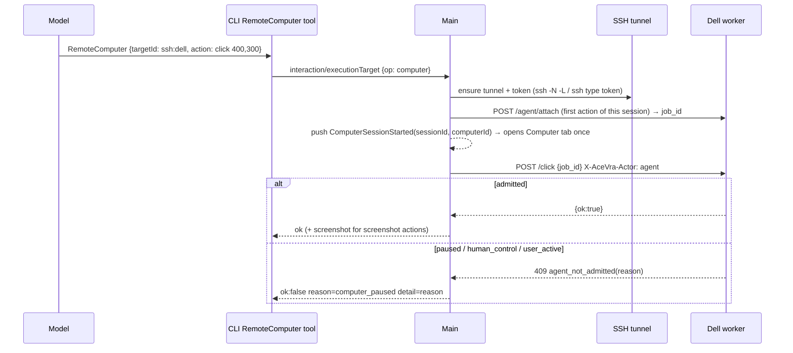
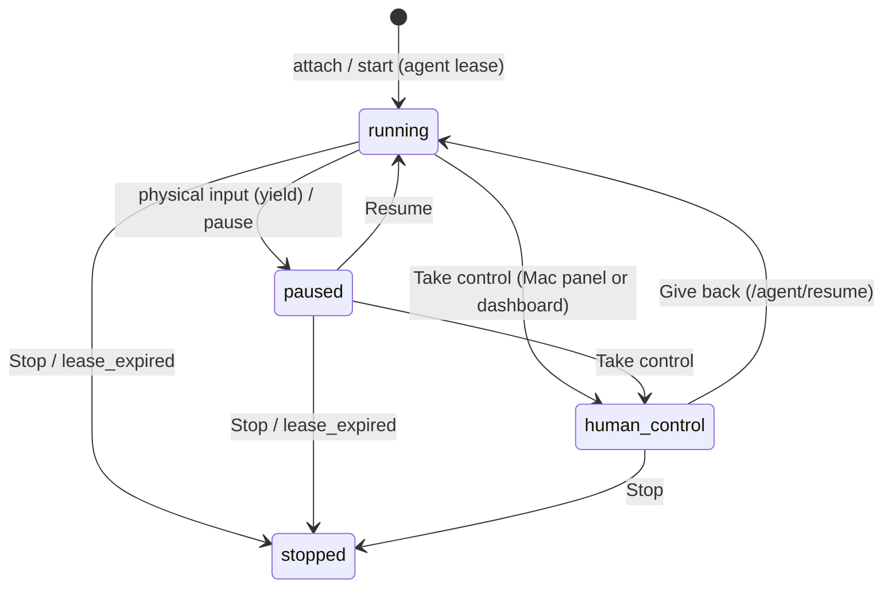
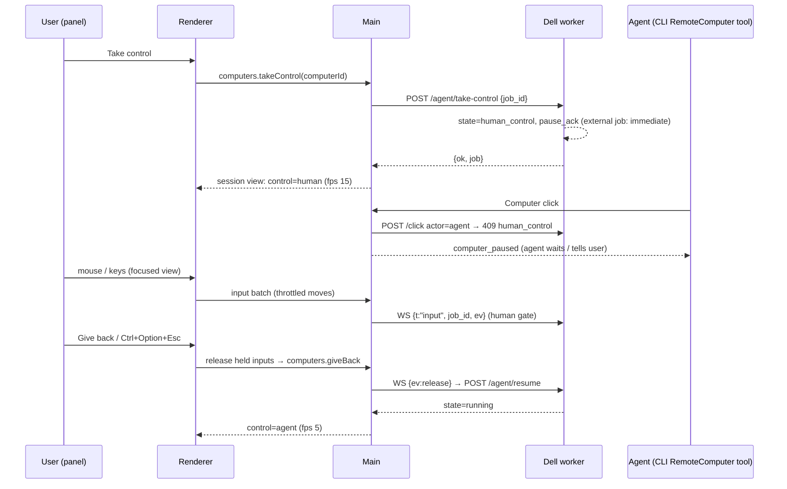
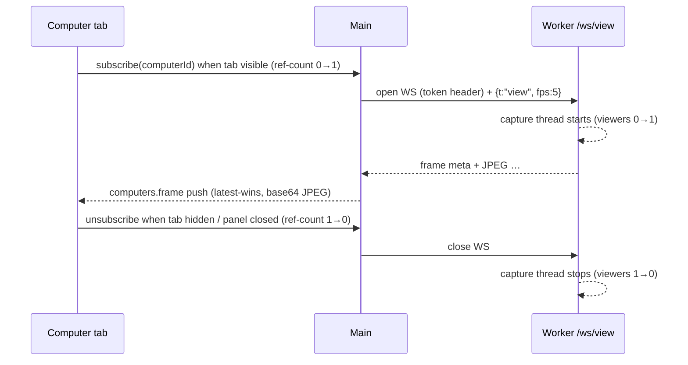

# The agent's own computer — spec and plan (v2: SSH computers)

Status: M1 (UI realignment) implemented in `a59fdba`. **v2 (this revision)** replaces the M2–M5
plan of revision 1 after inspecting the Dell. Date: 2026-10-01.

Superseded from revision 1 (kept only as history in git `263e502`): the Rust/C# Windows computer
helper, running `packages/node` on Windows for GUI work, the account-api media relay, and
WebRTC. The Dell **already runs its own AceVra computer-use worker**; the Mac app reuses it.

Still valid from revision 1: product model (§3), wording, "never silently fall back to this Mac",
deterministic AceVra-owned labels, and the M1 changes (§9).

## 1. Product direction

The agent gets a computer of its own — screen, apps, browser, files, terminal. Computers are a
**list**: This Mac (the existing local Computer Use, unchanged), the paired AceVra Nodes (unchanged),
and **SSH computers** — a machine running the AceVra worker that this Mac reaches over the user's
own SSH (first: the Dell). More SSH computers (another server, a bigger machine) are added the same
way. In chat the agent uses its computer; the user watches a live view, expands it, takes over,
gives back, and stops. No approval prompt is needed to use the user's own computers; the worker's
existing foreground policy (allow / ask / deny, fail-closed) still protects unsafe actions on the
Dell.

## 2. Verified facts (Dell, read-only inspection 2026-10-01)

| Fact                                                                                                                              | Consequence                                                                      |
| --------------------------------------------------------------------------------------------------------------------------------- | -------------------------------------------------------------------------------- |
| `ssh dell-node` works from the Mac (Tailscale, key auth, admin). SSH lands in Session 0                                           | SSH is only a transport; GUI work must happen in the worker running in Session 1 |
| Windows 11 Pro Education 26200, AutoAdminLogon, user `notfe` in console Session 1, 1366×768                                       | The agent shares `notfe`'s desktop; the user sometimes uses it in person         |
| `C:\agent\worker.py` (FastAPI) on `127.0.0.1:8765`, started at logon by task `AceVraWorkerInteractive`                            | The worker is the computer; only loopback; reached through an SSH tunnel         |
| Duplicate worker on 8766 (manual start, no supervision), both share `agent-control.json`                                          | Collapse to one authoritative worker on 8765                                     |
| Pixel routes require dashboard manual control; `CurrentBackend` posts without `job_id` → every agent pixel action 409s since 9/27 | Root cause of the Minecraft control failures; fix with an agent lease (§4.3)     |
| `/hold` is not gated                                                                                                              | Gate it like every other input route                                             |
| No auth on any route; no streaming; uvicorn output not logged; no watchdog; battery stop on the logon task                        | Token auth, MJPEG stream, rotating log, supervisor, battery-safe task            |
| Cua Driver 0.29.1 (`cua-driver serve` on `\\.\pipe\cua-driver`); Hybrid backend routes AX windows to Cua                          | Unchanged; `/health` reports the pipe                                            |

## 3. Product model

### 3.1 Computers list

| Kind                      | Where it runs                                    | GUI             | Terminal                  |
| ------------------------- | ------------------------------------------------ | --------------- | ------------------------- |
| This Mac                  | local Computer Use (`packages/zcode-cua`)        | unchanged       | Bash (unchanged)          |
| Connected computer (Node) | paired AceVra Node via account-api               | none            | `RunOnTarget` (unchanged) |
| **SSH computer** (new)    | AceVra worker on the remote host, via SSH tunnel | worker HTTP API | `ssh <alias>` PowerShell  |

Settings → Computers lists all three. **Add a computer** (SSH): enter the SSH host alias from
`~/.ssh/config` (e.g. `dell-node`), a name ("Dell"), and the worker port (default 8765). **Test
connection** opens the tunnel, fetches the worker token over SSH, and calls `/health`; only a
passing test can be saved. Rows show name, "SSH computer", Online / Offline, Rename, Remove.
Config (id, name, host alias, port) is stored locally; the token is never stored on the Mac's disk
— it is fetched over SSH on each connect and kept in Main's memory.

### 3.2 How a conversation uses a computer

- Default: this Mac (unchanged). The UI declares `automatic` every turn (M1).
- "Use my Dell …": the agent calls `ExecutionTargets` (now also lists SSH computers with
  capabilities `computerUse` + `shell`), then:
  - GUI → the **`RemoteComputer`** tool with that `targetId` (screenshot, click, double_click, move,
    drag, scroll, type, key ≤ 4 keys). Screenshots come back as images. The tool prompt forbids
    casually dismissing destructive dialogs (unsaved-document safety, §3.4).
  - Terminal → `RunOnTarget` with that `targetId`; the process runs through `ssh <alias>` in
    PowerShell, streams into the existing work card, and Stop kills it.
- The local Computer Use SDK (`agent.computerUse` in `node_repl`) is **not** routed: its contract is
  macOS-semantic (AX `semantic_ref`, `state_id`, Helper leases) and the user requires the Mac path
  to stay unchanged. Both surfaces share the `ComputerBackend` vocabulary in `packages/zcode-cua`
  (`remote-worker-backend.js` maps the worker API); the router is "which target the tool names".
- Offline / tunnel down / worker down → the tool fails with `target_unavailable` /
  `computer_offline`; nothing runs on this Mac.

### 3.3 Chat surface — the Computer side panel

No above-composer card for computers (terminal task cards stay as they are). The computer lives in
the existing toggled right side pane as **one more tab type**, `computer`, registered exactly like
Terminal and Browser (side-pane tab model, "Open tab" launcher entry **Computer** next to Review /
Terminal / Browser, tab trigger icon + title, persistence, i18n). It is opened from that launcher, or
automatically (once per conversation, when that conversation is on screen) on the first
`RemoteComputer` action on an SSH computer. With several computers and no choice yet, the tab shows
a picker; with exactly one it selects it. No new layout framework, no agent identity header, no extra tabs.

```text
┌ Review │ Browser │ Computer ×                              ┐
│ Dell · Working                     [Take control] [⤢] [■]  │
│ ┌─────────────────────────────────────────────────────────┐ │
│ │ live screen (letterboxed, remote cursor drawn)          │ │
│ └─────────────────────────────────────────────────────────┘ │
│ Typing text                                                 │
└─────────────────────────────────────────────────────────────┘
```

- Status line (i18n, AceVra-owned): `Working`, `Idle`, `Offline`, `Connecting`, `You're in
control`, `You're using the Dell — agent paused` (+ **Resume**), `Paused`.
- Activity line: `computers.activity.<action>` keyed by the last agent action; never model text.
- **Live screen** streams only while the Computer tab is the active tab of a visible side pane.
  Hidden → the renderer unsubscribes → Main closes the stream → the worker's capture thread stops
  when it has no viewers.
- **Expand (⤢)** reuses the pane's own sizing: it resizes the existing side-pane panel to its
  maximum width (the pane's `maxSize`) and remembers the previous width; **Collapse (⤡)** restores
  it. No new window or overlay. The local floating mini Computer for This Mac is untouched;
  unifying This Mac into this tab is M4.
- **Take control** (AnyDesk-like): worker `/agent/take-control` (agent paused, acknowledged), then
  mouse move/down/up/double-click/drag/scroll and key down/up/text from the focused view are sent
  as human input over the stream socket. **Give back** or the `Ctrl+Option+Esc` chord →
  `/agent/resume`. Keys are captured only while the view is focused and in control; captured keys
  call `preventDefault` + `stopPropagation` so AceVra shortcuts never fire.
- **Keyboard capture has two layers** (the renderer DOM capture listener cannot stop Electron
  native menu accelerators such as Cmd+Q / Cmd+W):
  1. While the view is focused and in control, the renderer tells Main
     (`acevra-computers:key-capture {active}`); Main installs `before-input-event` on that
     `webContents`, `preventDefault`s **every** key event, and forwards a plain
     `{type, key, code, modifiers}` object back over `acevra-computers:captured-key`. The renderer
     feeds that object into the same `mapKeyEvent` → `sendInput` path (single mapping owner); the
     DOM listener no longer sees prevented events, so nothing is sent twice.
  2. The give-back chord `Ctrl+Option+Esc` never contains Cmd, stays renderer-handled, and is
     never forwarded — the local escape hatch in both layers.
  Known platform limits (documented, not hackable): macOS system shortcuts (Cmd+Tab, Cmd+Space,
  Mission Control) are not interceptable; `before-input-event` cannot see events consumed by the
  system. `Ctrl+Alt+Del` is not supported.
- **Punctuation key names**: chorded punctuation (e.g. `Ctrl+Shift+;`) maps `event.code` to its
  character (`;`, `/`, `[`, …). The renderer allowlist and the relay `sanitizeInputEvent` accept the
  same explicit safe punctuation set (single printable ASCII symbols only — pyautogui accepts
  single-character names); modifier state travels as separate keydown/keyup events.
- Take control with no active job (computer idle) first attaches an external job owned by the
  panel (`controller: "acevra-mac:panel"`) so the worker's human gate has a job; Give back then
  stops that job instead of resuming. While it exists, agent attaches get `computer_busy`.
- **Physical input on the Dell** → the worker pauses the job (yield) and the panel shows "You're
  using the Dell — agent paused" with **Resume**; never reclaimed automatically.
- **Stop (■)** → worker `/agent/stop` and cancel of the conversation's SSH terminal tasks.

Input mapping (pure functions, unit-tested):

- Coordinates: the frame is drawn with `object-fit: contain`; a pointer at view `(vx, vy)` maps to
  `scale = min(viewW / remoteW, viewH / remoteH)`, `offX = (viewW − remoteW·scale)/2`, `x =
round((vx − offX)/scale)`; points in the letterbox bars are dropped (no clamp-to-edge clicks).
- Mouse move throttled to ≤ 40 Hz (latest-wins); buttons/keys never dropped.
- Modifiers (Mac → Windows, documented in Settings help): `Cmd → ctrl`, `Option → alt`, `Control →
ctrl`, `Shift → shift`. Printable characters without Cmd/Control/Option → `text`; everything else
  → `keydown`/`keyup` with pyautogui names (`enter`, `backspace`, `tab`, `esc`, arrows, `f1`…,
  `delete`, `home`, `end`, `pageup`, `pagedown`). On blur / give back all held keys and buttons are
  released. Ctrl+Alt+Del is not supported.
- Frame rate: 5 fps / ≤ 960 px while watching; 15 fps / ≤ 1366 px while in control.

### 3.4 Unsaved-document safety (narrow)

The agent operates a machine with the user's real sessions (Windows restores Notepad tabs with
unsaved buffers). Rules for the `RemoteComputer` tool prompt and the agent:

- Never casually dismiss destructive dialogs (Save / Don't save / Discard / Replace). When the
  post-action screenshot shows an unsaved-changes prompt for a document the agent did not create
  this turn: stop and ask the user, or pick the non-destructive option. Never choose Don't save
  merely as cleanup.
- Type only into a fresh, known-empty document the agent created this turn (Ctrl+N / new tab;
  verify an empty buffer before typing).
- Never send Ctrl+A / Delete / Alt+F4 without a fresh (§4.5.1 converged) post-action screenshot.

## 4. Worker HTTP contract v2 (the Dell side)

Single worker: `127.0.0.1:8765`. All JSON. Version string `2.0.0`.

### 4.1 Auth

- Token: 64 hex chars in `C:\ProgramData\AceVra\worker-token.txt`, ACL `notfe`, `Administrators`,
  `SYSTEM` only (inheritance off). Created by the supervisor if missing; never logged.
- Every route requires `X-AceVra-Token: <token>` **except** `GET /health` and the dashboard landing.
- Dashboard: `GET /dashboard/login?token=…` sets cookie `acevra_worker` (HttpOnly,
  SameSite=Strict, Path=/) and redirects to `/dashboard`; the cookie is accepted like the header.
  `C:\agent\open-dashboard.cmd` opens that URL locally. `/dashboard` without auth shows a locked
  page.
- `Host` must be `127.0.0.1:<port>` or `localhost:<port>` (DNS-rebinding guard) → else 400.
- Failures: `401 {"detail":{"code":"auth_required"}}`.
- Dell-side clients (`agent.py` → `acevra_backend.CurrentBackend`, `computer.py`) send the token
  from env `DELL_WORKER_TOKEN` (set by the worker for its children) or the file.

### 4.2 Actor-aware input gate

All input routes (`/move /click /doubleclick /drag /scroll /type /key /keydown /keyup /hotkey /look
/mousedown /mouseup /hold`) take `job_id` and header `X-AceVra-Actor: agent|human` (default
`human` — the dashboard).

| Actor   | Admitted when                                                                                     |
| ------- | ------------------------------------------------------------------------------------------------- |
| `human` | unchanged: active job, matching `job_id`, `state == human_control`, `pause_ack`, `manual_control` |
| `agent` | active job, matching `job_id`, `state == running`, no yield                                       |

Refusal: `409 {"detail":{"code":"agent_not_admitted"|"manual_control_inactive","reason":"no_active_job"|"stale_job_id"|"paused"|"human_control"|"user_active"|…}}`.
Every admitted agent input renews an external job's lease.

### 4.3 Jobs

- Existing `/agent/start|cli-start` (worker spawns `agent.py`) unchanged, plus the child gets
  `DELL_WORKER_TOKEN` and `CurrentBackend` sends `job_id` + `X-AceVra-Actor: agent` (409 fix).
- **External jobs** (an outside brain, e.g. the Mac agent): `POST /agent/attach {task, controller}`
  → `{ok, job}`; `job.mode = "external"`, no child process. Refused (`ok:false`) while another job
  is active. `POST /agent/heartbeat {job_id}` renews; lease TTL 120 s; lapse → `stopped`,
  `stop_reason: "lease_expired"`.
- `/agent/pause|resume|take-control|stop` work for both; for external jobs pause is acknowledged
  immediately (no child to acknowledge).
- `GET /agent/job` adds `mode`, `controller`, `lease_expires_at`, `yield`, `stop_reason`.

### 4.4 Physical-input yield

A low-level keyboard + mouse hook thread in the worker (Session 1) records **non-injected** input
(`LLKHF_INJECTED` / `LLMHF_INJECTED` clear). If a job is `running`, the worker pauses it:
`state = paused`, `pause_ack = true`, `yield = {reason: "physical_input", input, at}`; for `agent.py`
jobs the control file is set to `paused` too. Mouse moves within 750 ms after agent input are
ignored. `/agent/resume` clears the yield. Human control (`human_control`) never yields.

### 4.5 Frames — ComputerFrameStream (v2.2)

One capture source, two consumers with different semantics:

```text
capture source (Dell: WGC, fallback mss BitBlt)
    ├── human watch stream  → /ws/view → Computer pane   (continuous, latest-frame, lossy)
    └── agent observation   → GET /screen (PNG)          (sampled, converged, never dropped)
```

The contract is source-independent: any producer (Dell worker, future local Mac
ScreenCaptureKit workspace backend, future cloud VM) that emits `ComputerFrame`s plus
`ComputerCursor` events over the same message shapes can drive the same Computer pane. The
renderer never assumes the Dell.

- **Capture source (Dell)**: Windows Graphics Capture (`windows-capture`) is primary — measured
  GDI BitBlt (mss) costs ≈ 180–350 ms/grab on this machine (the old ~3 fps ceiling, seq gaps
  proved transport was NOT the bottleneck), while WGC delivers frames event-driven from the DWM
  composition. If WGC is unavailable (denied/missing), the worker falls back to mss and says so
  in `/health` (`stream.source = "wgc" | "gdi"`). The stream never draws the cursor into the
  frame; the cursor is its own event stream (below). WGC probe stack: `windows-capture`,
  installed with the same backup/rollback discipline as Pillow/websockets.
- **Capture cadence**: one shared producer thread runs while ≥ 1 viewer exists, at the max viewer
  fps (clamped 1–20). A tick advances `seq` and stores the newest frame only when the source
  produced new pixels; a static desktop produces no new frames (the viewer keeps the last one).
  Stage timings (`grab_ms`) and `capturedAt` (epoch ms) are recorded per frame.
- `WS /ws/view` (requires `websockets` + Pillow). Auth: `X-AceVra-Token` header on the upgrade
  (or the dashboard cookie); ≤ 4 viewers (`MAX_VIEWERS`).
  - client → server (JSON text): `{t:"view", fps, max_width, quality}`;
    `{t:"input", job_id, ev}` with `ev.kind ∈ move|down|up|dblclick|scroll|keydown|keyup|text|release`
    (`x,y` remote px; `button left|right|middle`; `dy` wheel clicks; `key` pyautogui name; `text`).
    Input is the **human** actor: it passes the §4.2 human gate (take-control acknowledged), else
    `{t:"error", code:"manual_control_inactive", reason}`.
  - server → client:
    - `{t:"frame", seq, captured_at, width, height, sw, sh, cx, cy}` immediately followed by one
      binary JPEG (`sw,sh` = remote screen size; `cx,cy` = cursor position at capture time,
      advisory — the cursor event stream supersedes it).
    - `{t:"cursor", seq, x, y}` — lightweight cursor updates from a dedicated ~24 Hz poller,
      sent only on change, decoupled from frame fps so the pointer stays smooth between frames.
    - `{t:"state", job}` on job changes; `{t:"error", …}`.
- **Latest-frame semantics (no backlog)**: every stage keeps only the newest frame. The producer
  stores one frame; each viewer's sender sends only the newest frame newer than what it last
  sent; skipped intermediate seqs count as `dropped`. If a send would block behind transport,
  the *next* tick supersedes it — freshness beats completeness everywhere.
- **Ownership changes never touch the stream**: take-control / give-back only change the job
  state (and the Mac's profile switch); the `/ws/view` socket and capture thread keep running.
- **Profiles** (Mac side): watch 10 fps / ≤ 960 px / q60; control 15 fps / ≤ 1366 px / q65.
- **Metrics (development only, no secrets)**: the worker logs a per-10 s stream summary to
  `worker.log` (`capture_fps`, `sent`, `dropped`, `bytes`, `grab_ms_p50`, `source`) and exposes
  `stream = {viewers, source, capture_fps, sent, dropped}` in `/health`. The Mac logs
  capture→render latency at debug level. The production UI stays free of dashboards.
- **Cursor ownership**: cursor events carry the latest position only; the renderer draws the
  overlay dot directly from cursor events (outside React state). `owner` (agent|user) is derived
  on the Mac from `deriveControl(job)` — the pane already knows who is driving.
- No MJPEG endpoint (the socket replaces it).

### 4.5.1 Action → fresh observation contract

Two separate concepts, one capture source:

- **Human live stream** (`WS /ws/view`) is never gated: continuous frames at the viewer's fps.
- **Agent observation** (`GET /screen`) must be *converged*: the worker records the finish time of
  every admitted input (agent or human); `/screen` returns only a frame that is
  1. captured at least `SCREEN_MIN_SETTLE` (0.25 s) after the last admitted input finished, and
  2. pixel-identical to the immediately preceding grab (bounded stability check, deadline
     `SCREEN_STABLE_TIMEOUT` = 2 s; on deadline the freshest grab is returned and the header says
     `converged=0`).

The grab itself is always fresh (`mss.grab` per call — there is no cache; the earlier
"screenshot cache" hypothesis was wrong). Response headers `X-AceVra-Settle-Ms`,
`X-AceVra-Settle-Frames`, `X-AceVra-Converged` (0/1) report the observed convergence so the Mac
can measure action → fresh-frame latency instead of guessing. Input routes themselves do not sleep
for the UI; convergence is awaited where the observation is taken.

**Stream freshness tie-in (§4.5)**: `/screen?after_frame_seq=N` additionally waits (same bounded
deadline) until the stream producer's `seq > N` before converging. The Mac passes the relay's
latest delivered frame seq as `preActionFrameSeq`, so a post-action observation is provably taken
from a frame newer than the one the action was decided on. The human may watch frames N+1, N+2…
while the agent takes only the one verified frame it needs — model vision is never invoked on
every stream frame.

### 4.6 Health

`GET /health` (no auth, no secrets): `status, version, started_at, pid, port, width, height,
mouse_x, mouse_y, auth: "token", job: {job_id, state, mode, controller, yield}|null,
cua_pipe: "present"|"absent", stream: {viewers}`.

### 4.7 Operations

- Supervisor `C:\agent\supervise_worker.py` (logon task `AceVraWorkerInteractive`, Session 1,
  runs `pythonw` directly, no battery conditions, no time limit) starts `run_worker.py`, checks
  `/health` every 10 s, restarts with backoff 2→60 s (reset after 5 min healthy).
- `run_worker.py` runs uvicorn with a rotating log `C:\agent\logs\worker.log` (5 MB × 5);
  supervisor log `C:\agent\logs\supervisor.log`.
- `cua-driver-serve` task runs `cua-driver.exe serve` directly (restart-on-failure effective).
- The 8766 duplicate is retired (scripts moved to `backups/`; route strings no longer say 8766).
- Every changed file is backed up first to `C:\agent\backups\computer-v2-<timestamp>\`; change log
  `C:\agent\backups\computer-v2-<timestamp>\CHANGELOG.md` with rollback steps.

## 5. Mac side architecture



| Fact                                      | Single owner                                                       |
| ----------------------------------------- | ------------------------------------------------------------------ |
| SSH computer list (id, name, alias, port) | Main `sshComputersStore` (`userData/computers/ssh-computers.json`) |
| Tunnel process, token                     | Main `sshComputerConnections` (memory; process infrastructure)     |
| Job, lease, pause, take-over, yield       | **The worker** (Main only correlates `sessionId → job_id`)         |
| Terminal task view/events                 | Main `sshProcessRunner` (same shape as `localProcessRunner`)       |
| Which computer a tool call uses           | The tool call's `targetId` (agent decides after the user asks)     |
| Computer tab open / expanded / focused    | Renderer side-pane tab state (presentation only)                   |
| Stream socket                             | Main `computerViewStreams` (ref-counted by renderer subscriptions) |

Main is used because it already schedules processes (local runner, account tasks); it holds no
conversation business state beyond the ephemeral correlation and attach push, like M2F.

Event order (agent GUI action):



Control lease ownership — one authority (the worker), three requesters:



Take control / give back ordering:



Stream lifecycle:



Tunnel lifecycle: `connecting → online → (exit) → backoff 1,2,4…30 s → connecting`; `stop` on
remove/app quit. Readiness = `/health` 200 through the forwarded port. `ExitOnForwardFailure`,
`ServerAliveInterval=15`, `ServerAliveCountMax=3`, `BatchMode=yes`; the local port is chosen free
on `127.0.0.1`.

Idempotency and fencing: tool calls carry `requestId`; the job lease belongs to one session; a
second conversation using the same computer while a job is active gets `computer_busy`. The
heartbeat runs every 30 s while the session's job is active and stops after 10 min without
actions (lease then lapses on the worker).

## 6. Protocol changes

- `packages/shared/src/execution-target-protocol.ts`: op `computer` `{sessionId, targetId,
action}` → `{op:"computer", ok:true, result, image?: {base64, mimeType, width, height}}`; new
  reasons `computer_paused`, `computer_busy`, `computer_offline`. Capabilities already include
  `computerUse`.
- `packages/shared/src/agent-computer.ts`: SSH computer config, status, session view, frame and
  `IComputersPlatform` (optional on `IPlatformService`; Web has none).
- CLI `RemoteComputer` tool (Desktop, local workspaces only), same registration as `RunOnTarget`; named `RemoteComputer` so it is never confused with local computer use on this Mac. No per-call approval (user decision): the Computer tab is the live oversight surface.

## 7. Milestones

- **M1** UI realignment — done (`a59fdba`).
- **M2 (this change)** Dell worker v2 (§4) + SSH computers on the Mac (§5): settings add/test,
  `Computer` + `RunOnTarget` on SSH computers, Computer side panel (live view, expand, Take
  control with mouse/keyboard, give back, step-aside, stop).
- **M3** Polish: H.264 if JPEG bandwidth hurts; multiple simultaneous computers per conversation;
  per-project default computer; clipboard sync.
- **M4** This Mac in the same Computer panel (fed by the local frame interface).

Acceptance (M2, live): add `dell-node`; in a chat "use the Dell to open Notepad and type a line"
and "run `python --version` on the Dell"; open the Computer panel, expand it, Take control, move
the mouse and type into Notepad from the Mac view, Give back, the agent resumes; Stop; the Mac's
frontmost app and cursor unchanged. Deterministic tests: fake worker HTTP + WS server (action
mapping, attach/lease, offline, take-control, yield, stream start/stop with subscriptions, human
input over the socket), fake `ssh` (tunnel lifecycle, backoff, process runner, cancel), and UI
pure functions (letterbox mapping, modifier/key mapping, throttling, no subscription when hidden).

## 8. Risks

- Tunnel or worker restart mid-action → `outcome_unknown`; the agent must re-screenshot.
- Lock screen / UAC secure desktop / monitor sleep break capture and input on the Dell.
- Low-level hooks are removed by Windows if the callback stalls; the callback only stamps time.
- `SetCursorPos`-driven moves may or may not appear as injected; the 750 ms window covers agent moves.
- Cua-eval scripts on the Dell that call the worker without a token stop working (documented).

## 9. M1 (implemented in `a59fdba`) — unchanged

Composer Run-on control removed; user turns declare `automatic`; Settings → Computers; plain work
card wording; agent tool descriptions reworded; "Tool callRunning" separator fixed.
