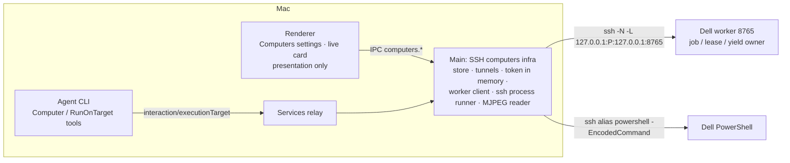
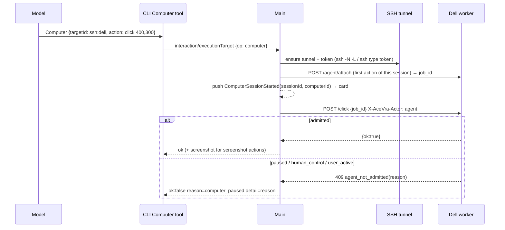

# The agent's own computer — spec and plan (v2: SSH computers)

Status: M1 (UI realignment) implemented in `a59fdba`. **v2 (this revision)** replaces the M2–M5
plan of revision 1 after inspecting the Dell. Date: 2026-10-01.

Superseded from revision 1 (kept only as history in git `263e502`): the Rust/C# Windows computer
helper, running `packages/node` on Windows for GUI work, the account-api media relay, and
WebRTC. The Dell **already runs its own AceVra computer-use worker**; the Mac app reuses it.

Still valid from revision 1: product model (§3), wording, "never silently fall back to this Mac",
deterministic AceVra-owned labels, and the M1 changes (§9).

## 1. Product direction

The agent gets a computer of its own — screen, apps, browser, files, terminal. Computers are a
**list**: This Mac (the existing local Computer Use, unchanged), the paired AceVra Nodes (unchanged),
and **SSH computers** — a machine running the AceVra worker that this Mac reaches over the user's
own SSH (first: the Dell). More SSH computers (another server, a bigger machine) are added the same
way. In chat the agent uses its computer; the user watches a live view, expands it, takes over,
gives back, and stops. No approval prompt is needed to use the user's own computers; the worker's
existing foreground policy (allow / ask / deny, fail-closed) still protects unsafe actions on the
Dell.

## 2. Verified facts (Dell, read-only inspection 2026-10-01)

| Fact                                                                                                                              | Consequence                                                                      |
| --------------------------------------------------------------------------------------------------------------------------------- | -------------------------------------------------------------------------------- |
| `ssh dell-node` works from the Mac (Tailscale, key auth, admin). SSH lands in Session 0                                           | SSH is only a transport; GUI work must happen in the worker running in Session 1 |
| Windows 11 Pro Education 26200, AutoAdminLogon, user `notfe` in console Session 1, 1366×768                                       | The agent shares `notfe`'s desktop; the user sometimes uses it in person         |
| `C:\agent\worker.py` (FastAPI) on `127.0.0.1:8765`, started at logon by task `AceVraWorkerInteractive`                            | The worker is the computer; only loopback; reached through an SSH tunnel         |
| Duplicate worker on 8766 (manual start, no supervision), both share `agent-control.json`                                          | Collapse to one authoritative worker on 8765                                     |
| Pixel routes require dashboard manual control; `CurrentBackend` posts without `job_id` → every agent pixel action 409s since 9/27 | Root cause of the Minecraft control failures; fix with an agent lease (§4.3)     |
| `/hold` is not gated                                                                                                              | Gate it like every other input route                                             |
| No auth on any route; no streaming; uvicorn output not logged; no watchdog; battery stop on the logon task                        | Token auth, MJPEG stream, rotating log, supervisor, battery-safe task            |
| Cua Driver 0.29.1 (`cua-driver serve` on `\\.\pipe\cua-driver`); Hybrid backend routes AX windows to Cua                          | Unchanged; `/health` reports the pipe                                            |

## 3. Product model

### 3.1 Computers list

| Kind                      | Where it runs                                    | GUI             | Terminal                  |
| ------------------------- | ------------------------------------------------ | --------------- | ------------------------- |
| This Mac                  | local Computer Use (`packages/zcode-cua`)        | unchanged       | Bash (unchanged)          |
| Connected computer (Node) | paired AceVra Node via account-api               | none            | `RunOnTarget` (unchanged) |
| **SSH computer** (new)    | AceVra worker on the remote host, via SSH tunnel | worker HTTP API | `ssh <alias>` PowerShell  |

Settings → Computers lists all three. **Add a computer** (SSH): enter the SSH host alias from
`~/.ssh/config` (e.g. `dell-node`), a name ("Dell"), and the worker port (default 8765). **Test
connection** opens the tunnel, fetches the worker token over SSH, and calls `/health`; only a
passing test can be saved. Rows show name, "SSH computer", Online / Offline, Rename, Remove.
Config (id, name, host alias, port) is stored locally; the token is never stored on the Mac's disk
— it is fetched over SSH on each connect and kept in Main's memory.

### 3.2 How a conversation uses a computer

- Default: this Mac (unchanged). The UI declares `automatic` every turn (M1).
- "Use my Dell …": the agent calls `ExecutionTargets` (now also lists SSH computers with
  capabilities `computerUse` + `shell`), then:
  - GUI → the **`Computer`** tool with that `targetId` (screenshot, click, double_click, move, drag,
    scroll, type, key, hotkey, list_windows, activate_window). Screenshots come back as images.
  - Terminal → `RunOnTarget` with that `targetId`; the process runs through `ssh <alias>` in
    PowerShell, streams into the existing work card, and Stop kills it.
- The local Computer Use SDK (`agent.computerUse` in `node_repl`) is **not** routed: its contract is
  macOS-semantic (AX `semantic_ref`, `state_id`, Helper leases) and the user requires the Mac path
  to stay unchanged. Both surfaces share the `ComputerBackend` vocabulary in `packages/zcode-cua`
  (`remote-worker-backend.js` maps the worker API); the router is "which target the tool names".
- Offline / tunnel down / worker down → the tool fails with `target_unavailable` /
  `computer_offline`; nothing runs on this Mac.

### 3.3 Chat surface

```text
┌ Dell · Working ──────────── [Expand] [Take over] [Stop] ┐
│ ▣ live frames (MJPEG, ~5 fps, ≤640 px)    "Clicking"    │
└────────────────────────────────────────────────────────┘
```

- The card appears for a conversation after its first `Computer` action on an SSH computer (the
  same attach pattern as task cards: a Main push keyed by `sessionId`).
- Live frames come from the worker's stream endpoint through the tunnel; Main parses MJPEG and
  forwards JPEG frames to the subscribed renderer only while the card is visible (no polling of
  `/screen` from React). Expanded view: same stream at higher fps/size.
- **Take over** → worker `/agent/take-control`; agent paused, "You're in control" + **Give back**
  (→ `/agent/resume`). While in control, clicks / scroll / typed keys in the expanded view are sent
  as human input.
- **Physical input on the Dell** → the worker pauses the job (yield). The card shows "You're using
  the Dell — agent paused" with **Resume**. The agent's actions are refused with `user_active`
  until resumed (same rule as macOS: never reclaim automatically).
- **Stop** → worker `/agent/stop` and cancel of the conversation's SSH terminal tasks.
- Agent cursor: the last agent target reported by `/status` is drawn on the frame.
- Labels: `computers.activity.*` AceVra-owned i18n (en + zh) keyed by action name; never the model.

## 4. Worker HTTP contract v2 (the Dell side)

Single worker: `127.0.0.1:8765`. All JSON. Version string `2.0.0`.

### 4.1 Auth

- Token: 64 hex chars in `C:\ProgramData\AceVra\worker-token.txt`, ACL `notfe`, `Administrators`,
  `SYSTEM` only (inheritance off). Created by the supervisor if missing; never logged.
- Every route requires `X-AceVra-Token: <token>` **except** `GET /health` and the dashboard landing.
- Dashboard: `GET /dashboard/login?token=…` sets cookie `acevra_worker` (HttpOnly,
  SameSite=Strict, Path=/) and redirects to `/dashboard`; the cookie is accepted like the header.
  `C:\agent\open-dashboard.cmd` opens that URL locally. `/dashboard` without auth shows a locked
  page.
- `Host` must be `127.0.0.1:<port>` or `localhost:<port>` (DNS-rebinding guard) → else 400.
- Failures: `401 {"detail":{"code":"auth_required"}}`.
- Dell-side clients (`agent.py` → `acevra_backend.CurrentBackend`, `computer.py`) send the token
  from env `DELL_WORKER_TOKEN` (set by the worker for its children) or the file.

### 4.2 Actor-aware input gate

All input routes (`/move /click /doubleclick /drag /scroll /type /key /keydown /keyup /hotkey /look
/mousedown /mouseup /hold`) take `job_id` and header `X-AceVra-Actor: agent|human` (default
`human` — the dashboard).

| Actor   | Admitted when                                                                                     |
| ------- | ------------------------------------------------------------------------------------------------- |
| `human` | unchanged: active job, matching `job_id`, `state == human_control`, `pause_ack`, `manual_control` |
| `agent` | active job, matching `job_id`, `state == running`, no yield                                       |

Refusal: `409 {"detail":{"code":"agent_not_admitted"|"manual_control_inactive","reason":"no_active_job"|"stale_job_id"|"paused"|"human_control"|"user_active"|…}}`.
Every admitted agent input renews an external job's lease.

### 4.3 Jobs

- Existing `/agent/start|cli-start` (worker spawns `agent.py`) unchanged, plus the child gets
  `DELL_WORKER_TOKEN` and `CurrentBackend` sends `job_id` + `X-AceVra-Actor: agent` (409 fix).
- **External jobs** (an outside brain, e.g. the Mac agent): `POST /agent/attach {task, controller}`
  → `{ok, job}`; `job.mode = "external"`, no child process. Refused (`ok:false`) while another job
  is active. `POST /agent/heartbeat {job_id}` renews; lease TTL 120 s; lapse → `stopped`,
  `stop_reason: "lease_expired"`.
- `/agent/pause|resume|take-control|stop` work for both; for external jobs pause is acknowledged
  immediately (no child to acknowledge).
- `GET /agent/job` adds `mode`, `controller`, `lease_expires_at`, `yield`, `stop_reason`.

### 4.4 Physical-input yield

A low-level keyboard + mouse hook thread in the worker (Session 1) records **non-injected** input
(`LLKHF_INJECTED` / `LLMHF_INJECTED` clear). If a job is `running`, the worker pauses it:
`state = paused`, `pause_ack = true`, `yield = {reason: "physical_input", input, at}`; for `agent.py`
jobs the control file is set to `paused` too. Mouse moves within 750 ms after agent input are
ignored. `/agent/resume` clears the yield. Human control (`human_control`) never yields.

### 4.5 Frames

- `GET /screen` unchanged (exact PNG; auth required).
- `GET /stream.mjpeg?fps=5&max_width=960&quality=60` → `multipart/x-mixed-replace; boundary=frame`;
  each part `Content-Type: image/jpeg` + `X-Frame-Seq`, `X-Screen-Width`, `X-Screen-Height`. One
  shared capture thread runs only while ≥1 viewer is connected; fps clamped 1–15; ≤4 viewers;
  the physical cursor ring is drawn. Requires Pillow.

### 4.6 Health

`GET /health` (no auth, no secrets): `status, version, started_at, pid, port, width, height,
mouse_x, mouse_y, auth: "token", job: {job_id, state, mode, controller, yield}|null,
cua_pipe: "present"|"absent", stream: {viewers}`.

### 4.7 Operations

- Supervisor `C:\agent\supervise_worker.py` (logon task `AceVraWorkerInteractive`, Session 1,
  runs `pythonw` directly, no battery conditions, no time limit) starts `run_worker.py`, checks
  `/health` every 10 s, restarts with backoff 2→60 s (reset after 5 min healthy).
- `run_worker.py` runs uvicorn with a rotating log `C:\agent\logs\worker.log` (5 MB × 5);
  supervisor log `C:\agent\logs\supervisor.log`.
- `cua-driver-serve` task runs `cua-driver.exe serve` directly (restart-on-failure effective).
- The 8766 duplicate is retired (scripts moved to `backups/`; route strings no longer say 8766).
- Every changed file is backed up first to `C:\agent\backups\computer-v2-<timestamp>\`; change log
  `C:\agent\backups\computer-v2-<timestamp>\CHANGELOG.md` with rollback steps.

## 5. Mac side architecture



| Fact                                      | Single owner                                                       |
| ----------------------------------------- | ------------------------------------------------------------------ |
| SSH computer list (id, name, alias, port) | Main `sshComputersStore` (`userData/computers/ssh-computers.json`) |
| Tunnel process, token                     | Main `sshComputerConnections` (memory; process infrastructure)     |
| Job, lease, pause, take-over, yield       | **The worker** (Main only correlates `sessionId → job_id`)         |
| Terminal task view/events                 | Main `sshProcessRunner` (same shape as `localProcessRunner`)       |
| Which computer a tool call uses           | The tool call's `targetId` (agent decides after the user asks)     |
| Card visibility / expand                  | Renderer presentation store                                        |

Main is used because it already schedules processes (local runner, account tasks); it holds no
conversation business state beyond the ephemeral correlation and attach push, like M2F.

Event order (agent GUI action):



Tunnel lifecycle: `connecting → online → (exit) → backoff 1,2,4…30 s → connecting`; `stop` on
remove/app quit. Readiness = `/health` 200 through the forwarded port. `ExitOnForwardFailure`,
`ServerAliveInterval=15`, `ServerAliveCountMax=3`, `BatchMode=yes`; the local port is chosen free
on `127.0.0.1`.

Idempotency and fencing: tool calls carry `requestId`; the job lease belongs to one session; a
second conversation using the same computer while a job is active gets `computer_busy`. The
heartbeat runs every 30 s while the session's job is active and stops after 10 min without
actions (lease then lapses on the worker).

## 6. Protocol changes

- `packages/shared/src/execution-target-protocol.ts`: op `computer` `{sessionId, targetId,
action}` → `{op:"computer", ok:true, result, image?: {base64, mimeType, width, height}}`; new
  reasons `computer_paused`, `computer_busy`, `computer_offline`. Capabilities already include
  `computerUse`.
- `packages/shared/src/agent-computer.ts`: SSH computer config, status, session view, frame and
  `IComputersPlatform` (optional on `IPlatformService`; Web has none).
- CLI `Computer` tool (Desktop, local workspaces only), same registration as `RunOnTarget`.

## 7. Milestones

- **M1** UI realignment — done (`a59fdba`).
- **M2 (this change)** Dell worker v2 (§4) + SSH computers on the Mac (§5): settings add/test,
  `Computer` + `RunOnTarget` on SSH computers, live card, take over / give back, step-aside, stop.
- **M3** Polish: H.264 / WebSocket frames if MJPEG bandwidth hurts; multiple simultaneous
  computers per conversation; per-project default computer.
- **M4** This Mac as the same card model (mini Computer panel fed by the same frame interface).

Acceptance (M2, live): add `dell-node`; in a chat "use the Dell to open Notepad and type a line"
and "run `python --version` on the Dell"; live frames visible; Take over / Give back; Stop; the
Mac's frontmost app and cursor unchanged. Deterministic tests: fake worker HTTP server (mapping,
lease, offline, take-over, yield, MJPEG consumer) and fake `ssh` (tunnel lifecycle, backoff,
process runner, cancel).

## 8. Risks

- Tunnel or worker restart mid-action → `outcome_unknown`; the agent must re-screenshot.
- Lock screen / UAC secure desktop / monitor sleep break capture and input on the Dell.
- Low-level hooks are removed by Windows if the callback stalls; the callback only stamps time.
- `SetCursorPos`-driven moves may or may not appear as injected; the 750 ms window covers agent moves.
- Cua-eval scripts on the Dell that call the worker without a token stop working (documented).

## 9. M1 (implemented in `a59fdba`) — unchanged

Composer Run-on control removed; user turns declare `automatic`; Settings → Computers; plain work
card wording; agent tool descriptions reworded; "Tool callRunning" separator fixed.
