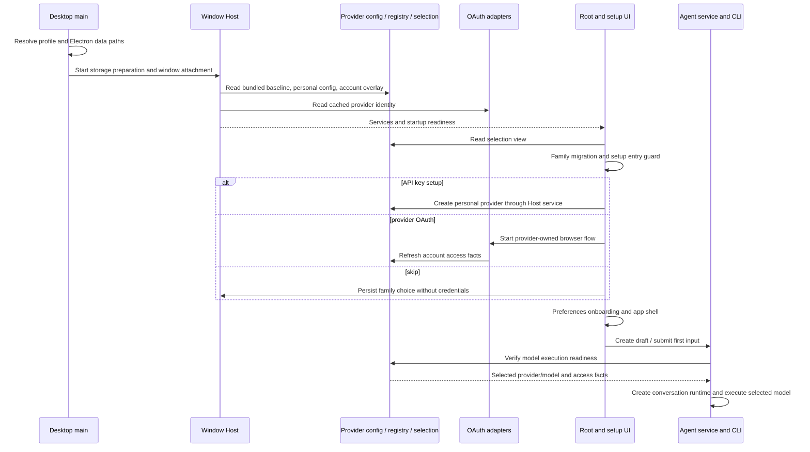

# AceVra provider-independent first run

Status: discovery and proposed specification; no production behavior implemented.
Baseline: `release/0.1.0-alpha`, `9cd6581ea387debb6b29fc42de462787820a5a34`.
Source inventory date: 2026-10-01.

## Scope and evidence

AceVra owns its product identity, local profile, and first-run completion. Connecting a
model provider does not create an AceVra account. Z.ai remains an optional provider.
This document specifies the direction before implementation, as required by AGENTS.md.
The runtime-scope investigation is parked: no valid failing first-turn lineage exists,
and this document proposes no taskType, runtime-scope, runtime-lifecycle, or Computer change.

Statements under “Current” describe checked-in source. Proposed behavior is explicitly
separated below. No provider inference, browser sign-in, secret inspection, package build,
profile migration, or clean-profile acceptance run was performed for this discovery.
Provider catalog entries prove configured support, not remote model availability today.

## Current fresh-install startup chain

Paths below are repository-relative references to the baseline source.

| Stage                                      | Owner / source                                                                                                                                                                              | Current behavior and identity dependency                                                                                                                                                                                                                                                                                                                                                   |
| ------------------------------------------ | ------------------------------------------------------------------------------------------------------------------------------------------------------------------------------------------- | ------------------------------------------------------------------------------------------------------------------------------------------------------------------------------------------------------------------------------------------------------------------------------------------------------------------------------------------------------------------------------------------ | --- | ----------------------------------------------------------------------------------------------------------------------------------------------------------------------------------------------------- |
| 1. Early data-root resolution              | `packages/desktop/src/main/desktopEarlyDataBaseDirBootstrap.ts`, `desktopDataBaseDirBootstrap.ts`                                                                                           | Applies data-root settings before other main-process initialization. Local alpha resolves its isolated profile before consulting settings; normal bootstrap can read `.zcode/v2/setting.json` for `dataBaseDir`.                                                                                                                                                                           |
| 2. Electron identity and paths             | `packages/desktop/src/main/desktopRuntimeEnv.ts`, `index.ts`; `packages/desktop/scripts/desktop-release-profile.mjs`                                                                        | App name is AceVra (alpha: AceVra Local Engineering Alpha), scheme defaults to `zcode`. Explicit userData/sessionData overrides precede defaults; main calls `app.setPath`. Alpha profile home defaults to `~/.zcode-local-engineering-alpha`; its service root is `<profileHome>/.zcode/v2`.                                                                                              |
| 3. Storage preparation and window Host     | `packages/desktop/src/main/index.ts`; `packages/desktop/src/host/hostDatabaseStartup.ts`, `index.ts`                                                                                        | Storage readiness precedes service initialization. Each window has one Local Host, shared by local workspaces. Storage preparation/control-plane Agent processes must be distinguished from a conversation's AgentRuntime.                                                                                                                                                                 |
| 4. Host services                           | `packages/services/src/node.ts:createLocalServices`                                                                                                                                         | Creates settings, credential service, OAuth repo/service, onboarding records, provider config/account source/registry, selection service, task services, and Agent service. Host owns business state; main schedules and forwards.                                                                                                                                                         |
| 5. Catalog and personal config             | `packages/services/src/model-provider/providerConfigRuntime.ts`, `providerRuntime.ts`; `packages/provider-node/src/provider-config-runtime.ts`                                              | Merges bundled/active built-in rules, personal `provider_config.json`, and account access facts. Optional legacy import occurs when personal config is missing. Built-in refresh is tied to the inherited ZCode endpoint; the bundled baseline remains usable when remote refresh fails.                                                                                                   |
| 6. Host warmup                             | `packages/desktop/src/host/index.ts`; `packages/services/src/zcode-agent/zcodeAgentService.ts`                                                                                              | Warmup consults selection readiness. Without a usable selection, model execution waits; some storage/history/settings paths may start a read-only process. A process existing is not proof of a conversation runtime existing.                                                                                                                                                             |
| 7. Renderer and root gates                 | `packages/desktop/src/renderer/src/main.tsx`; `packages/ui/src/Root.tsx`, `lib/rootStartupGate.ts`                                                                                          | Renderer obtains services over MessagePort, restores cached OAuth identity, migrates provider-family settings, hydrates selection, then resolves the provider-availability entry guard. Workspace restoration/draft prewarm waits for that guard.                                                                                                                                          |
| 8. Setup/login entry                       | `packages/ui/src/root/useProviderAvailabilityLoginEntryGuard.ts`, `WelcomeScreen.tsx`, `login/LoginApiKeyForm.tsx`                                                                          | Opens when `!providerFamilyDomain                                                                                                                                                                                                                                                                                                                                                          |     | (!user && !hasUsableProvider)`. A configured ordinary provider alone does not satisfy a missing family domain. Welcome offers Z.ai/BigModel OAuth and an API-key form limited to those two providers. |
| 9. Existing skip path                      | `packages/ui/src/login/LoginApiKeyForm.helpers.ts`; `Root.tsx:handleWelcomeScreenComplete`                                                                                                  | “Skip for now” writes the selected `zai`/`bigmodel` family domain and migration timestamp, creates/opens the default conversation workspace when needed, and closes the entry. It does not save an empty key or mark API-key login successful. Shell entry without a model is already partly supported.                                                                                    |
| 10. Preferences and optional migration     | `packages/ui/src/onboarding/OccupationOnboarding.tsx`, `useOnboardingTrigger.ts`, `OnboardingDialog.tsx`; `packages/services/src/onboarding/onboardingRecordService.ts`                     | Occupation/mode/preferences onboarding wraps the shell. Records are device-local but keyed by OAuth user ID or anonymous `null`; anonymous records can be claimed at login. Welcome/import wizard is a distinct flow, with optional history/skills/MCP/commands/AGENTS import.                                                                                                             |
| 11. Provider/model selection               | `packages/ui/src/settings/ModelProviderSection.tsx`, `settings/model-provider-section/ProviderTemplatePicker.tsx`; `packages/services/src/model-provider/providerFacadeServices.ts`         | Settings exposes the broader template catalog and custom providers. Registry resolves usable provider/model pairs. Default recommendation comes from personal configured default, then the first visible selectable pair in registry order. This is not remote account model discovery.                                                                                                    |
| 12. First conversation and session runtime | `packages/ui/src/v4/composer/useDraftSessionPrewarm.ts`; `apps/zcode-cli/packages/bootstrap/src/zcode-protocol-v4/v4-bridge.ts`, `zcode-protocol/server-operations.ts`; `app/create-app.ts` | Normal V4 draft creation uses deferred session persistence, then first send promotes/adopts that session. `createRecord` defaults absent taskType to `interactive` and materializes session runtime configuration. The service passes formal selected-model configuration to the Agent process; the model adapter performs inference. This is a source path, not a new live lineage claim. |



## Dependency classification

A = product identity that should become AceVra-native. B = provider-specific integration
that belongs behind a provider adapter. C = compatibility contract to preserve. D = durable
historical data that must not be renamed by search-and-replace. A physical surface can have
more than one concern; the rows distinguish its product role from its wire/storage spelling.

| Surface / evidence                                                                                                              | Class | Direction                                                                                                                                                                              |
| ------------------------------------------------------------------------------------------------------------------------------- | ----- | -------------------------------------------------------------------------------------------------------------------------------------------------------------------------------------- |
| Root requires providerFamilyDomain; login completion and `store.user` imply app identity                                        | A     | First-run completion is profile-owned; OAuth user becomes provider connection identity.                                                                                                |
| `ProviderFamilyDomain = zai \| bigmodel`, account-plan selection/availability                                                   | B/C   | Keep for those account adapters. Stop using it to decide whether AceVra may open. Do not expand it into a universal provider registry.                                                 |
| Z.ai-first OAuth ordering and locale-based API-key default                                                                      | A/B   | Neutral connection chooser; provider brands remain truthful. No automatic Z.ai connection.                                                                                             |
| Z.ai/BigModel browser authorization, portal userinfo, business login, ZCode token exchange, Start/Coding Plan entitlement/quota | B     | Existing OAuth adapters and account source own them. OpenAI/custom API inference must not depend on these facts.                                                                       |
| Shared `oauth:active_provider` and `zcodejwttoken`                                                                              | B/C/D | Preserve current mutual-exclusion and refresh/logout behavior while wrapping it. Product setup must not require this shared identity. Multi-account OAuth is a separate future change. |
| Onboarding record user ID, anonymous claim, uploads and provider user telemetry                                                 | A/B/D | New setup completion is independent of OAuth; preserve old records and provenance. Provider-linked uploads are optional adapter behavior, not setup authority.                         |
| Built-in catalog refresh and runtime/download release services tied to ZCode endpoint                                           | A/C   | AceVra eventually owns distribution policy and provider templates. Reuse validated catalog loader/schema and bundled fallback; endpoint independence needs an explicit later cutover.  |
| `ZCODE_ENV` also controls build/backend behavior; provider endpoint env configuration                                           | B/C   | Do not confuse app identity, build environment, provider endpoints, and control plane. Preserve old keys through translation at the composition root.                                  |
| `ZCODE_*`, `@zcode/*`, `apps/zcode-cli`, service-channel/protocol/schema identifiers                                            | C     | Internal compatibility names are not product account requirements. Keep in this track.                                                                                                 |
| `zcode://oauth/callback`, provider client IDs/redirect registrations, deep-link parsers                                         | B/C   | Keep registered URI until a provider-approved callback migration exists. App-independent onboarding does not require changing it.                                                      |
| `.zcode/v2`, `.zcode/cli`, task/session IDs, provider IDs, workspace hashes, legacy config                                      | C/D   | Preserve readers and historical paths. A new profile resolver must adapt them explicitly.                                                                                              |
| ZCode wording/logos in welcome, preferences, startup errors, menus, about and updates                                           | A     | Replace product-facing presentation in a later branding milestone. Keep third-party attribution and provider names.                                                                    |
| Z.ai-backed sharing, official MCP auth/usage, account-linked automation/off-peak capabilities                                   | B/C   | Optional features have their own requirements. Their credentials cannot become a generic app startup prerequisite.                                                                     |

Primary related sources: `packages/shared/src/model-provider-family.ts`,
`packages/ui/src/lib/providerFamilyDomainMigration.ts`,
`packages/services/src/oauth/oauthService.ts`, `oauth/repo/oauthCredentialRepo.ts`,
`packages/services/src/model-provider/accountProviderConnectionResolver.ts`,
`packages/provider-node/src/endpoint-scoped-zcode-builtin-source.ts`,
`packages/services/src/node.ts`, and `packages/ui/specs/fork-clean-slate.md`.

## Current provider and authentication architecture

There are two different connection families today. Ordinary API providers are personal
configuration plus formal model execution. Z.ai/BigModel account providers add OAuth and
entitlement-derived access overlays. Connected execution accounts (Codex/Claude Code) are
a third, separate backend mechanism; they are not direct OpenAI/Anthropic API credentials.

| Provider / connection                   | Auth owner; browser required?                                                                                                                      | Current credential location                                                                                                                       | Without Z.ai login?                                                                                | Models / defaults                                                                                                                                                            |
| --------------------------------------- | -------------------------------------------------------------------------------------------------------------------------------------------------- | ------------------------------------------------------------------------------------------------------------------------------------------------- | -------------------------------------------------------------------------------------------------- | ---------------------------------------------------------------------------------------------------------------------------------------------------------------------------- |
| Z.ai ordinary API / Coding Plan API key | ProviderSettings service + API adapter; browser OAuth not required                                                                                 | Personal `<dataBaseDir>/.zcode/v2/provider_config.json`, access.apiKey (and potentially configured headers)                                       | Yes, with its own valid API key                                                                    | `zai-standard-api` and `zai-api` templates respectively; catalog IDs plus personal models; normal selection rules                                                            |
| Z.ai account plans                      | OAuthService + ZaiProviderAdapter; browser OAuth/polling or registered callback                                                                    | Encrypted `credentials.json`: provider token/profile namespace, active-provider key, shared ZCode JWT; derived plan keys in same credential store | No for this account connection; it is specifically Z.ai auth                                       | Built-in account rules, account entitlement/access overlay, family connection selection, normal registry recommendation                                                      |
| BigModel API / account plans            | API-key path or BigModelProviderAdapter OAuth; account variant requires browser flow                                                               | Personal provider file for API key; encrypted credential store for OAuth/derived plan keys                                                        | Yes; BigModel is a separate provider, but its OAuth path still uses inherited ZCode token exchange | BigModel templates/account rules and access facts                                                                                                                            |
| OpenAI direct API                       | ProviderSettings + model-execution adapter using OpenAI Responses; no direct API OAuth adapter exists here                                         | Personal provider file                                                                                                                            | Yes                                                                                                | Bundled `openai` template and personal model rules; no live `/models` discovery path identified in these facades                                                             |
| Anthropic direct API                    | ProviderSettings + Anthropic Messages adapter; no direct API OAuth adapter exists here                                                             | Personal provider file                                                                                                                            | Yes                                                                                                | Bundled `anthropic` template and personal rules; same default mechanism                                                                                                      |
| Azure OpenAI                            | Custom personal provider using supported Responses or Chat Completions format, base URL, key/headers; no dedicated Azure OAuth/Entra adapter found | Personal provider file; Azure endpoint/deployment and auth must be explicitly configured                                                          | Yes, for a compatible configured endpoint                                                          | No Azure built-in template in the checked-in catalog; manually configured deployment/model IDs. Fork-dev metadata importer recognizes `azure-openai`, without importing auth |
| Generic OpenAI-compatible               | Custom provider, Chat Completions adapter (or explicitly selected supported API format); API key/headers                                           | Personal provider file                                                                                                                            | Yes                                                                                                | Manual model IDs and model capability rules; configured default then registry fallback                                                                                       |
| Other bundled templates                 | Ordinary API adapters; provider-owned API keys                                                                                                     | Personal provider file                                                                                                                            | Yes, structurally                                                                                  | Kimi, MiniMax, DeepSeek, Alibaba Cloud China/Global, Xiaomi MiMo, xAI, OpenRouter, OpenCode Go and Zen (multiple API formats); bundled models and personal additions         |
| Codex / Claude Code execution accounts  | Source tool owns auth via its supported account API/CLI; optional browser login                                                                    | Source tool's own store; AceVra stores link preference and reads sanitized status                                                                 | Yes, separate execution backends, subject to installed runtime/readiness                           | Backend-specific model/execution selection; not interchangeable with direct API templates                                                                                    |

Current credential handling must be described accurately: `credentials.json` values use
AES-256-GCM via `credentialCipherProvider.ts`, with explicit `ZCODE_CREDENTIAL_SECRET` or
the existing platform/home/user-derived fallback. It is not an OS-keychain credential vault.
Personal provider config is written as private JSON by
`NodePersonalProviderConfigRepository`; its API keys are not routed through that cipher.
Client projections redact secret values; remote credential-bearing mutations are guarded in
`providerFacadeServices.ts`. Neither redaction nor file permissions imply encrypted API-key
storage. Any future vault change needs its own spec and explicit migration; this phase moves
no secrets and reads no actual credential files.

Provider configuration and OAuth state are Host/environment-wide, not workspace-specific.
The local windows share the profile files; registry lifecycles are per Host/process.
Remote environments have their own registries and provisioning policy. Session model
selection is task-specific and can differ from the environment's default recommendation.
Workspace association uses `workspaceIdentity?.trim() || workspacePath`; source account
identity must never replace workspace identity.

The checked-in catalog `config/provider/zcode-builtin.json` is a template/model rule release,
not authenticated remote discovery. `ProviderSettingsFacade` projects templates/config and
`ModelSelectionFacade` projects usable models. `resolveInitialModelSelection` first accepts
a valid configured default, otherwise chooses the first visible selectable pair; new selection
completion uses the available reasoning values. No hardcoded GLM model is required by the
ordinary API runtime. Historical session selections follow their existing validation rules.

Sources: `packages/services/src/model-provider/providerRuntime.ts`, `providerFacadeServices.ts`,
`providerSettingsConnectivity.ts`; `packages/provider/src/facades.ts`, `model-selection-config.ts`,
`effective-model-selection.ts`; `packages/provider-node/src/personal-provider-config-repository.ts`,
`model-selection-config-repository.ts`; `apps/zcode-cli/packages/adapters/src/model/model-execution.ts`;
`packages/services/specs/accounts-and-imports.md`; `packages/services/src/credential/`.

### What works and what remains blocked

Source supports ordinary API providers without Z.ai account auth, custom endpoints and
manual models, independent account execution backends, bundled catalog fallback, and shell
entry via skip. Existing history/settings/control-plane read paths need not run inference.

Current first-run UI cannot configure OpenAI/Anthropic/Azure directly in its limited API-key
form. It cannot express “setup complete, no provider family selected” without bypassing or
changing the guard. OAuth account identity is still treated as product `user`, onboarding
records follow that identity, and the product control plane still supplies catalog/update
policy. Azure native Entra OAuth and authenticated provider model discovery are not exposed
by the inspected provider setup contracts. Model execution cannot succeed without a valid
provider/model and provider credentials; “Configure later” does not promise free inference.

## Proposed first-run UX and product rules

The first page reads “Welcome to AceVra” and “Choose how you want to connect.” It offers
OpenAI, Anthropic, Z.ai, Azure / OpenAI-compatible, and Configure later. Additional supported
templates are available under More providers, including BigModel. All entries describe
provider connections; no provider is called the AceVra account. Cards have consistent weight.

OpenAI/Anthropic use the existing API-key templates. Z.ai offers clearly distinct API-key
and account-plan connection paths. Azure/custom asks for API format, endpoint, credential
method currently supported, and deployment/model ID; it must not promise Entra OAuth before
that exists. Provider requirements, quota and provider links stay scoped to that connection.

Saving configuration is distinct from successful verification. A sanitized connection view
reports unconfigured, configured-unverified, checking, usable, unavailable, or error.
Catalog selectability is structural readiness; it does not prove a remote key is valid.
Connectivity verification reuses the formal model execution probe and discloses its network
request. A failed verification retains editable configuration and cannot claim “connected.”

Configure later persists profile setup completion with no fabricated family, user, key, or
model. It enters the shell and allows browsing local history, settings and project navigation.
Send, automated model work, and other inference actions explain “Connect a model provider
to continue” and open the same connection flow. They must not accept a hidden model task
or silently choose a provider. Existing read-only service paths stay usable.

Occupation/mode/preferences and imports are optional and skippable. Provider login changes
must not restart first-run setup. Local setup completion is independent of subscription,
quota, telemetry upload, migration success and provider portal availability. A registry error
is shown as an error with retry/configuration actions, not relabeled as “no providers.”

## Smallest abstraction and state ownership

Reuse `IProviderSettingsService`, `IModelSelectionService`, provider registry/config sources,
formal connectivity testing, and existing OAuth/execution account adapters. Add a small
Host-owned setup/connection application facade, not another registry or a general plugin
framework. UI calls it through `packages/ui/src/hooks/` and existing RPC/service contracts.
Main continues to own native window/launch/open-URL operations only.

| Fact / operation                                             | Single owner                                                                                          | Proposed facade responsibility                                                              |
| ------------------------------------------------------------ | ----------------------------------------------------------------------------------------------------- | ------------------------------------------------------------------------------------------- |
| Provider templates, personal rules, secret-bearing mutations | Existing ProviderSettings / personal repository                                                       | Project available connection choices; delegate create/update/delete                         |
| Account auth and tokens                                      | Existing provider OAuth adapters + credential repository; external execution tools for their accounts | Dispatch explicit selected-provider connection, cancel/disconnect, project sanitized status |
| Available models and readiness                               | Existing registry + ModelSelection service                                                            | Return model choices, selection issue, structural execution readiness                       |
| Configured model default                                     | Existing personal repository / selection-config repository                                            | Persist through that owner; no second default in onboarding state                           |
| Task selection and command admission                         | Existing task/session owner and CLI inbox                                                             | Use existing session command path; setup facade does not launch or route tasks              |
| First-run completion and later choice                        | New small profile setup service                                                                       | Persist versioned completion/deferred state; has no OAuth user or secret fields             |

Proposed read result contains profile setup state, connection descriptors with stable
provider/template IDs, supported auth methods, sanitized auth/config/verification state,
model-selection view and issue/revision. Commands cover connect/configure/cancel/check,
choose default via its current owner, and finish/defer setup. Secret input is allowed only
at the local Host mutation boundary; never in read results/events/logs/relay messages.
Concrete types, channel registration and architecture contracts are an implementation
milestone, not declarations added by this discovery.

```mermaid
sequenceDiagram
  participant U as Setup UI
  participant S as Host setup facade
  participant R as Existing registry / config owner
  participant A as Selected provider auth adapter
  participant F as Profile setup store
  U->>S: Read versioned setup and connection view
  S->>R: Read templates / usable models / selection
  S-->>U: Sanitized choices and readiness
  alt Configure connection
    U->>S: Explicit provider choice and local configuration
    S->>A: Auth only for this provider if needed
    S->>R: Commit config and refresh facts
    R-->>S: Revision and selected model readiness
    S->>F: Commit setup completion
  else Configure later
    U->>S: Defer setup
    S->>F: Commit completion without provider/model
  end
  S-->>U: Shell available; model actions require readiness
```

Event rules: one admitted operation ID per connection attempt; repeated completion is
idempotent. Cancelled/replaced auth or verification results cannot overwrite a newer
attempt. Capture provider ID and registry revision before work; revalidate after awaited
results. Config must commit before publishing completion; partial auth/config failure is
shown explicitly. No timeout can substitute for ownership or completion. Existing account
mutual exclusion stays in its adapter until a separately designed multi-account change.
Desktop continuous delivery and mobile replayable delivery project the same owner facts;
neither transport gains secret-bearing connection setup or independent setup truth.

## Profile and migration direction

| State category                                              | Contents                                                                                                                      | Direction                                                                                                                                                                                      |
| ----------------------------------------------------------- | ----------------------------------------------------------------------------------------------------------------------------- | ---------------------------------------------------------------------------------------------------------------------------------------------------------------------------------------------- |
| New AceVra-owned state                                      | New first-run completion, profile identity, product preferences, future connection descriptors, future product release policy | Store under an AceVra-resolved OS application-data profile root; schema names belong to AceVra. A concrete proposed new setup path is `<AceVra userData>/profiles/default/app/first-run.json`. |
| Compatibility state                                         | CLI configuration, Agent/plugin/skill contracts, environment variables, registered callback                                   | Keep `.zcode` layout and `ZCODE_*` contract through a product profile resolver that publishes explicit legacy adapter paths.                                                                   |
| Migratable legacy state                                     | Settings, onboarding records, personal provider metadata, task indexes/history, caches where needed                           | Explicit opt-in/versioned import; preserve originals, task/provider IDs, workspace identity/hash and timestamps. Rebuild disposable caches rather than relabeling account facts.               |
| Must remain ZCode-named until a separate protocol migration | `zcode://`, `@zcode/*`, `apps/zcode-cli`, protocol channels, on-disk schema/history identifiers, upstream attribution         | Preserve literal contracts. Product naming must not rewrite stored messages or import provenance.                                                                                              |

New clean installs should resolve an AceVra profile before services start, then pass precise
paths to existing compatibility adapters. The eventual CLI compatibility directory can sit
inside the AceVra-owned profile; it is not an account identity. Do not simply set `ZCODE_HOME`
to an arbitrary non-`.zcode` directory: `getUserHomeDir`/`resolveDataBaseDir` currently depend
on the `.zcode` basename and parent layout. A resolver/adapters milestone must reconcile
all direct readers before changing physical defaults. Existing alpha roots stay readable.

No migration implicitly copies OAuth/API keys, logs out of source tools, or opens the user's
normal profile. Credentials remain in their existing Host/source store in the first UX
milestone; provider reconnection or a separately reviewed vault migration handles later
physical relocation. Home-dependent credential encryption and absolute workspace paths
make bulk copy unsafe. Migration needs a manifest, schema validation, resumable/idempotent
steps, rollback, and corruption evidence retention. Run ownership/leases remain intact.

## Branding inventory and safe replacement boundaries

| Surface                           | Baseline sources                                                                                                                   | Future action                                                                                                                                                                                                                  |
| --------------------------------- | ---------------------------------------------------------------------------------------------------------------------------------- | ------------------------------------------------------------------------------------------------------------------------------------------------------------------------------------------------------------------------------ |
| Packaged name/icon                | `packages/desktop/scripts/desktop-product-identity.mjs`, `electron-builder.config.js`, `build/icon.icns`                           | Name is already AceVra; audit artwork before choosing new AceVra artwork. Binary asset identity was not visually verified here. Preserve bundle/signing identity until reviewed.                                               |
| App logos/wordmarks and hero      | `packages/ui/src/components/ui/ZCodeAboutLogo.tsx`, `openWorkspacePageThemeHero.tsx`                                               | Z glyph and ZCode wordmark SVG are inherited; replace product presentation. Internal component names need not be renamed for a branding change.                                                                                |
| Welcome/login/preferences/imports | `WelcomeScreen.tsx`, `onboarding/OnboardingWelcomeView.tsx`, `OccupationOnboarding.tsx`, `onboarding/*`; both i18n locale files    | Welcome title already says AceVra, but account-first description, ZCode logo/aria label and preference wording remain. Replace product copy; preserve explicit historical import source names.                                 |
| Provider picker/settings          | `settings/ModelProviderSection.tsx`, `settings/model-provider-section/*`, `SettingsPage.tsx`, `settingsPageHelpers.tsx`            | Neutral connection wording; retain OpenAI, Anthropic, Z.ai, BigModel and other provider logos/names and truthful auth/usage requirements.                                                                                      |
| Menus and native dialogs          | `packages/shared/src/desktopMenu.ts`, `desktopApplicationMenu.ts`, `desktopWindowsOpenFolderContextMenu.ts`                        | Replace app-facing labels and Finder/service wording where product-owned; command IDs remain compatible.                                                                                                                       |
| Startup, empty states and errors  | `packages/ui/src/i18n/locales/en-US.ts`, `zh-CN.ts`; credential/provider error sources                                             | Replace “Starting/reopen/sign in to ZCode,” product tips and generic connection prompts. Leave technical identifiers when they help support; never rewrite history/error provenance. Computer copy remains outside this track. |
| Links and official integrations   | OAuth config files; `packages/shared/src/zcodeEndpoint.ts`; provider key-management URLs, official MCP, sharing and plugin sources | Provider links remain in provider detail; product help/docs/support require verified AceVra destinations. Do not invent links or silently repoint a provider portal. Preserve upstream licensing/attribution.                  |
| Updates/releases                  | `autoUpdater.ts`, `manifestUpdateProvider.ts`, `forceUpdatePrompt.ts`, release-profile spec                                        | Replace visible ZCode copy later. Feed authority and force-update policy need an explicit AceVra release milestone; alpha's existing policy remains.                                                                           |
| Package-visible/internal names    | root/package manifests, `@zcode/*`, `apps/zcode-cli`, env/schema/channel IDs                                                       | Installer display name can be product-owned. Package/module names and compatibility strings are not renamed in this task.                                                                                                      |

The purchase-surface removal rules in `packages/ui/specs/fork-clean-slate.md` remain in
force. Branding cannot restore removed purchase flows or remove functioning provider access.

## Supported clean-profile acceptance design

Current isolation surfaces already exist: `ZCODE_DESKTOP_USER_DATA_DIR`,
`ZCODE_DESKTOP_SESSION_DATA_DIR`, `ZCODE_DESKTOP_HOME_DIR`, `ZCODE_DATA_BASE_DIR`,
and `ZCODE_HOME`, resolved before Host creation. Use one short runner-owned root and its
marker, with all explicit desktop/data roots consistent. The alpha bootstrap publishes
`ZCODE_HOME=<profileHome>/.zcode`. Node test `HOME` alone is insufficient because Electron
home and explicit runtime roots can differ. Disable fork-dev legacy metadata auto-import;
never point `ZCODE_FORK_PROVIDER_IMPORT_SOURCE` at a real user's config.

The eventual harness must launch the normal packaged app with these isolated paths and
an empty setup store. It records resolved path ownership before starting and asserts that
no path resolves to normal userData, a real profile, or source-tool credentials. Use short
socket paths with a platform length check; the prior long temporary path was not a valid
first-turn attempt. No production lifecycle correction is inferred from that test error.

Two acceptance lanes are required:

1. Deterministic: configure a custom ordinary provider through the normal local setup service
   and UI, using a runner-owned loopback HTTP fixture and a non-secret sentinel key. The fixture
   implements one supported API format, a minimal valid stream/tool/error contract, and a fixed
   answer. Disable external egress/update/catalog refresh for the test through a future explicit
   harness composition policy; retain bundled catalog. Do not use the UI login bypass flag for
   first-run acceptance. Prove empty profile → setup → registry → selection → first conversation
   → real session runtime → fixture response, including a restart of the same test profile.
2. Optional real-provider smoke: the user supplies a dedicated test key through ordinary local
   setup or completes provider-owned sign-in. Source tool supported account APIs may be tested
   separately, but use of an already logged-in real source account cannot prove clean isolation.
   No raw auth copying, profile cloning, or OAuth token fabrication. This lane reports its explicit
   external auth/network dependencies and never blocks deterministic CI coverage.

Existing pieces: provider registry/config tests, secret projection tests,
`packages/services/test/rendererCredentialBoundary.test.ts`,
`officialProviderMetadataImporter.test.ts`, `providerConfigMigration.test.ts`,
`packages/ui/test/onboardingHookOrderRegression.test.ts`, and the model settings fixture UI.
`VITE_ZCODE_E2E_SKIP_PROVIDER_LOGIN` exists for unrelated E2E, but bypasses the very behavior
this harness must exercise. `packages/desktop/e2e/cua-release-safety.e2e.mjs` is not a provider
first-run harness and is not extended in this track. No complete reusable loopback inference
fixture / packaged provider-first-run harness was identified in the inspected entrypoints;
building that fixture and runner is an implementation milestone, not existing capability.

Capture only profile/instance/task IDs, selected provider/model IDs, event order, sanitized
auth/verification/readiness states, and outcomes. No keys, tokens, emails, prompts or raw
provider responses in evidence. Cleanup verifies runner ownership and removes only test
roots/processes. Accepted reports live in `.spike` during development, outside tracked code.

## Later orchestration and Agent/Bot extension points

Provider connection identity, product profile identity, task identity and execution host are
separate concepts. An Agent/Bot's persistent identity must not be a Z.ai user ID, provider
token, machine hostname, SSH alias or specific Dell hardware. Future remote computer/server
execution selects an environment/host attachment with capability and provider readiness facts;
existing SSH/remote Host routes are starting points, not proof of a shipped AceVra Node daemon.

Future main-agent orchestration can reuse the provider/model selection contracts when assigning
subagent tasks. Task owner/CLI admission owns assignment, cancellation and progress; the setup
facade supplies connection/readiness facts only. Provider switching must not reidentify the bot,
move task ownership or widen child privileges. Continuous desktop progress and replayable mobile
presence share sequence/snapshot facts; responsiveness, subagent reuse and background Agent/Bot
mode require a later spec, and are not implemented or promised by this discovery.

## Implementation milestones and acceptance

1. **Profile-owned setup and neutral UX.** Add versioned Host setup completion; wrap current
   provider services; show all primary connection paths and configure later; remove product gate's
   dependency on OAuth user/providerFamilyDomain. Existing Z.ai/BigModel adapters keep their
   account-family behavior. Tests prove no provider family/user/key is fabricated by deferral.
2. **Deterministic first-run harness.** Add loopback provider fixture, explicit isolated launch and
   external-network policy; cover connect → select → first turn, deferred shell → later connection,
   invalid key, registry failure, OAuth cancellation, stale completion, restart and multiple windows.
3. **Product-facing branding.** Update product copy/artwork/menu/about/empty-state presentation in
   both locales. Keep provider names, compatibility strings, attribution and old history unchanged.
4. **AceVra catalog and release authority.** Make bundled connection templates sufficient for
   startup; specify/update product-owned catalog and update policy independently of provider portals.
   Verify offline and inherited-control-plane-unavailable startup; preserve version/schema checks.
5. **Profile migration and optional credential vault.** Inventory every path reader, design aliases
   and import manifest/rollback, then move new state defaults. Credentials get a separate custody
   decision and migration plan. Test existing alpha/legacy profiles, corruption, remote provisioning,
   workspace identity, rollback and source-account preservation before changing defaults.
6. **Orchestration / Agent-Bot track.** Separate persistent agent identity, host attachment, provider
   readiness, task ownership and progress contracts; preserve security boundaries. No implementation
   in the onboarding milestones.

Core acceptance invariants: a fresh profile opens AceVra with no Z.ai login; Configure later
keeps the shell usable without model execution; an OpenAI/Anthropic/custom fixture connection
can create the first task without OAuth user/family state; invalid credentials never appear as
verified; losing one connection does not erase setup completion or silently select another;
provider OAuth failure does not hide ordinary providers; existing account plans and history
remain available; remote/mobile cannot write credentials or create duplicate setup owners.

## Migration risks and blockers

The provider-independent UX has no fundamental runtime/provider abstraction blocker: ordinary
API execution and provider-neutral registry contracts already exist. It does require production
work on the family-dependent root guard, first-run form and setup ownership, followed by real
acceptance coverage. A valid provider credential remains necessary for actual inference.

Major risks are home-derived encryption after relocation; unencrypted personal API-key config;
OAuth active-provider mutual exclusion/shared JWT; callback collision/registration across apps;
absolute workspace paths and identity hashes; direct `.zcode` readers across processes; old
onboarding record attribution; registry/config revision races; remote credential provisioning;
catalog model metadata drift; inherited update/force-update authority; and accidental imports
from real source profiles. Native Azure Entra auth would need an additional adapter, while its
API-compatible key path does not block the initial independence milestone. No migration or
provider endpoint registration is assumed to be complete by writing this specification.
