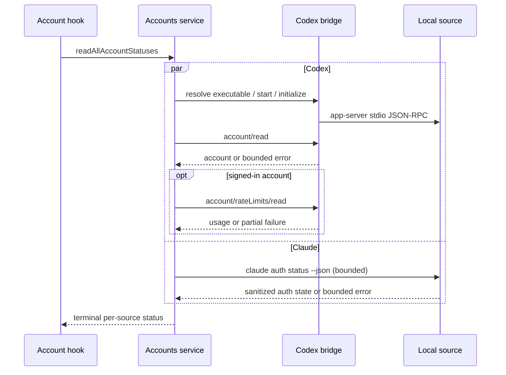

# Accounts & Imports (Phase 9)

Status: **implemented (phase 9, see HANDOFF.md).** Codex/Claude account bridges,
sanitized status, and Claude/Codex history discovery are live.

## Settings placement

Model Settings distinguishes two concepts that used to be conflated:

- **Providers** — model API / plan configuration (`preset` and `custom` navigation groups).
- **Connected accounts** — authenticated external execution accounts: Codex, Claude Code.
  The `account` variant of `ModelProviderNavItem`
  (`packages/ui/src/settings/model-provider-section/constants.ts`) carries a `source`, so each
  account is its own navigation node rendered by the static (non-sortable) list in
  `Navigation.tsx` and dispatched in `Detail.tsx` to
  `packages/ui/src/settings/account-bridge/AccountBridgeDetail.tsx`. The standalone top-level
  `accounts` Settings section stays removed; its old id migrates to `modelProvider`.

`connectionSelectionMatchesNavigationItem` excludes account nodes, so account nodes never
participate in provider drag-reorder and provider-family connection resolution never selects
one. The init/fallback path (`pickInitialConnectionNavigationItem`) only ever returns a
plan or preset node, so the default selection lands on account nodes only in the degenerate
case where no provider node exists at all.

**Command Code has exactly one presence.** It is a real personal model provider
(`command-code`, seeded by `officialProviderMetadataImporter`) _and_ a CLI account held
separately by `~/.commandcode/auth.json`. Previously both were surfaced in Model Settings —
the provider under `custom` and a look-alike "Command Code" account card — which read as a
duplicate. The CLI status now renders as a compact strip inside the Command Code provider
detail (`model-provider-section/CommandCodeCliStatus.tsx`) and is no longer part of the
accounts screens.

The compact provider detail must retain all useful fields from the supported local CLI
status payload: authenticated state, user, version, default model, and context window. The
default model and context window are metadata about the CLI execution account, not duplicate
provider identity or quota data; render them as a wrapping metadata line rather than restoring
the former multi-row account card. Quota and plan figures remain absent unless a supported
local status surface returns them.

Two _distinct_ features, deliberately not conflated:

1. **Account connection** — sign in to Codex / Claude Code through their own supported
   mechanisms. The source app owns and refreshes its credentials. ZCode never reads, copies
   or stores raw tokens, and receives only sanitized status.
2. **History import** — pull past conversations from each tool's local store. No credentials
   involved at all.

## Correction to the earlier investigation

An earlier pass concluded that "import" meant session import only, and that Codex account
connection should be avoided because it would require copying OAuth tokens. The first half
stands; **the second half was wrong**. Codex exposes a first-class account API through its
App Server that performs the browser OAuth flow itself. No token copying is required, so an
account bridge is both possible and safe.

## Codex — account connection via App Server

Installed client: `codex-cli 0.155.0-alpha.9.2`, bundled at
`/Applications/ChatGPT.app/Contents/Resources/codex`. Not on `PATH`; address it by that
absolute path. `codex login status` currently reports "Logged in using ChatGPT".

The protocol is self-describing, which is why none of this is guesswork:

```bash
codex app-server generate-json-schema --out <dir>   # JSON Schema
codex app-server generate-ts --out <dir>            # TypeScript bindings
```

`ClientRequest.json` defines 101 request methods. The relevant ones:

| Method                    | Purpose                       |
| ------------------------- | ----------------------------- |
| `account/login/start`     | begin login                   |
| `account/login/cancel`    | cancel an in-flight login     |
| `account/logout`          | disconnect                    |
| `account/read`            | sanitized account info        |
| `account/rateLimits/read` | plan limits / usage allowance |
| `account/usage/read`      | token usage summary           |

Transport: `codex app-server --listen` accepts `stdio://` (default), `unix://PATH` or
`ws://IP:PORT`. `codex app-server daemon` manages a shared local daemon and
`codex app-server proxy` bridges stdio to its control socket.

### The flow

`account/login/start` takes `LoginAccountParams`, whose variants include
`{ type: "chatgpt", … }`, `{ type: "apiKey", apiKey }`, plus Bedrock and device-code forms.
For subscription sign-in we send `{ type: "chatgpt" }` and get back:

```jsonc
{
  "type": "chatgpt",
  "authUrl": "…", // schema description: "URL the client should open in a browser
  //  to initiate the OAuth flow."
  "loginId": "…",
}
```

ZCode opens `authUrl` in the user's browser. Completion arrives as
`AccountLoginCompletedNotification { success, loginId, error }`. `AccountUpdatedNotification`
and `AccountRateLimitsUpdatedNotification` push later changes.

### What ZCode is allowed to see

`account/read` returns an `Account` union. The ChatGPT variant is exactly:

```jsonc
{ "type": "chatgpt", "email": string|null, "planType": PlanType }
```

`PlanType` ∈ free, go, plus, pro, prolite, team, business, enterprise, edu, … , unknown.

**There is no token field anywhere in that response.** Codex holds the OAuth material in its
own `~/.codex/auth.json` and refreshes it (`ChatgptAuthTokensRefresh*` is Codex-internal).
This satisfies every stated requirement: credentials stay Mac-host-only, nothing raw crosses
the relay, nothing is stored in the repo, no token can be logged or rendered, and Codex's own
login is preserved because ZCode never writes to it.

### Included usage surfaced to the UI

`account/rateLimits/read` is read alongside `account/read` (its failure is not an account
error — usage is an optional data plane). The response's `rateLimits` snapshot is mapped by
`packages/services/src/accounts/accountBridgeMapping.ts` into `AccountBridgeUsage`:

| Backend field                                                                         | Contract field                                                               |
| ------------------------------------------------------------------------------------- | ---------------------------------------------------------------------------- |
| `ordinaryUsageAllowed`                                                                | `ordinaryUsageAllowed`                                                       |
| `rateLimits.primary.usedPercent` / `.resetsAt` (Unix seconds) / `.windowDurationMins` | `primaryUsedPercent` / `primaryResetsAt` (ISO) / `primaryWindowDurationMins` |
| `rateLimits.secondary.*`                                                              | `secondaryUsedPercent` / `secondaryResetsAt` / `secondaryWindowDurationMins` |
| `rateLimits.rateLimitReachedType`                                                     | `blockedReason`, allowlisted to the documented enum values                   |

The acceptance read on 2026-09-23 used the installed Codex App Server directly over stdio
(`initialize`, `account/read`, `account/rateLimits/read`) without invoking inference. Its
sanitized response shape was:

```json
{
  "ordinaryUsageAllowed": true,
  "rateLimits": {
    "primary": { "usedPercent": 2, "windowDurationMins": 300, "resetsAt": 1790164641 },
    "secondary": { "usedPercent": 16, "windowDurationMins": 10080, "resetsAt": 1790729023 },
    "rateLimitReachedType": null
  },
  "rateLimitsByLimitId": {
    "codex": {
      "primary": { "usedPercent": 2, "windowDurationMins": 300, "resetsAt": 1790164641 },
      "secondary": { "usedPercent": 16, "windowDurationMins": 10080, "resetsAt": 1790729023 }
    }
  }
}
```

Account identifiers, account email, and credential material are deliberately omitted. This
live response confirms that this connected account currently supplies both percentages, reset
times, and the window durations. The UI names a window from its returned duration (300 minutes
→ 5 hours; 10080 minutes → weekly), not from primary/secondary position. Unknown durations
remain generic. A window is rendered only when `usedPercent` exists, and a reset is shown only
when `resetsAt` exists; neither is synthesized.
`account/rateLimits/updated` push notifications are still not consumed; usage is read on
demand with the rest of the status.

### Sign-in state honesty

Codex answers `account/read` only while its app-server child process is running, and the
harness link is in-memory. A snapshot taken with the link disabled therefore carries a
placeholder `sourceSignedIn: false`. `AccountBridgeStatus.sourceSignInChecked` marks whether
the source was actually asked, and the UI only states "Signed in"/"Signed out" when it was.

## Claude Code — account connection via the CLI auth surface

Installed: `claude 2.1.202` at `~/.local/bin/claude`. Officially supported commands:

| Command                                                          | Purpose                                                       |
| ---------------------------------------------------------------- | ------------------------------------------------------------- |
| `claude auth login [--claudeai\|--console\|--sso] [--email <e>]` | browser sign-in; `--claudeai` (subscription) is the default   |
| `claude auth logout`                                             | disconnect                                                    |
| `claude auth status --json`                                      | sanitized status                                              |
| `claude setup-token`                                             | long-lived token for programmatic use (subscription required) |

`claude auth status --json` on this machine returns:

```json
{
  "loggedIn": true,
  "authMethod": "claude.ai",
  "apiProvider": "firstParty",
  "email": "…",
  "orgId": "…",
  "orgName": "…",
  "subscriptionType": "pro"
}
```

Again **no token is exposed** — the status surface carries login state, auth method, API
provider, email and subscription tier only. Claude Code owns its credentials (keychain / its
own store) and ZCode reads status only. `email` and `subscriptionType` are mapped onto the
shared `AccountBridgeIdentity.email` / `.planType` slots so the Claude account card shows the
same account tokens as Codex.

`setup-token` is deliberately **not** the recommended path: it mints a long-lived token that
ZCode would then hold, which is the credential-custody outcome we are avoiding. Prefer
`auth login` + `auth status`.

### Claude quota: do not invent unavailable values

The installed `claude 2.1.202` documents `claude auth status --json` as a local status
surface; its observed output reports login, auth method, provider, and subscription identity,
but no quota fields. Do not generalize this observation into a claim about every Claude usage
API. The account screen should say only that usage information is not available through this
connection, and must show no estimated 5-hour or weekly figures.

Disconnect is available only while the harness bridge is connected. It stops that bridge and
does not invoke `claude auth logout`; source sign-in and harness connection are distinct states.
At approximately 420 px, detail metadata must remain readable, action rows must wrap, and no
nested action button should become full width through a broad descendant selector.

### Asymmetry worth designing around

Codex offers a structured JSON-RPC API with push notifications. Claude Code offers CLI
commands with JSON output and no event stream. The reusable service therefore defines one
interface and two adapters, with Claude's status obtained by polling on demand (on Settings
open, and after an explicit connect/disconnect) rather than by subscription. The asymmetry is
visible in the UI: Codex can show included-usage windows, Claude cannot.

## History import — separate feature

Claude (already built): `importClaudeNativeSessions`
(`packages/services/src/session/claude-native/claudeNativeSessionImportService.ts`) copies
Claude's `.jsonl` transcripts into the workspace as ZCode tasks. It is already shared by
onboarding (`OnboardingDialog.tsx:61`) and Settings (`MigrationSection.tsx:61`, rendered by
`AccountBridgeDetail` for the Claude account node, which is the Model settings split-panel
`account` variant in `model-provider-section/Detail.tsx`) through the
`useClaudeSessionMigration` hook, so it is already re-runnable after onboarding. Per
"do not duplicate it", this stays as is; only its presentation moved with the section.

Codex history import reads local rollout JSONL files under `~/.codex/sessions/{year}/…`.
`thread_history_1.sqlite` is not part of the import contract. The live scanner reuses
`ZCodeImportSessionsResult` with `provider: "codex"` alongside the existing
`provider: "claude"`.

## Proposed shape

- `packages/services/src/accounts/accountConnectionService.ts` — provider-agnostic
  interface: `connect()`, `cancelConnect()`, `disconnect()`, `readStatus()`, returning only
  `{ connected, accountLabel?, planType?, authMethod?, lastCheckedAt, usage? }`.
- Adapters: `codexAppServerAccountAdapter` (JSON-RPC over the app-server socket) and
  `claudeCliAccountAdapter` (spawn `claude auth …`, parse `--json`).
- Credentials: none stored by ZCode. Where any local state is unavoidable, reuse
  `createCredentialService` (`packages/services/src/credential/credentialService.ts`) rather
  than adding a second secret store.
- Relay boundary: the RPC surface exposed to the browser carries only the sanitized status
  object above. `authUrl` is opened **host-side**; it is a one-time OAuth initiation URL, and
  the decision on whether it may cross to the browser is called out as an open question below.
- Settings section "Accounts & Imports": Import from Claude Code, Import from Codex,
  connection/import status, re-import / reconnect, disconnect from this harness. Connect and
  import both require an explicit click; nothing runs automatically.

## Open questions before implementation

1. **Remote browser flow.** The relay is used from a phone. `authUrl` must be opened in a
   browser that can complete the OAuth and hand back to the _local_ Codex daemon. Opening it
   on the phone will likely fail, because the callback targets localhost on the Mac. Options:
   restrict connect to host-side sessions, or surface a QR/copy-link for the Mac. Needs a
   decision.
2. **Disconnect semantics.** "Disconnect from this harness" could mean forget ZCode's link
   only, or call `account/logout` / `claude auth logout` and sign the user out of the source
   app. The latter mutates the source login, which the brief says to preserve. Recommend
   default = forget the link only, with source logout behind a clearly separate control.
3. **App Server lifecycle.** Whether ZCode spawns `codex app-server` per request, attaches to
   the shared `daemon`, or requires the user to have Codex running.

## Command Code catalogue — clarification

The `command-code` provider added in Phase 8 is a real GOAT Provider API integration. Only
two models (`deepseek/deepseek-v4-flash`, `z-ai/glm-5.3-flash`) were exposed, purely as a
validation subset. The account's actual capability is the full catalogue: 76 models from
`GET /provider/v1/models`, of which 68 support `/chat/completions` and 8 (the Claude family)
are `/messages`-only. Exposing more is a configuration change requiring no code; the
`/messages` models additionally need a second provider entry with `anthropic-messages`.

## Live account status termination and Codex history parity (2026-09-23)

### Account status ownership and terminal behavior

`createAccountBridgeService` owns host-side harness-link state; the source CLI/App Server owns
source sign-in state and credentials. Renderer `useAccountBridge` owns only request presentation
state and sanitized snapshots. Every host status read must resolve to exactly one status for its
source. `readAllStatuses` may combine independent source reads, but each adapter has bounded
process/request timeouts so one source cannot strand the other. A connected state requires an
enabled harness bridge and a verified signed-in source account; signed-out or disabled links are
disconnected. Missing executables are not-installed. Launch/protocol failures are error and can
be retried. Codex usage is optional: `account/rateLimits/read` failure leaves a signed-in account
connected without usage.



### Executable discovery

Codex discovery must consider an explicit configured path, executable names found on the
process PATH, and known macOS app-bundle locations without assuming one Homebrew prefix. Claude
uses the same host PATH lookup and configured-path precedence. Child processes inherit the
normalized host environment. Never put a user-specific home path into source.

### Codex local import boundary

Codex history import reads rollout JSONL session files only. The observed format starts with a
`session_meta` header (`payload.session_id`, `cwd`, `timestamp`, `cli_version`); conversation
records include `response_item` messages and tool-call/result payloads plus `event_msg` and
`turn_context`. The scanner must use Codex's configured home when supplied by the existing
App Server initialization, otherwise the standard per-user Codex home; it must never inspect
`auth.json` or import credentials. It filters by workspace, activity range, and limit, and
marks an already imported `codex` source session by stable source identity.

A source adapter parses Codex records into the existing import-history/task creation contract.
Migration UI remains one shared `MigrationSection` with source-specific scan/import adapters;
Claude's existing parser and Codex's rollout parser stay source-specific. Imported tasks carry
`migrationSource = codex` and original source session id in task metadata. The task index is the
idempotency owner: check the stable `(source, original session id)` before creation, and use a
deterministic task id so a retry cannot create a second task. Only user-visible user/assistant
text is converted; tool calls/results, reasoning, metadata, unknown record types and credentials
are ignored.

Codex rollout sessions are local Codex history only. Account/App Server APIs do not establish
availability of general chatgpt.com conversations; no browser scraping, cookie copying, or
invented cloud-history endpoint is permitted.
