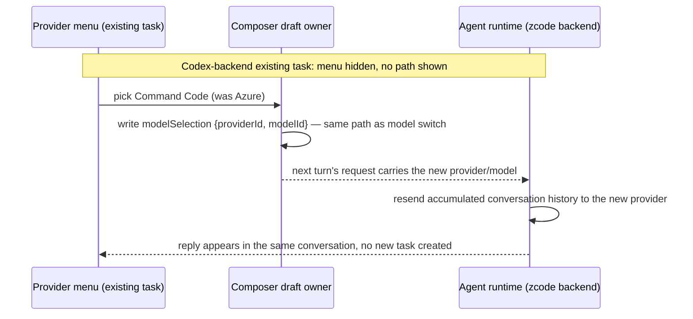
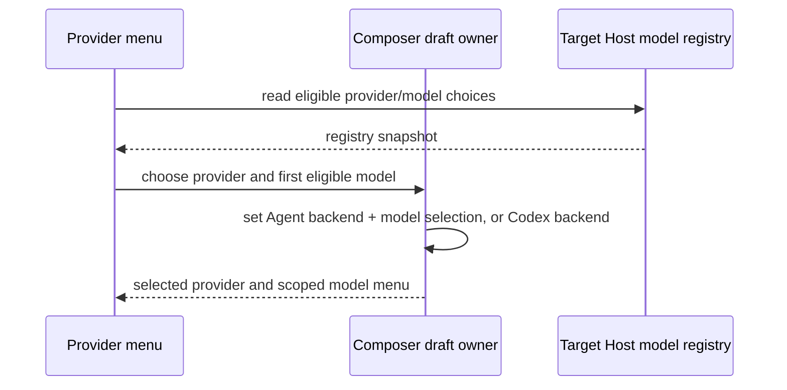
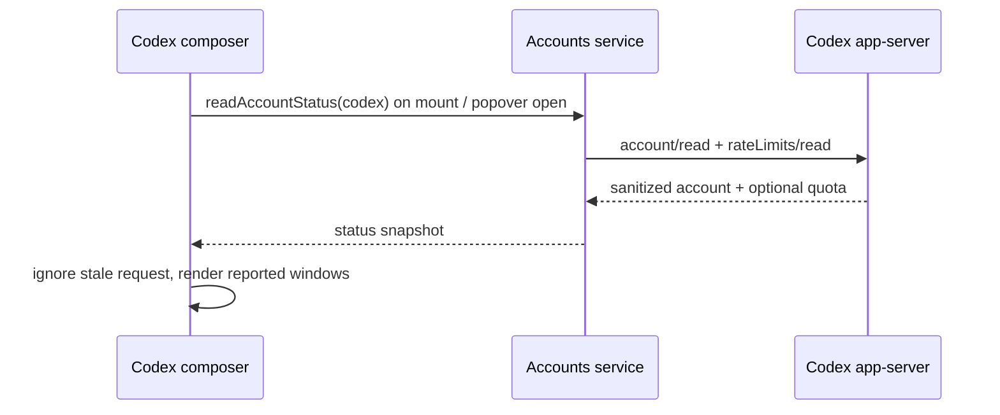

# Composer toolbar presentation

## Scope

This spec covers only the user-facing presentation and accessibility of the V4 conversation
composer action controls. It does not rename runtime backends, protocol values, package identities,
bundle identities, or release identities. The built-in execution backend keeps its stable
`zcode` value; its composer-visible name is generalized to **Agent**.

## Naming boundary

- `chat.toolbar.backend.zcode.label` is the display name for the built-in backend and says `Agent`.
- `chat.toolbar.backend.zcode.description` describes the built-in agent without using the product
  name as the user-facing label.
- Backend values, test IDs, service names, protocol fields, storage values, and internal logs remain
  unchanged.
- The second backend remains **Codex** and remains disabled when the Codex execution service is not
  available.
- Composer availability reflects the local Codex execution service. The optional account and
  usage link in Model Settings has a separate status; its disconnected state does not disable
  a working local Codex chat or require the composer to tell users to connect first.

## Composer action presentation

The composer has two action clusters:

- leading actions: mode selector, Computer Use entry, and background-work entry;
- task options: backend selector, model selector, thought level, and context usage where available.

Both clusters use a semantic `toolbar` role with a localized accessible name. Controls share one
presentation contract:

- compact `h-7` hit target with a `min-w-7` icon-only floor, `rounded-lg`, and content-driven width
  when a text label is visible;
- visible labels must never be clipped by a square width or overlap a neighboring control; narrow
  composer states hide the label and collapse to the icon-only floor;
- outline affordance using semantic surface, border, and hover tokens;
- visible keyboard focus using the repository's input-border-focused ring;
- expanded picker state reflected by the existing Radix state and corresponding surface token;
- `text-ui-*` typography only;
- icon plus text when composer width allows, icon-only in compact mode with an accessible name;
- no raw colors, arbitrary typography, or new height systems.

The Agent model and thought-level triggers use the same outlined surface as the backend and
Codex controls. Switching backends must not make those two choices lose their visible control
boundaries.

The Computer Use entry remains a Settings entry, not a direct runtime toggle. Its visible state and
tooltip remain owned by `cuaComposerEntryState`; this presentation spec does not change state
ownership.

Composer entry copy uses the same generalized actor language: task placeholders say **agent**, not
the internal runtime/product name. This is display copy only; runtime identifiers remain unchanged.

## Backend and model clarity

### Provider-first draft choice (2026-09-24)

- The first new-task selector is labeled **Provider**. It lists **Z.ai** as one family entry,
  **Codex**, **Claude Code**, and each saved personal API provider by its display name. The
  Agent execution backend is an internal route for Z.ai and personal API providers, not a
  visible catch-all choice. Codex retains its own execution backend and sign-in.
- **BigModel-family accounts are excluded from this menu entirely** (2026-09-24 correction):
  this product line does not route through BigModel, so its accounts must not appear even as
  a disabled/unavailable entry — showing an unconnected family here is misleading, not merely
  incomplete. `buildComposerAgentProviderChoices` skips any provider whose resolved family is
  not `zai`; only the `zai` family is eligible for the family-grouping treatment.
- The selected provider is derived from the draft's selected model provider id for Agent
  execution, or its Codex execution backend. Choosing a runnable Agent provider selects its
  first eligible model only when the current draft model is outside that provider/family;
  model selection then remains owned by the existing composer draft path. No duplicate
  provider-selection cache or separate execution state is introduced.
- The model dropdown is **scoped to the selected Provider choice only** (2026-09-24
  correction): it must not also list every other saved provider's models as extra groups or
  submenus inside the same menu — that duplicates the Provider menu's job and is confusing.
  `resolveModelSelectScopeProviderIds` maps the current provider id to the set of registry
  provider ids the model menu may show: the **Z.ai** family expands to its three account ids
  (so Individual/Start Plan/Team all stay visible as distinct groups under that one top-level
  provider); any other saved provider (Azure, OpenCode, etc.) maps to just its own id. A
  single-provider scope always renders as one flat, borderless list (`directItems`), the same
  visual treatment as Z.ai's Individual/Start Plan groups — never a nested submenu, since
  there is nothing else in the menu to disambiguate. This scoping applies to the composer's
  model menu only; Settings' Manage Models, the Subagents picker, and the Workflow run
  popover keep listing every provider (`buildRegistryModelSelectGroups` treats the new scope
  parameter as optional and unscoped when omitted). Codex model and effort menus use the same
  clean, borderless option rows; the menus retain a bounded scroll area and selected-state
  indicator.
- **Existing tasks keep their established execution backend, but not a fixed provider
  within it** (2026-09-24 correction): "backend" (`zcode` vs `codex`) and "provider" (Z.ai,
  Azure, Command Code, ...) are different things. Backend is fixed at task creation —
  crossing into or out of Codex mid-task needs a runtime migration (extracting the visible
  transcript and re-seeding it on the other side) that does not exist yet, so the Provider
  menu is hidden entirely for an existing Codex session (`shouldShowComposerProviderMenu`,
  `packages/ui/src/v4/composer/composerToolbarPresentation.ts`) and its Codex entry is
  disabled everywhere except a fresh draft. Provider, within the `zcode` backend, is **not**
  fixed: switching from Command Code to Azure mid-conversation is the same safe operation as
  switching models — the Agent owns the conversation and resends accumulated history to
  whichever provider answers the next turn regardless of who answered the last one. The
  Provider menu therefore stays visible and wired (`onSelectAgentProvider`) on any existing
  `zcode`-backend session, reusing the exact same draft-model-selection write path the Models
  dropdown already used for model switching — no new state, no new write path. This was a
  regression introduced when the Provider menu shipped: it was gated on `draftMode` alone,
  which hid it for every existing task instead of only existing Codex ones.

Accepted scenarios (continued): (8) an existing `zcode`-backend conversation shows the
Provider menu and can switch from one saved provider to another mid-conversation, with the
conversation continuing in place; (9) an existing Codex conversation shows no Provider menu at
all, only its own model/effort controls; (10) a fresh draft still shows every choice including
Codex, unaffected by either existing-task rule above.

- Saved personal providers appear immediately in the Provider menu. A provider without an
  eligible model is visible but disabled with an Add model explanation; it cannot be selected
  for chat. A provider that lacks a key or valid endpoint is likewise unavailable until fixed
  in Model Settings. The target Host's model selection view, not the Settings form, decides
  which model can execute.
- **Claude Code** is listed as unavailable. Its current account/history link does not provide
  chat execution; a later Claude execution backend and authentication path will enable it.
  The menu must never silently route a Claude choice through Agent or Codex.

Accepted scenarios: (1) Z.ai selection shows Individual and Start Plan model groups;
(2) adding an Azure or OpenCode provider makes its name appear and its saved models become
selectable once executable; (3) choosing Codex shows its curated model/effort controls;
(4) Claude Code and incomplete custom providers are visible but unavailable; (5) opening an
existing task does not reinterpret its execution backend; (6) BigModel accounts never appear
in the Provider menu, connected or not; (7) with Azure selected as the Provider, the model
menu shows only Azure's own models as one flat list — not Z.ai's, Command Code's, or any
other saved provider's models.

The Agent backend's model picker lists the AceVra plan catalog and selection drives the plan model
as before. For the Codex backend, the composer renders a dedicated Codex model + effort control
instead of the Agent picker, in **both** new-task drafts and existing Codex conversations:

- The model list is the curated `CODEX_MODEL_OPTIONS` contract in `@zcode/shared`
  (`codex-execution.ts`): **Default (Codex app setting)** plus the reviewed ids
  (`gpt-6-astra`, `gpt-6-sol`, `gpt-6-luna`, `gpt-5.6-sol`, `gpt-5.6-terra`, `gpt-5.6-luna`,
  `gpt-5.5`).
  Exact allow-list, not a free-text field; new ids require a contract change.
- Effort choices are derived from the selected Codex model's curated `reasoningEfforts` list;
  model `Default` uses the union of reviewed Codex tiers. The tiers are checked against the
  installed `codex debug models` catalog (model capabilities are not interchangeable). The Codex `ReasoningEffort` schema is an
  open string (“advertised by the model”), so the curated model-to-effort map is the contract and
  unsupported values are rejected host-side (fail loud).
- `null/undefined` is the **Default / no override** sentinel: no `model` / `effort` field is sent
  and Codex keeps its own settings.
- Verified against the installed binary (`codex-cli 0.155.0-alpha.16.4`,
  `app-server generate-json-schema` + live handshake):
  - `thread/start` accepts a top-level `model`;
  - `turn/start` accepts `model` and `effort` overrides whose description is “Override the
    model/effort for this turn **and subsequent turns**”, so **mid-session switching is supported**
    (the earlier “thread-level lock” note is superseded);
  - both the `thread/start` response and the `Thread` object in `thread/started` report the
    actually-adopted `model` and `reasoningEffort`.
- The displayed value is therefore Codex's **reported** model/effort (snapshot `config.model` /
  `config.thought`) whenever the user has no explicit override — “which model is answering” is
  never guessed, it is what Codex reported (e.g. the app's config default such as `gpt-6-luna`).
- An explicit override in the session-scoped composer draft is sent as `codexTurnOverride` on the
  v4 `sendText` payload (schema-strict, host validates against the allow-list). Draft task
  creation sends the model via `thread/start` and the effort on the first turn.
- Changing backend is a new-task choice: an existing task remains bound to its original execution
  backend. The draft backend selector remains the route back to Agent/provider models before a
  task is created; an existing Codex task can switch among curated Codex models via `turn/start`.
- The host fails loud when the installed Codex binary rejects `model` / `effort`; silently falling
  back while displaying a chosen value is a defect.
- Claude is not a backend; no Claude model surface exists or may be implied by this UI.

### Codex toolbar layout and usage (2026-09-24)

- The Codex task-options cluster presents **three separate controls in this order**: usage
  wheel, model selector, reasoning-effort selector. Model and effort are individually outlined
  with the same toolbar trigger tokens as Agent; compact widths hide labels but preserve each
  control's accessible name. Each selector opens its own bounded menu, with a visible section
  label and clean borderless option rows. The model menu shows friendly labels plus exact
  model ids; the effort menu contains only tiers supported by the selected model. Both expose a
  selectable Default/no-override item so a previous override can be cleared.
- The Codex usage wheel is a read-only projection of sanitized `readAccountStatus("codex")`.
  The account service owns the source snapshot; the composer owns only its mounted display
  snapshot and refresh-on-open request state. On mount and each popover open it reads status;
  a stale or unmounted result cannot replace a newer one. There is no second quota cache or
  polling loop. If the source has no reported usage, the wheel remains a neutral entry and the
  popover says usage is unavailable; it never invents a percentage or reset time.
- When present, the wheel reflects the **first reported** Codex window (the primary/five-hour
  window on current Codex). The popover names each window from its reported duration and shows
  every reported remaining percentage and reset using the same formatting as Model Settings.
  It does not merge context-token usage with account quota. Local Codex execution remains
  independent of the optional settings link.

## Explicit input rejection

`inputRouting.mode = "reject"` is a runtime decision to refuse _sending_ new input (for example
while an external backend turn is running). When it is active:

- the editor stays **typeable** — a follow-up draft must never be trapped or lost;
- sending stays blocked by the existing routing gate (`submitDisabled`), and Stop remains available;
- the placeholder explains the state: the agent is working, but the user may type a follow-up now.

Silently disabling the whole editor here (the earlier behavior) is the “locked chat” defect and is
forbidden.

## Accessibility invariants

- Every icon-only compact state retains an accessible name.
- Picker triggers identify the picker they open; Radix continues to expose expanded state.
- Toolbar clusters expose a toolbar role and localized name so keyboard users can identify the
  group.
- Visual grouping must not create a second state owner or duplicate command admission.
